# Сценарий: Часть 1. Продвинутое кэширование и консистентность кэша

**Домен примеров:** Интернет-магазин / маркетплейс  
**Общее время:** 35-45 минут  
**Целевая аудитория:** Middle+ backend разработчики

---

## ВВЕДЕНИЕ (1-2 минуты)

Привет! Мы начинаем продвинутую часть курса по системному дизайну. В предыдущих главах мы говорили про кэш на уровне "вот Redis, он ускоряет запросы к базе". Это правда, но очень поверхностно.

В реальности кэш — это не просто "ускоритель". Это архитектурный компонент, который может как спасти вашу систему под нагрузкой, так и создать труднодебажимые баги, из-за которых пользователи видят неправильные данные.

В этой части мы разберём три ключевых вопроса:
1. Как держать копии данных синхронными в распределённой системе? (Cache Coherence)
2. Как правильно распределить данные по уровням кэша? (Многоуровневое кэширование)
3. Что делать, когда всё ломается под нагрузкой? (Сложные проблемы)

Для примеров я буду использовать маркетплейс с миллионами товаров, корзинами, заказами — всё как в реальной жизни.

Поехали!

---

## БЛОК 1. МОДЕЛЬ КЭША И БАЗОВЫЕ ПАТТЕРНЫ (3-5 минут)

### 1.1. Зачем нужен кэш в продакшене?

Давайте начнём с конкретной боли. Представьте: у вас маркетплейс, на оформление заказа нужно показать актуальный курс валют. Вы интегрировались с внешним сервисом курсов.

**Проблема:** Каждый пользователь при оформлении заказа дёргает этот API. У вас 200 тысяч активных пользователей. Внешний API не ваш, он может упасть, тормозить или банально заблокировать вас за DDoS.

**Решение:** Отдельный воркер раз в минуту запрашивает курсы и кладёт их в Redis. Все запросы пользователей читают из кэша, а не лупят внешний API.

Это типичный кейс. Кэш нужен для:
- **Разгрузки БД и внешних API** — вместо 100k запросов в секунду делаем 100
- **Ускорения горячих чтений** — карточка товара за 2ms вместо 50ms из БД
- **Переиспользования дорогих вычислений** — рекомендации, агрегаты, отчёты

Кэш в архитектурных терминах: **быстрый, ограниченный, потенциально устаревающий слой рядом с медленным источником истины**.

Ключевые метрики:
- **Hit rate** — процент запросов, которые нашли данные в кэше
- **Latency** — время ответа из кэша vs из БД
- **TTL** (Time To Live) — как долго данные живут в кэше

Базовая терминология:
- `cache hit` / `cache miss` — нашли/не нашли в кэше
- `hot key` — очень популярный ключ (например, товар дня)
- `stale data` — устаревшие данные в кэше

### 1.2. Слои кэширования: от браузера до базы данных

Теперь важный момент: у нас не один кэш, а **целая пирамида слоёв**.

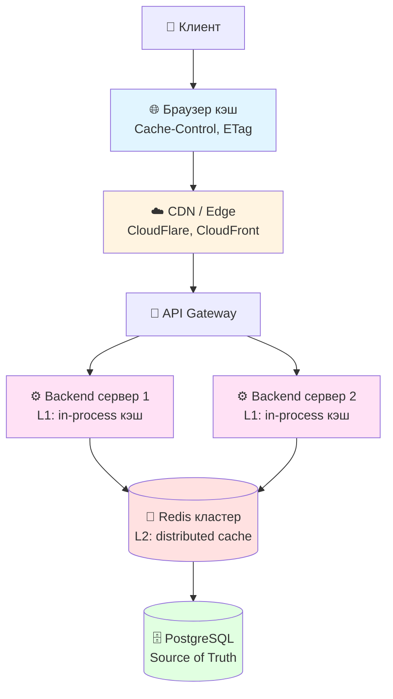
```mermaid
graph TB
    Client[👤 Клиент]
    Browser[🌐 Браузер кэш<br/>Cache-Control, ETag]
    CDN[☁️ CDN / Edge<br/>CloudFlare, CloudFront]
    Gateway[🚪 API Gateway]
    Backend1[⚙️ Backend сервер 1<br/>L1: in-process кэш]
    Backend2[⚙️ Backend сервер 2<br/>L1: in-process кэш]
    Redis[(🔴 Redis кластер<br/>L2: distributed cache)]
    DB[(🗄️ PostgreSQL<br/>Source of Truth)]
    
    Client --> Browser
    Browser --> CDN
    CDN --> Gateway
    Gateway --> Backend1
    Gateway --> Backend2
    Backend1 --> Redis
    Backend2 --> Redis
    Redis --> DB
    
    style Browser fill:#e1f5ff
    style CDN fill:#fff4e1
    style Backend1 fill:#ffe1f5
    style Backend2 fill:#ffe1f5
    style Redis fill:#ffe1e1
    style DB fill:#e1ffe1
```

**Что на каком уровне держим в маркетплейсе:**

| Слой | Что лежит | Типичный TTL |
|------|-----------|--------------|
| **Браузер** | JS/CSS/картинки, куски каталога | 1 день - 1 неделя |
| **CDN** | Медиа, страницы товаров, статика | 5-60 минут |
| **L1 (in-process)** | Справочники категорий, права, фича-флаги | 30-60 секунд |
| **L2 (Redis)** | Сессии, корзины, популярные товары, счётчики | 5 минут - 1 час |
| **БД** | Source of Truth, индексы, материализованные вьюхи | - |

### 1.3. Базовый паттерн: Cache-Aside

Давайте разберём самый популярный паттерн — **Cache-Aside** (lazy loading).

**Псевдокод для запроса карточки товара:**

```python
def get_product(product_id):
    # Шаг 1: Проверяем Redis
    cache_key = f"product:{product_id}"
    data = redis.get(cache_key)
    
    if data is not None:
        # Cache HIT! Возвращаем сразу
        return json.loads(data)
    
    # Cache MISS — идём в базу
    # Шаг 2: Запрос в PostgreSQL
    data = db.query(
        "SELECT * FROM products WHERE id = ?", 
        product_id
    )
    
    if data is None:
        return None  # Товар не найден
    
    # Шаг 3: Кладём в кэш с TTL 5 минут
    redis.set(
        cache_key, 
        json.dumps(data), 
        ex=300  # TTL = 300 секунд
    )
    
    return data
```

**Flow запроса "товар ID=123":**

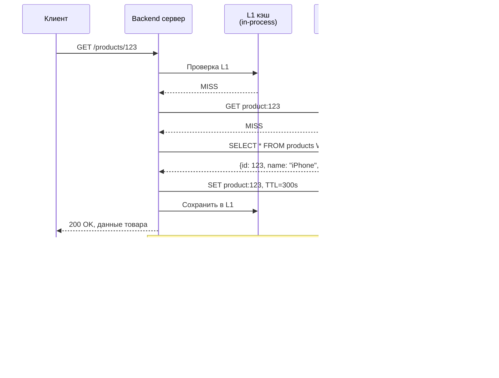
```mermaid
sequenceDiagram
    participant Client as Клиент
    participant Backend as Backend сервер
    participant L1 as L1 кэш<br/>(in-process)
    participant Redis as Redis (L2)
    participant DB as PostgreSQL
    
    Client->>Backend: GET /products/123
    Backend->>L1: Проверка L1
    L1-->>Backend: MISS
    Backend->>Redis: GET product:123
    Redis-->>Backend: MISS
    Backend->>DB: SELECT * FROM products WHERE id=123
    DB-->>Backend: {id: 123, name: "iPhone", price: 1000}
    Backend->>Redis: SET product:123, TTL=300s
    Backend->>L1: Сохранить в L1
    Backend-->>Client: 200 OK, данные товара
    
    Note over Backend,Redis: Следующий запрос
    Client->>Backend: GET /products/123
    Backend->>L1: Проверка L1
    L1-->>Backend: HIT ✅ (latency: 0.1ms)
    Backend-->>Client: 200 OK, данные товара
```

**Вопрос к аудитории:** Что произойдёт, если пока мы читали из БД, кто-то обновил цену товара?

→ Это подводка к нашей главной теме: **Cache Coherence**

### 1.4. Мост к следующим блокам

Итак, у нас теперь не один кэш, а пирамида слоёв. В каждом слое лежат копии одних и тех же данных.

**Три главных вызова:**

1. **Как держать эти копии синхронными?**  
   → Блок 2 (Cache Coherence)

2. **Как правильно распределить данные по уровням?**  
   → Блок 3 (Многоуровневое кэширование)

3. **Что делать, когда всё ломается под нагрузкой?**  
   → Блок 4 (Сложные проблемы)

Дальше у нас три подпункта, каждый отвечает на один из этих вопросов.

---

## БЛОК 2 (A). CACHE COHERENCE В РАСПРЕДЕЛЁННЫХ СИСТЕМАХ (10-15 минут)

### 2.1. Инцидент: почему пользователь видит старые данные?

Представьте ситуацию в маркетплейсе:

**08:00** — Пользователь Иван заходит в профиль, меняет адрес доставки с "Москва" на "Санкт-Петербург"  
**08:00:05** — Адрес обновился в базе данных ✅  
**08:00:10** — Иван идёт в корзину оформлять заказ  
**08:00:11** — Корзина показывает старый адрес "Москва" ❌

**Что случилось?**

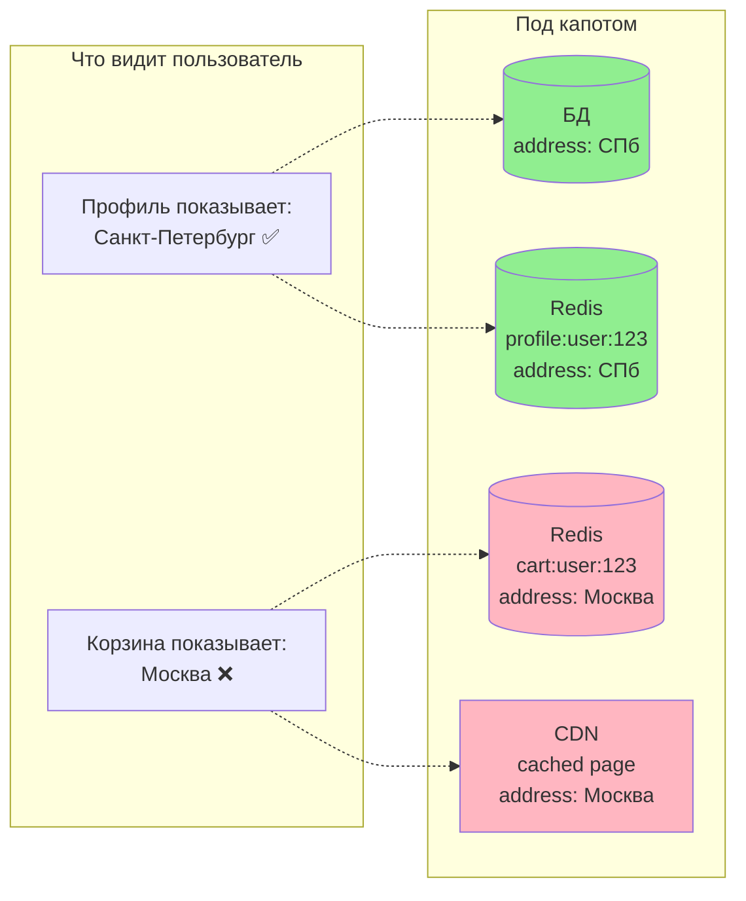
```mermaid
graph LR
    subgraph "Что видит пользователь"
        A[Профиль показывает:<br/>Санкт-Петербург ✅]
        B[Корзина показывает:<br/>Москва ❌]
    end
    
    subgraph "Под капотом"
        DB[(БД<br/>address: СПб)]
        Redis1[(Redis<br/>profile:user:123<br/>address: СПб)]
        Redis2[(Redis<br/>cart:user:123<br/>address: Москва)]
        CDN[CDN<br/>cached page<br/>address: Москва]
    end
    
    A -.-> Redis1
    A -.-> DB
    B -.-> Redis2
    B -.-> CDN
    
    style Redis1 fill:#90EE90
    style DB fill:#90EE90
    style Redis2 fill:#FFB6C1
    style CDN fill:#FFB6C1
```

**Проблема:** Профиль пользователя хранится в 4 местах:
- База данных (обновилась)
- Ключ `profile:user:123` в Redis (обновился)
- Ключ `cart:user:123` в Redis (не обновился!)
- Страница в CDN (не обновилась!)

Это классическая проблема **cache coherence** — когда копии одного и того же объекта расходятся между разными кэшами.

### 2.2. Что такое Cache Coherence?

**Cache coherence** — это свойство системы, при котором все копии одного и того же объекта данных в разных кэшах остаются согласованными.

**Важно:** Это не то же самое, что:
- **Консистентность БД** (ACID транзакции)
- **CAP-теорема** (консистентность в распределённой БД)

Cache coherence — это именно про **кэши**, а не про источник истины.

**Условие coherence:** Нет двух кэшей с противоречащими значениями одного объекта.

Но тут встаёт вопрос: **как быстро** мы требуем согласованности?
- Мгновенно (strong coherence)? — дорого
- В течение секунды (eventual coherence)? — реалистично
- В течение минуты? — зависит от бизнеса

### 2.3. Аналогия с процессорными кэшами

В CPU есть протоколы согласованности кэша, например **MESI**:
- **M**odified — ядро изменило данные
- **E**xclusive — только у одного ядра
- **S**hared — копии у нескольких ядер
- **I**nvalid — данные устарели

Это работает потому что:
✅ Жёсткий порядок операций  
✅ Надёжная шина связи  
✅ Микросекундные задержки

В распределённой системе всё хуже:
❌ Ненадёжная сеть (пакеты теряются)  
❌ Непредсказуемые задержки (от 1ms до 1 секунды)  
❌ Нет глобальных часов (сервера в разных ДЦ)

**Вывод:** Нам нужны другие подходы, которые работают в "грязном" мире распределённых систем.

### 2.4. Race Condition в Cache-Aside

Давайте посмотрим, как возникает классическая гонка при обновлении.

**Код обновления товара:**

```python
def update_product(product_id, new_price):
    # Шаг 1: Обновляем БД
    db.execute(
        "UPDATE products SET price = ? WHERE id = ?",
        new_price, product_id
    )
    
    # Шаг 2: Инвалидируем кэш
    redis.delete(f"product:{product_id}")
```

**Timeline гонки:**

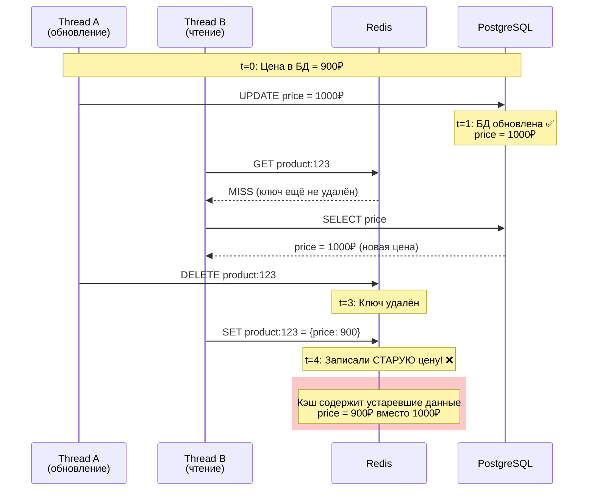
```mermaid
sequenceDiagram
    participant A as Thread A<br/>(обновление)
    participant B as Thread B<br/>(чтение)
    participant Redis as Redis
    participant DB as PostgreSQL
    
    Note over A,DB: t=0: Цена в БД = 900₽
    
    A->>DB: UPDATE price = 1000₽
    Note over DB: t=1: БД обновлена ✅<br/>price = 1000₽
    
    B->>Redis: GET product:123
    Redis-->>B: MISS (ключ ещё не удалён)
    
    B->>DB: SELECT price
    DB-->>B: price = 1000₽ (новая цена)
    
    A->>Redis: DELETE product:123
    Note over Redis: t=3: Ключ удалён
    
    B->>Redis: SET product:123 = {price: 900}
    Note over Redis: t=4: Записали СТАРУЮ цену! ❌
    
    rect rgb(255, 200, 200)
        Note over Redis: Кэш содержит устаревшие данные<br/>price = 900₽ вместо 1000₽
    end
```

**Численная оценка:**

При 10,000 RPS и окне гонки 100ms:
- ~1000 запросов попадают в проблемное окно
- Из них ~1% могут записать stale данные
- **= 10 багов в секунду** ❌

Для критичных данных (цены, балансы, лимиты) это неприемлемо!

### 2.5. Типичные архитектуры кэшей

Где coherence всплывает в разных архитектурах:

**Архитектура 1: Один Redis-кластер**

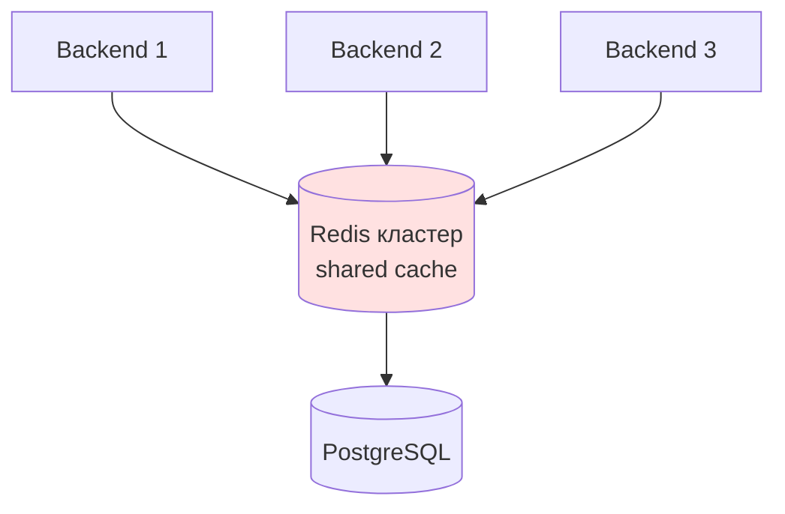
```mermaid
graph TB
    B1[Backend 1]
    B2[Backend 2]
    B3[Backend 3]
    Redis[(Redis кластер<br/>shared cache)]
    DB[(PostgreSQL)]
    
    B1 --> Redis
    B2 --> Redis
    B3 --> Redis
    Redis --> DB
    
    style Redis fill:#ffe1e1
```

**Плюсы:** Coherence проще — данные в одном месте  
**Минусы:** Есть TTL, репликация между нодами Redis, шардирование

**Архитектура 2: Многоуровневый кэш (L1 + L2)**

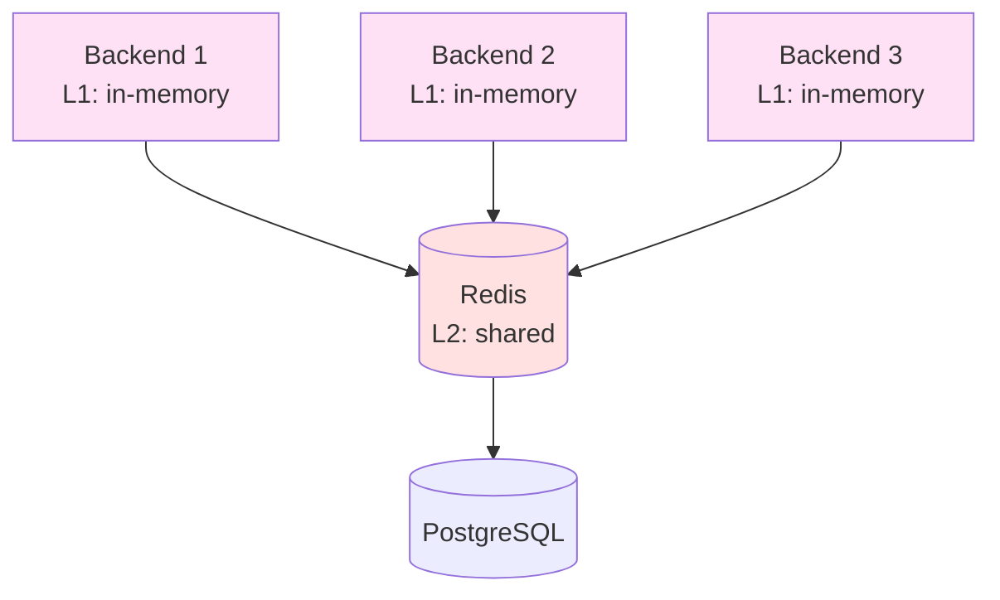
```mermaid
graph TB
    B1[Backend 1<br/>L1: in-memory]
    B2[Backend 2<br/>L1: in-memory]
    B3[Backend 3<br/>L1: in-memory]
    Redis[(Redis<br/>L2: shared)]
    DB[(PostgreSQL)]
    
    B1 --> Redis
    B2 --> Redis
    B3 --> Redis
    Redis --> DB
    
    style B1 fill:#ffe1f5
    style B2 fill:#ffe1f5
    style B3 fill:#ffe1f5
    style Redis fill:#ffe1e1
```

**Плюсы:** Очень быстрый L1 (микросекунды)  
**Минусы:** Сложнее держать L1 всех серверов синхронными с L2 и БД

**Архитектура 3: С CDN/Edge**

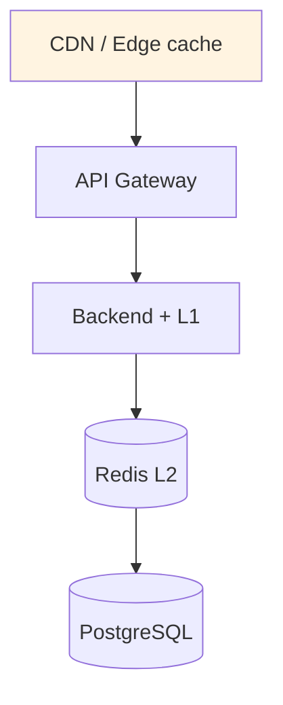
```mermaid
graph TB
    CDN[CDN / Edge cache]
    API[API Gateway]
    Backend[Backend + L1]
    Redis[(Redis L2)]
    DB[(PostgreSQL)]
    
    CDN --> API
    API --> Backend
    Backend --> Redis
    Redis --> DB
    
    style CDN fill:#fff4e1
```

**Плюсы:** Отличная latency для пользователей  
**Минусы:** CDN может кэшировать данные на часы — самый сложный случай для coherence

### 2.6. Стратегии обеспечения согласованности

Разберём 3 базовых подхода (не весь зоопарк, а ключевые идеи).

#### Стратегия A: TTL-only (ленивая согласованность)

**Идея:** Просто ждём, пока данные протухнут по TTL.

```python
# Запись
redis.set("product:123", data, ex=60)  # TTL = 60 секунд

# Обновление
db.update(...)
# Ничего не делаем с кэшем!
# Через 60 секунд данные протухнут сами
```

**Плюсы:**
- ✅ Максимально просто
- ✅ Нет дополнительной инфраструктуры
- ✅ Нет race conditions с инвалидацией

**Минусы:**
- ❌ Пользователи видят stale данные до истечения TTL

**Когда использовать:**
- Ленты новостей
- Счётчики лайков/просмотров
- Некритичная статистика
- Каталог товаров (если TTL 30-60 секунд приемлем)

#### Стратегия B: Event-based инвалидация

**Идея:** При изменении данных посылаем событие, которое инвалидирует кэш на всех серверах.

```python
# Обновление товара
def update_product(product_id, data):
    # 1. Обновляем БД
    db.update(product_id, data)
    
    # 2. Публикуем событие
    event_bus.publish("product.updated", {
        "id": product_id,
        "timestamp": now()
    })

# На ВСЕХ backend-серверах подписка:
event_bus.subscribe("product.updated", lambda event: {
    # Инвалидируем во всех слоях
    redis.delete(f"product:{event.id}")
    local_cache.delete(f"product:{event.id}")
})
```

**Архитектура с Pub/Sub:**

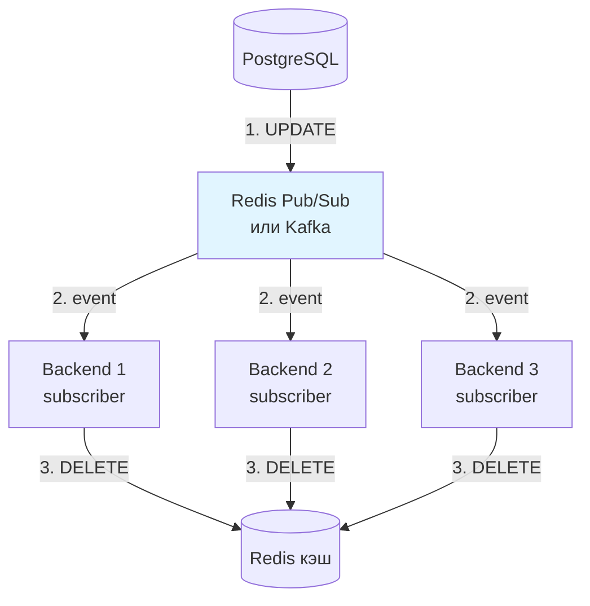
```mermaid
graph TB
    DB[(PostgreSQL)]
    PubSub[Redis Pub/Sub<br/>или Kafka]
    B1[Backend 1<br/>subscriber]
    B2[Backend 2<br/>subscriber]
    B3[Backend 3<br/>subscriber]
    Redis[(Redis кэш)]
    
    DB -->|1. UPDATE| PubSub
    PubSub -->|2. event| B1
    PubSub -->|2. event| B2
    PubSub -->|2. event| B3
    B1 -->|3. DELETE| Redis
    B2 -->|3. DELETE| Redis
    B3 -->|3. DELETE| Redis
    
    style PubSub fill:#e1f5ff
```

**Плюсы:**
- ✅ Предсказуемое окно рассинхрона (<1 секунды обычно)
- ✅ Работает для многоуровневых кэшей

**Минусы:**
- ❌ Нужна инфраструктура (Kafka, Redis Pub/Sub, RabbitMQ)
- ❌ Что если сообщение потеряется? (нужен fallback на TTL)

**Когда использовать:**
- Профили пользователей
- Корзины покупок
- Настройки аккаунта
- Inventory (остатки) с невысокой нагрузкой

#### Стратегия C: Lease-based подходы

**Идея:** Только владелец "лизинга" может обновить кэш. При обновлении в БД все лизинги аннулируются.

```python
# Запрос с лизингом
def get_product_with_lease(product_id):
    # Получаем данные + lease token
    data, lease_token = cache_with_lease.get(product_id)
    
    if data is None:
        data = db.query(product_id)
        # Записываем только если наш lease всё ещё валидный
        cache_with_lease.set_if_lease_valid(
            product_id, 
            data, 
            lease_token
        )
    
    return data

# Обновление — инвалидирует все лизинги
def update_product(product_id, new_data):
    db.update(product_id, new_data)
    cache_with_lease.invalidate_all_leases(product_id)
```

**Плюсы:**
- ✅ Гарантия от race condition
- ✅ Strong coherence

**Минусы:**
- ❌ Высокая сложность реализации
- ❌ Overhead на управление лизингами
- ❌ Может снизить производительность

**Когда использовать:**
- Балансы счетов
- Лимиты (rate limiting, квоты)
- Inventory с высокой нагрузкой
- Любые финансовые данные

**Связь с distributed locks:**  
Lease-based кэширование похоже на fencing tokens в распределённых блокировках.

### 2.7. Сравнение стратегий

| Стратегия | Окно рассинхрона | Сложность | Примеры use-cases |
|-----------|------------------|-----------|-------------------|
| **TTL-only** | До TTL (секунды/минуты) | Низкая | Ленты, счётчики, каталоги |
| **Event-based** | <1 секунды | Средняя | Профили, корзины, настройки |
| **Lease-based** | Нет (strong coherence) | Высокая | Балансы, лимиты, финансы |

**Golden rule инвалидации:**

> При сомнении — инвалидируй (`DELETE`), а не обновляй (`SET`)

Почему?
- `DELETE` безопаснее — следующий запрос сам подгрузит свежие данные из БД
- `SET new_value` рискует записать stale данные при гонках

**Push vs Pull:**
- **Push** (pub/sub): кэш получает события → быстрее, но сложнее
- **Pull** (polling): кэш сам опрашивает БД → проще, но медленнее

### 2.8. Примеры сложных кейсов

#### Кейс 1: Профиль пользователя

**Требования:**
- Быстрое чтение (latency <10ms)
- Обновления редкие (раз в день-неделю)
- Допустимо eventual consistency до 5 секунд

**Решение:**
```python
# L1 (in-process): TTL 30 секунд
# L2 (Redis): TTL 5 минут
# Инвалидация: pub/sub при обновлении профиля
```

#### Кейс 2: Баланс пользователя

**Требования:**
- Критично показывать актуальное значение
- Высокая частота чтений и записей
- Strong consistency

**Решение:**
```python
# Кэш только для СНИЖЕНИЯ нагрузки, но НЕ источник истины
# L2 (Redis): TTL 5 секунд, lease-based
# При любой операции с деньгами — ВСЕГДА проверка по БД
```

#### Кейс 3: Остатки товара на складе

**Требования:**
- Нельзя продать больше, чем есть
- Высокая нагрузка (тысячи покупок в секунду)
- Допустимо показывать чуть завышенные остатки

**Решение:**
```python
# Показываем из кэша (TTL 10 секунд)
# При добавлении в корзину — проверка по БД
# При оплате — финальная проверка по БД с блокировкой
```

### 2.9. Наблюдаемость coherence

**Ключевые метрики:**

```python
# 1. Доля stale reads (через версионирование)
stale_read_rate = stale_reads / total_reads
# Target: < 1% для некритичных данных, < 0.01% для критичных

# 2. Hit rate по уровням
l1_hit_rate = l1_hits / l1_requests  # Target: 60-80%
l2_hit_rate = l2_hits / l2_requests  # Target: 80-95%

# 3. Latency инвалидации
invalidation_latency = time(event_published) - time(cache_cleared)
# Target: < 1 секунда

# 4. Частота инвалидаций
invalidation_rate = events_per_second
# Мониторим спайки — может указывать на проблему
```

**Chaos testing:**

```bash
# Тест: добавляем 500ms задержку в pub/sub
tc qdisc add dev eth0 root netem delay 500ms

# Смотрим: растёт ли stale_read_rate?
# Если да — нужен fallback на TTL или lease
```

**Типичные вопросы на собесе:**

**Q:** "Какие гарантии по свежести данных в кэше вы даёте?"

**A (хороший ответ):**
> "Для каталога товаров — eventual consistency с окном до 60 секунд через TTL.  
> Для балансов — read-through с БД на каждую операцию, кэш только для справки.  
> Для профилей — event-based инвалидация с окном до 5 секунд, fallback на TTL 5 минут."

**Q:** "Как убедиться, что кэш и БД не расходятся?"

**A (хороший ответ):**
> "1. Версионирование ключей (включаем updated_at в ключ)
> 2. Метрики stale reads через сравнение версий
> 3. Периодический reconciliation job — проходится по кэшу и сверяет с БД
> 4. Алерты на аномальный рост stale_read_rate"

### 2.10. Визуализация Multi-level cache с рассинхроном

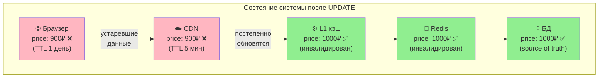
```mermaid
graph TB
    subgraph "Состояние системы после UPDATE"
        Browser["🌐 Браузер<br/>price: 900₽ ❌<br/>(TTL 1 день)"]
        CDN["☁️ CDN<br/>price: 900₽ ❌<br/>(TTL 5 мин)"]
        L1["⚙️ L1 кэш<br/>price: 1000₽ ✅<br/>(инвалидирован)"]
        Redis["🔴 Redis<br/>price: 1000₽ ✅<br/>(инвалидирован)"]
        DB["🗄️ БД<br/>price: 1000₽ ✅<br/>(source of truth)"]
    end
    
    Browser -.->|устаревшие<br/>данные| CDN
    CDN -.->|постепенно<br/>обновятся| L1
    L1 --> Redis
    Redis --> DB
    
    style Browser fill:#FFB6C1
    style CDN fill:#FFB6C1
    style L1 fill:#90EE90
    style Redis fill:#90EE90
    style DB fill:#90EE90
```

**Проблема:** Браузер и CDN не получили событие инвалидации!

**Решения:**
1. Короткий TTL на CDN (5-15 минут)
2. Версионирование URL: `/products/123?v=1702345678`
3. Cache-Control с `must-revalidate`
4. Webhook для CDN purge (дорого, но быстро)

---

*[Продолжение в следующем файле из-за ограничения размера]*
# Сценарий: Часть 1. Продвинутое кэширование (продолжение)

## БЛОК 3 (B). МНОГОУРОВНЕВОЕ КЭШИРОВАНИЕ И ОПТИМИЗАЦИИ (10-15 минут)

### 3.1. Боль многоуровневого кэширования

Мы хотим отдавать данные как можно ближе к пользователю. Зачем тянуть картинку из S3 в БД, если её может отдать CDN за 10ms? Зачем каждый раз ходить в Redis (2-5ms), если можно держать маленький L1-кэш прямо в памяти сервера (<1ms)?

**Но:** чем больше слоёв, тем сложнее поддерживать согласованность.

Вопрос: **какие данные на каком уровне держать?**

### 3.2. Heatmap: что где держим

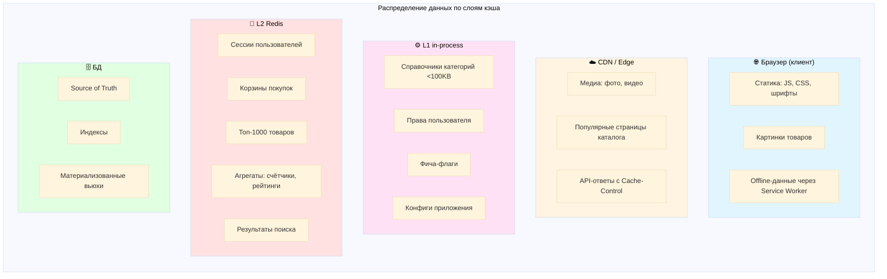
```mermaid
%%{init: {'theme':'base'}}%%
graph TB
    subgraph "Распределение данных по слоям кэша"
        direction TB
        
        subgraph Browser["🌐 Браузер (клиент)"]
            B1[Статика: JS, CSS, шрифты]
            B2[Картинки товаров]
            B3[Offline-данные через Service Worker]
        end
        
        subgraph CDN["☁️ CDN / Edge"]
            C1[Медиа: фото, видео]
            C2[Популярные страницы каталога]
            C3[API-ответы с Cache-Control]
        end
        
        subgraph L1["⚙️ L1 in-process"]
            L1_1[Справочники категорий <100KB]
            L1_2[Права пользователя]
            L1_3[Фича-флаги]
            L1_4[Конфиги приложения]
        end
        
        subgraph L2["🔴 L2 Redis"]
            L2_1[Сессии пользователей]
            L2_2[Корзины покупок]
            L2_3[Топ-1000 товаров]
            L2_4[Агрегаты: счётчики, рейтинги]
            L2_5[Результаты поиска]
        end
        
        subgraph DB["🗄️ БД"]
            DB1[Source of Truth]
            DB2[Индексы]
            DB3[Материализованные вьюхи]
        end
    end
    
    style Browser fill:#e1f5ff
    style CDN fill:#fff4e1
    style L1 fill:#ffe1f5
    style L2 fill:#ffe1e1
    style DB fill:#e1ffe1
```

**Критерии выбора слоя:**

| Критерий | Браузер | CDN | L1 | L2 | БД |
|----------|---------|-----|----|----|-----|
| **Размер данных** | <10MB | <100MB | <100KB | <10MB | Any |
| **Latency** | 0ms | 10-50ms | 0.1ms | 2-5ms | 20-100ms |
| **Частота обновлений** | Редко | Редко | Средне | Часто | Постоянно |
| **Допустимость stale** | Высокая | Высокая | Средняя | Низкая | N/A |
| **Стоимость** | Free | $$$ | $ | $$ | $$$ |

### 3.3. Read path через многоуровневый кэш

**Запрос карточки товара с полным проходом:**

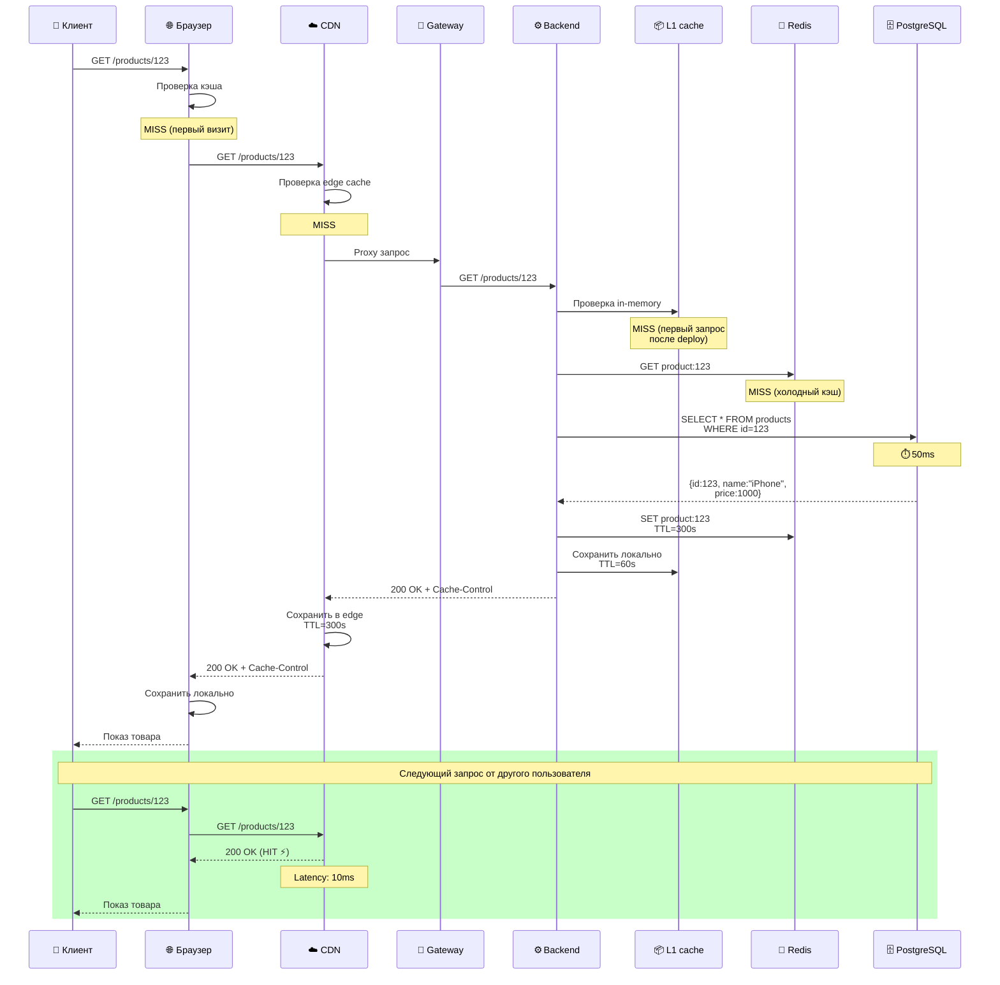
```mermaid
sequenceDiagram
    participant Client as 👤 Клиент
    participant Browser as 🌐 Браузер
    participant CDN as ☁️ CDN
    participant Gateway as 🚪 Gateway
    participant Backend as ⚙️ Backend
    participant L1 as 📦 L1 cache
    participant Redis as 🔴 Redis
    participant DB as 🗄️ PostgreSQL
    
    Client->>Browser: GET /products/123
    Browser->>Browser: Проверка кэша
    Note over Browser: MISS (первый визит)
    
    Browser->>CDN: GET /products/123
    CDN->>CDN: Проверка edge cache
    Note over CDN: MISS
    
    CDN->>Gateway: Proxy запрос
    Gateway->>Backend: GET /products/123
    
    Backend->>L1: Проверка in-memory
    Note over L1: MISS (первый запрос<br/>после deploy)
    
    Backend->>Redis: GET product:123
    Note over Redis: MISS (холодный кэш)
    
    Backend->>DB: SELECT * FROM products<br/>WHERE id=123
    Note over DB: ⏱️ 50ms
    DB-->>Backend: {id:123, name:"iPhone",<br/>price:1000}
    
    Backend->>Redis: SET product:123<br/>TTL=300s
    Backend->>L1: Сохранить локально<br/>TTL=60s
    Backend-->>CDN: 200 OK + Cache-Control
    CDN->>CDN: Сохранить в edge<br/>TTL=300s
    CDN-->>Browser: 200 OK + Cache-Control
    Browser->>Browser: Сохранить локально
    Browser-->>Client: Показ товара
    
    rect rgb(200, 255, 200)
        Note over Client,DB: Следующий запрос от другого пользователя
        Client->>Browser: GET /products/123
        Browser->>CDN: GET /products/123
        CDN-->>Browser: 200 OK (HIT ⚡)
        Note over CDN: Latency: 10ms
        Browser-->>Client: Показ товара
    end
```

**Метрики по слоям (типичные значения):**

```python
# Пример метрик за 1 час для товара #123
total_requests = 100_000

# Браузер (разные пользователи)
browser_hits = 0  # Каждый пользователь свой браузер

# CDN
cdn_requests = 100_000
cdn_hits = 95_000  # 95% hit rate
cdn_misses = 5_000

# L1 (на одном из 10 backend-серверов)
l1_requests = 500  # 5000 / 10 серверов
l1_hits = 400      # 80% hit rate
l1_misses = 100

# L2 Redis
l2_requests = 100 + 4900  # misses от всех L1 + свои запросы
l2_hits = 4500     # 90% hit rate
l2_misses = 500

# DB
db_requests = 500  # Только холодные запросы

# Средняя latency
avg_latency = (
    95_000 * 10ms +      # CDN hits
    4_500 * 3ms +        # Redis hits
    500 * 50ms           # DB queries
) / 100_000 = 12.9ms ✅
```

**Без кэша:** 100k * 50ms = 5000 секунд CPU времени БД  
**С кэшем:** 500 * 50ms = 25 секунд CPU времени БД  
**Выигрыш:** 200x снижение нагрузки на БД! 🎉

### 3.4. Write path: как обновлять многоуровневый кэш

**Порядок обновления (правильный):**

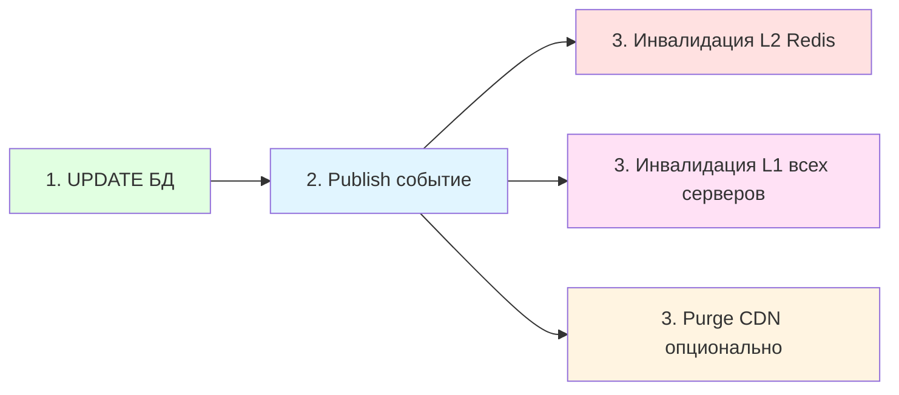
```mermaid
graph LR
    A[1. UPDATE БД] --> B[2. Publish событие]
    B --> C[3. Инвалидация L2 Redis]
    B --> D[3. Инвалидация L1 всех серверов]
    B --> E[3. Purge CDN опционально]
    
    style A fill:#e1ffe1
    style B fill:#e1f5ff
    style C fill:#ffe1e1
    style D fill:#ffe1f5
    style E fill:#fff4e1
```

**Псевдокод:**

```python
def update_product_price(product_id, new_price):
    # 1. Обновляем source of truth
    db.execute(
        "UPDATE products SET price = ?, updated_at = NOW() WHERE id = ?",
        new_price, product_id
    )
    
    # 2. Публикуем событие для всех подписчиков
    event = {
        "type": "product.price_updated",
        "product_id": product_id,
        "new_price": new_price,
        "timestamp": datetime.now().isoformat()
    }
    
    event_bus.publish("product.updated", event)
    
    # Подписчики на событие (на каждом backend-сервере):
    # - Очищают L1
    # - Очищают L2 Redis
    # - Опционально: отправляют purge в CDN

# На каждом backend-сервере:
@event_bus.subscribe("product.updated")
def handle_product_update(event):
    product_id = event["product_id"]
    
    # Инвалидация L1 (локальный кэш этого сервера)
    l1_cache.delete(f"product:{product_id}")
    
    # Инвалидация L2 (Redis, shared)
    redis.delete(f"product:{product_id}")
    redis.delete(f"product:card:{product_id}")  # Может быть несколько ключей
    
    # Опционально: CDN purge для критичных данных
    if event["new_price"] < event.get("old_price", float('inf')):
        # Цена упала — важно показать быстрее!
        cdn_api.purge_url(f"/products/{product_id}")
```

**Важно:** Инвалидация через `DELETE`, а не через `SET new_value`!

Почему?
- `DELETE` + lazy load безопаснее от гонок
- Следующий запрос сам подгрузит свежие данные
- `SET` может записать stale данные при race condition

### 3.5. Тегирование для массовой инвалидации

**Проблема:** Изменилась цена всей категории "Электроника" (10,000 товаров). Как инвалидировать?

**Наивный подход:**
```python
# ❌ Плохо: 10,000 DELETE запросов к Redis
for product_id in electronics_products:
    redis.delete(f"product:{product_id}")
```

**Лучше: тегирование ключей**

```python
# При записи в кэш добавляем теги
redis.set(f"product:{product_id}", data)
redis.sadd(f"tag:category:electronics", f"product:{product_id}")

# При обновлении категории
def update_category_prices(category_id, discount_percent):
    # 1. Обновляем БД
    db.execute(
        "UPDATE products SET price = price * (1 - ?) WHERE category_id = ?",
        discount_percent, category_id
    )
    
    # 2. Массовая инвалидация по тегу
    tagged_keys = redis.smembers(f"tag:category:{category_id}")
    
    if len(tagged_keys) < 1000:
        # Мало ключей — удаляем по одному
        redis.delete(*tagged_keys)
    else:
        # Много ключей — увеличиваем версию тега
        redis.incr(f"tag:category:{category_id}:version")
        # Старые ключи протухнут по TTL
```

**Схема версионирования тегов:**

```python
# Чтение с версионированием
def get_product_with_tag(product_id, category_id):
    # Получаем текущую версию тега категории
    tag_version = redis.get(f"tag:category:{category_id}:version") or "0"
    
    # Ключ включает версию
    cache_key = f"product:{product_id}:v{tag_version}"
    
    data = redis.get(cache_key)
    if data:
        return json.loads(data)
    
    # Cache miss
    data = db.query(product_id)
    redis.set(cache_key, json.dumps(data), ex=300)
    return data

# При обновлении категории просто увеличиваем версию
redis.incr(f"tag:category:{category_id}:version")
# Все старые ключи с v0 станут недоступны
# Новые запросы будут использовать v1
```

### 3.6. Версионирование при деплоях

**Проблема:** Деплоим новую версию кода, меняется схема данных в кэше.

**Пример:**
```python
# Старая версия кода
product = {"id": 123, "name": "iPhone", "price": 1000}

# Новая версия кода (добавили поле discount)
product = {"id": 123, "name": "iPhone", "price": 1000, "discount": 0.1}
```

**Решение: версионирование ключей**

```python
# Версия схемы в константе
CACHE_SCHEMA_VERSION = "v2"

def get_product(product_id):
    cache_key = f"product:{product_id}:{CACHE_SCHEMA_VERSION}"
    
    data = redis.get(cache_key)
    if data:
        return json.loads(data)
    
    data = db.query(product_id)
    redis.set(cache_key, json.dumps(data), ex=300)
    return data
```

**Blue-Green deploy с кэшем:**

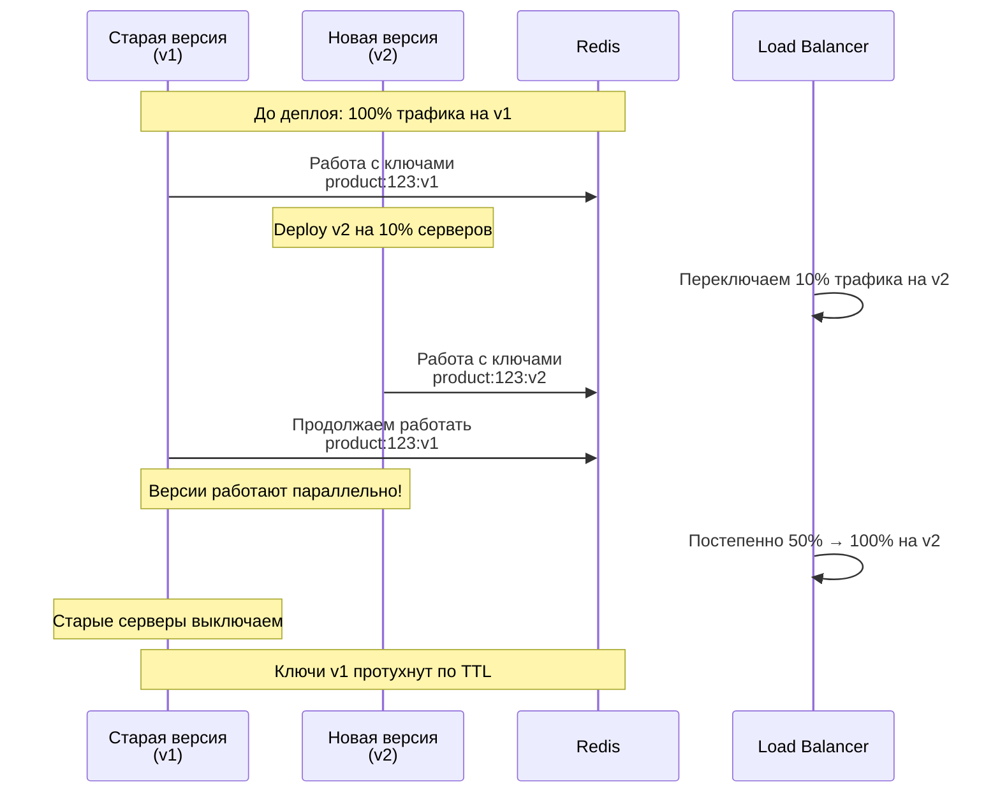
```mermaid
sequenceDiagram
    participant Old as Старая версия<br/>(v1)
    participant New as Новая версия<br/>(v2)
    participant Redis as Redis
    participant LB as Load Balancer
    
    Note over Old,Redis: До деплоя: 100% трафика на v1
    
    Old->>Redis: Работа с ключами<br/>product:123:v1
    
    Note over New: Deploy v2 на 10% серверов
    
    LB->>LB: Переключаем 10% трафика на v2
    
    New->>Redis: Работа с ключами<br/>product:123:v2
    Old->>Redis: Продолжаем работать<br/>product:123:v1
    
    Note over Old,New: Версии работают параллельно!
    
    LB->>LB: Постепенно 50% → 100% на v2
    
    Note over Old: Старые серверы выключаем
    Note over Old,Redis: Ключи v1 протухнут по TTL
```

**Преимущества:**
- ✅ Нет race conditions между версиями
- ✅ Можно откатиться без сброса кэша
- ✅ Постепенный rollout

**Недостатки:**
- ❌ Двойной расход памяти Redis (временно)
- ❌ Нужно планировать версионирование заранее

### 3.7. Оптимизации под реальные паттерны трафика

#### Проблема 1: Hot Keys (горячие ключи)

**Сценарий:** "Товар дня" — 100,000 запросов в секунду на один ключ.

**Проблема:** Даже Redis не справится с таким QPS на один ключ.

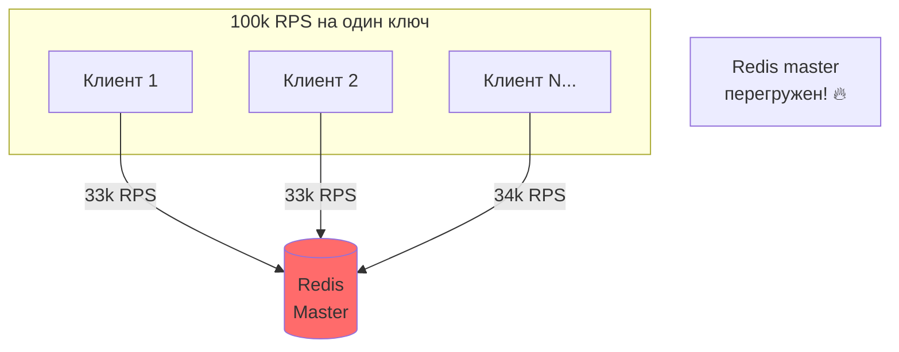
```mermaid
graph TB
    subgraph "100k RPS на один ключ"
        Client1[Клиент 1]
        Client2[Клиент 2]
        ClientN[Клиент N...]
    end
    
    Redis[(Redis<br/>Master)]
    
    Client1 -->|33k RPS| Redis
    Client2 -->|33k RPS| Redis
    ClientN -->|34k RPS| Redis
    
    style Redis fill:#ff6b6b
    
    Note[Redis master<br/>перегружен! 🔥]
```

**Решение A: Репликация в L1**

```python
# Храним hot keys локально на каждом backend-сервере
HOT_KEYS = {"product:12345"}  # Товар дня

def get_product(product_id):
    cache_key = f"product:{product_id}"
    
    # Для hot keys — всегда проверяем L1 первым
    if cache_key in HOT_KEYS:
        data = l1_cache.get(cache_key)
        if data:
            return data
        
        # L1 miss — идём в Redis, но с коротким TTL
        data = redis.get(cache_key)
        if data:
            # Сохраняем в L1 с коротким TTL (30 секунд)
            l1_cache.set(cache_key, data, ttl=30)
            return data
    
    # Обычная логика для не-hot keys
    return get_from_redis_or_db(product_id)
```

**Результат:** 100k RPS распределяются по 10 backend-серверам = 10k RPS на сервер из L1 (легко).

**Решение B: Separate tier для hot keys**

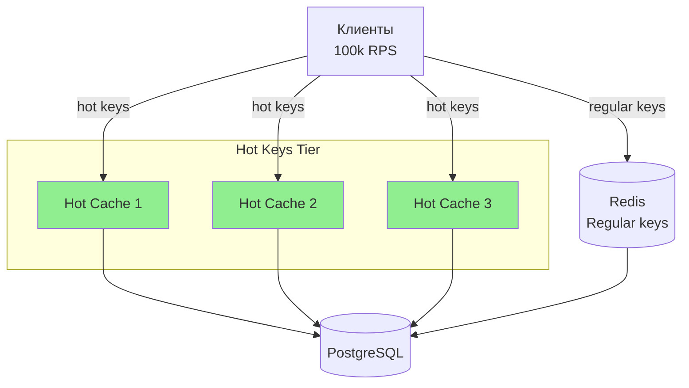
```mermaid
graph TB
    Clients[Клиенты<br/>100k RPS]
    
    subgraph "Hot Keys Tier"
        Hot1[Hot Cache 1]
        Hot2[Hot Cache 2]
        Hot3[Hot Cache 3]
    end
    
    Redis[(Redis<br/>Regular keys)]
    DB[(PostgreSQL)]
    
    Clients -->|hot keys| Hot1
    Clients -->|hot keys| Hot2
    Clients -->|hot keys| Hot3
    Clients -->|regular keys| Redis
    
    Hot1 --> DB
    Hot2 --> DB
    Hot3 --> DB
    Redis --> DB
    
    style Hot1 fill:#90EE90
    style Hot2 fill:#90EE90
    style Hot3 fill:#90EE90
```

#### Проблема 2: Cache Stampede (thundering herd)

Разберём подробно в Блоке 4.

#### Проблема 3: Cold Start (холодный старт)

**Сценарий:** Деплой новой версии → весь in-memory кэш сбросился → БД получает 10x нагрузку.

**Решение: Batch pre-warming**

```python
# При старте сервера
def warmup_cache():
    logger.info("Starting cache warmup...")
    
    # Загружаем топ-1000 товаров из БД
    top_products = db.query("""
        SELECT * FROM products 
        ORDER BY views_last_24h DESC 
        LIMIT 1000
    """)
    
    # Кладём в кэш батчами по 100
    for batch in chunks(top_products, 100):
        pipeline = redis.pipeline()
        for product in batch:
            key = f"product:{product.id}"
            pipeline.set(key, json.dumps(product), ex=300)
        pipeline.execute()
        
        time.sleep(0.1)  # Не убиваем Redis
    
    logger.info(f"Warmed up {len(top_products)} products")

# В main()
if __name__ == "__main__":
    warmup_cache()
    start_server()
```

**Метрики warmup:**

```python
# Цель: достичь 80% hit rate за 2 минуты после старта

time_to_80_percent_hit_rate = measure_warmup()
# Хорошо: < 2 минуты
# Плохо: > 5 минут — нужно оптимизировать warmup
```

#### Проблема 4: Request Coalescing (single flight)

**Сценарий:** 100 запросов одновременно на один ключ, которого нет в кэше.

**Наивный код:**
```python
# ❌ Плохо: 100 запросов пойдут в БД одновременно
def get_product(product_id):
    data = redis.get(f"product:{product_id}")
    if data is None:
        data = db.query(product_id)  # 100 параллельных запросов!
        redis.set(f"product:{product_id}", data, ex=300)
    return data
```

**С single flight (Golang пример):**

```go
import "golang.org/x/sync/singleflight"

var group singleflight.Group

func getProduct(productID int) (*Product, error) {
    key := fmt.Sprintf("product:%d", productID)
    
    // singleflight гарантирует, что только один запрос
    // пойдёт в БД, остальные подождут результата
    v, err, shared := group.Do(key, func() (interface{}, error) {
        // Проверяем Redis
        data, err := redis.Get(key)
        if err == nil {
            return data, nil
        }
        
        // Идём в БД (только один поток!)
        product, err := db.Query(productID)
        if err != nil {
            return nil, err
        }
        
        // Кладём в Redis
        redis.Set(key, product, 300*time.Second)
        return product, nil
    })
    
    if shared {
        log.Printf("Request coalesced for product %d", productID)
    }
    
    return v.(*Product), err
}
```

**Результат:** 100 запросов → 1 запрос в БД ✅

### 3.8. Метрики и наблюдаемость

**Dashboard для многоуровневого кэша:**

```python
# Prometheus metrics (пример)

# Hit rate по слоям
cache_hit_rate{layer="l1"} 0.75      # 75%
cache_hit_rate{layer="l2"} 0.90      # 90%
cache_hit_rate{layer="cdn"} 0.95     # 95%

# Latency по слоям (P99)
cache_latency_p99{layer="l1"} 0.5    # 0.5ms
cache_latency_p99{layer="l2"} 3.0    # 3ms
cache_latency_p99{layer="cdn"} 15.0  # 15ms
db_latency_p99 50.0                  # 50ms

# Количество инвалидаций
cache_invalidations_per_sec 150

# Hot keys
cache_hot_keys_detected 3
```

**Когда добавить/убрать слой кэша:**

```
Добавить L1 если:
- L2 hit rate > 80%, но latency всё равно высокая (>5ms)
- Есть очень горячие ключи (>10k RPS на ключ)
- Читаем одни и те же справочники постоянно

Убрать L1 если:
- Hit rate < 50% — накладные расходы не оправдываются
- Проблемы с coherence — L1 постоянно устаревает
- Memory pressure на backend-серверах

Добавить CDN если:
- Много статики и медиа
- Пользователи географически распределены
- Можем позволить eventual consistency

Убрать CDN если:
- Данные меняются слишком часто (TTL < 10 секунд)
- Нужна strong consistency
- Высокая стоимость purge операций
```

---

## БЛОК 4 (C). СЛОЖНЫЕ ПРОБЛЕМЫ И ПРАКТИКА (10-15 минут)

### 4.1. Thundering Herd / Cache Stampede

**Самая частая проблема в продакшене.**

**Сценарий:**

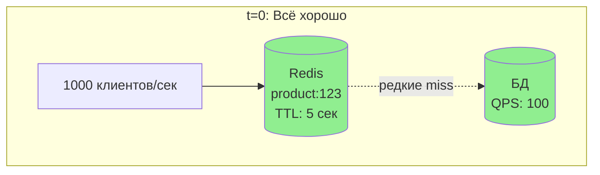
```mermaid
graph TB
    subgraph "t=0: Всё хорошо"
        C1[1000 клиентов/сек]
        Redis1[(Redis<br/>product:123<br/>TTL: 5 сек)]
        DB1[(БД<br/>QPS: 100)]
    end
    
    C1 --> Redis1
    Redis1 -.->|редкие miss| DB1
    
    style Redis1 fill:#90EE90
    style DB1 fill:#90EE90
```

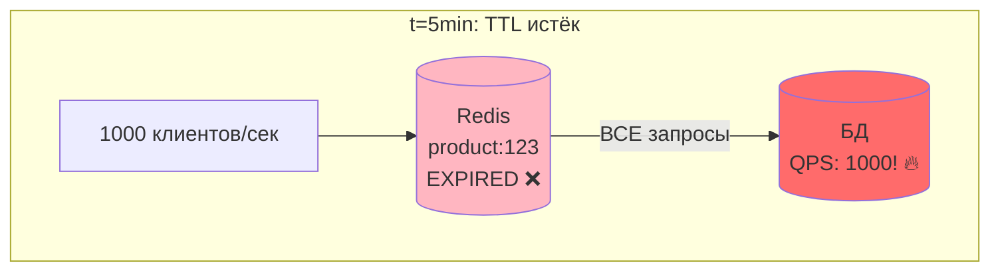
```mermaid
graph TB
    subgraph "t=5min: TTL истёк"
        C2[1000 клиентов/сек]
        Redis2[(Redis<br/>product:123<br/>EXPIRED ❌)]
        DB2[(БД<br/>QPS: 1000! 🔥)]
    end
    
    C2 --> Redis2
    Redis2 -->|ВСЕ запросы| DB2
    
    style Redis2 fill:#FFB6C1
    style DB2 fill:#ff6b6b
```

**Timeline инцидента:**

```
08:00:00 — Товар дня опубликован, QPS 1000/сек
08:00:30 — Первый запрос кладёт товар в кэш, TTL 300 сек
08:00:31 — 08:05:29 — Все запросы идут из кэша ✅
08:05:30 — TTL истёк, ключ удалён из Redis
08:05:30 — 1000 запросов одновременно идут в БД 🔥
08:05:31 — БД перегружена, latency 5 секунд
08:05:35 — Пользователи видят ошибки 500
08:06:00 — Кто-то положил товар обратно в кэш
08:06:01 — Система восстановилась
```

**График нагрузки:**

```
БД QPS
  ^
  |
1k|     *
  |    * *
  |   *   *
  |  *     *_______________
  | *
100|*
  +-----|-----|-----|------> время
     08:00  08:05  08:10
            ↑
         stampede!
```

#### Решение 1: Single Flight (request coalescing)

Уже разобрали выше — только один запрос идёт в БД.

#### Решение 2: Early Refresh (заглядывание вперёд)

```python
import time

def get_product_with_early_refresh(product_id):
    cache_key = f"product:{product_id}"
    TTL = 300  # 5 минут
    EARLY_REFRESH_WINDOW = 30  # 30 секунд до истечения
    
    # Получаем данные + timestamp их записи
    cached = redis.get_with_timestamp(cache_key)
    
    if cached is not None:
        data, cached_at = cached
        age = time.time() - cached_at
        
        # Если до истечения TTL осталось < 30 секунд
        if age > (TTL - EARLY_REFRESH_WINDOW):
            # Асинхронно обновляем кэш в фоне
            asyncio.create_task(refresh_cache_in_background(product_id))
        
        # Возвращаем текущие данные (пусть чуть устаревшие)
        return data
    
    # Cache miss — обычная загрузка
    return load_from_db_and_cache(product_id)

async def refresh_cache_in_background(product_id):
    data = await db.query_async(product_id)
    await redis.set_async(f"product:{product_id}", data, ex=300)
```

**Результат:** Кэш обновляется до истечения TTL, stampede не происходит.

#### Решение 3: Jittered TTL (рандомизация)

```python
import random

# ❌ Плохо: все ключи истекают одновременно
redis.set(key, data, ex=300)  # Ровно 300 секунд

# ✅ Хорошо: добавляем случайный jitter ±10%
base_ttl = 300
jitter = random.randint(-30, 30)  # ±10%
redis.set(key, data, ex=base_ttl + jitter)
```

**Результат:** Ключи истекают равномерно во времени, нет одновременного stampede.

### 4.2. Stale Data (устаревшие данные)

**Где можно жить с stale данными:**

| Тип данных | Допустимое окно | Стратегия |
|------------|-----------------|-----------|
| Лента новостей | 1-5 минут | TTL-only |
| Счётчики лайков | 10-60 секунд | TTL-only |
| Рекомендации | 1-10 минут | TTL + периодический пересчёт |
| Каталог товаров | 30-60 секунд | Event-based + fallback TTL |

**Где НЕЛЬЗЯ жить с stale данными:**

| Тип данных | Требование | Стратегия |
|------------|------------|-----------|
| Баланс счёта | <1 секунды | Read-through с БД, lease-based |
| Остатки на складе | <5 секунд | Short TTL + проверка при checkout |
| Лимиты (rate limiting) | Real-time | Distributed counter, no cache |
| Права доступа (ACL) | <10 секунд | Event-based инвалидация |

**Пример: баланс пользователя**

```python
def get_user_balance(user_id):
    # Кэш используем только для снижения нагрузки,
    # НО не как source of truth
    
    cache_key = f"balance:{user_id}"
    cached_balance = redis.get(cache_key)
    
    # Для критичных операций ВСЕГДА проверяем БД
    if is_financial_operation():
        return db.query_balance(user_id)  # Всегда из БД!
    
    # Для отображения можно использовать кэш
    if cached_balance is not None:
        return float(cached_balance)
    
    # Cache miss
    balance = db.query_balance(user_id)
    redis.set(cache_key, balance, ex=5)  # Короткий TTL!
    return balance

def withdraw_money(user_id, amount):
    # Критичная операция — всегда из БД с блокировкой
    with db.transaction():
        balance = db.query_balance(user_id, for_update=True)  # SELECT FOR UPDATE
        
        if balance < amount:
            raise InsufficientFunds()
        
        new_balance = balance - amount
        db.update_balance(user_id, new_balance)
        
        # Инвалидируем кэш
        redis.delete(f"balance:{user_id}")
        event_bus.publish("balance.updated", {"user_id": user_id})
    
    return new_balance
```

### 4.3. Продакшен-инциденты (реальные истории)

#### Инцидент 1: Старая цена в кэше

**Компания:** Маркетплейс (анонимизировано)  
**Дата:** Чёрная пятница 2023

**Симптомы:**
- 12:00 — Начинается распродажа, цены на 10k товаров снижены на 50%
- 12:05 — Пользователи жалуются: "В каталоге цена 500₽, в корзине 1000₽"
- 12:10 — Поддержка завалена обращениями

**Root cause:**
```python
# Баг в коде обновления цен
def update_prices_for_sale(product_ids, discount):
    for product_id in product_ids:
        # Обновили БД ✅
        db.update_price(product_id, discount)
        
        # Забыли инвалидировать кэш! ❌
        # redis.delete(f"product:{product_id}")
```

**Timeline:**
```
11:50 — Маркетинг запускает скидки через admin-панель
11:55 — БД обновлена, цены снижены
12:00 — Пользователи заходят
12:01 — Каталог показывает старые цены из кэша (TTL 5 минут)
12:05 — Первые жалобы
12:10 — Инженеры обнаружили проблему
12:11 — FLUSHALL в Redis (сброс всего кэша)
12:12 — БД получила 10x нагрузку (холодный кэш)
12:15 — Система восстановилась, цены корректные
```

**Фикс:**
```python
def update_prices_for_sale(product_ids, discount):
    # Батчовое обновление БД
    db.batch_update_prices(product_ids, discount)
    
    # Инвалидация через событие
    event_bus.publish("prices.bulk_update", {
        "product_ids": product_ids,
        "timestamp": now()
    })
    
    # Немедленная инвалидация в Redis
    if len(product_ids) < 1000:
        redis.delete(*[f"product:{pid}" for pid in product_ids])
    else:
        # Слишком много ключей — увеличиваем версию тега
        redis.incr("tag:sale:version")
```

**Уроки:**
1. Всегда инвалидировать кэш при обновлении критичных данных
2. Иметь мониторинг расхождений кэш vs БД
3. Тестировать bulk-операции под нагрузкой

#### Инцидент 2: Split-brain в Redis кластере

**Компания:** SaaS платформа  
**Дата:** 2024

**Симптомы:**
- 03:00 — Сетевой сбой в ДЦ
- 03:05 — Половина пользователей видит корректные данные, половина — старые
- 03:10 — Система "раздвоилась"

**Root cause:**

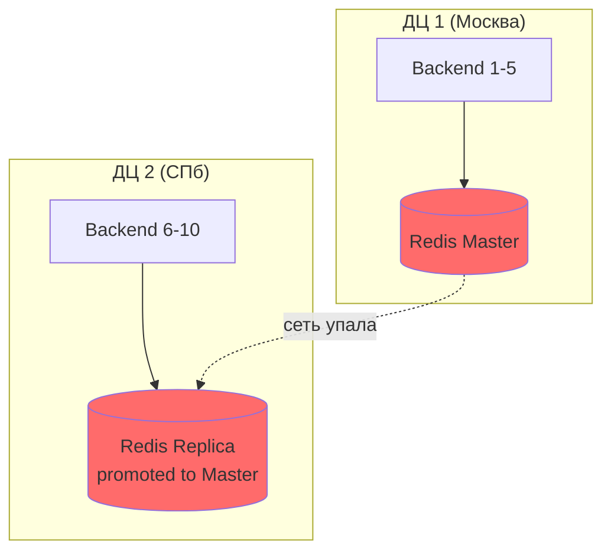
```mermaid
graph TB
    subgraph "ДЦ 1 (Москва)"
        B1[Backend 1-5]
        R1[(Redis Master)]
    end
    
    subgraph "ДЦ 2 (СПб)"
        B2[Backend 6-10]
        R2[(Redis Replica<br/>promoted to Master)]
    end
    
    B1 --> R1
    B2 --> R2
    
    R1 -.->|сеть упала| R2
    
    style R1 fill:#ff6b6b
    style R2 fill:#ff6b6b
```

**Timeline:**
```
03:00 — Сетевой сбой, Redis replica в СПб потеряла связь с master
03:01 — Redis Sentinel автоматически продвинул replica в master
03:02 — Теперь два master'а (split-brain!)
03:05 — Пользователи пишут в разные Redis
03:10 — Обнаружили проблему
03:15 — Вручную отключили один из master'ов
03:20 — Ресинхронизация данных
03:30 — Восстановлено
```

**Фикс:**
- Правильная настройка Redis Sentinel quorum
- Мониторинг split-brain ситуаций
- Автоматическое отключение "меньшинства" при partition

#### Инцидент 3: Cache всегда холодный

**Компания:** E-commerce  
**Дата:** 2023

**Симптомы:**
- Hit rate постоянно < 30%
- БД перегружена
- Latency P99 = 500ms (при норме 100ms)

**Root cause:**

```python
# Неправильная настройка Redis eviction
maxmemory-policy allkeys-random  # ❌ Случайная эвикция!
```

Redis выбрасывал случайные ключи, включая горячие товары.

**Фикс:**
```python
# Правильная настройка
maxmemory-policy allkeys-lru  # ✅ LRU eviction
maxmemory 10gb

# + Мониторинг eviction rate
if evicted_keys_per_sec > 1000:
    alert("Redis evicting too much! Increase memory.")
```

### 4.4. Кэш на собеседовании (подробный разбор)

**Задача от интервьюера:**

> "Спроектируйте систему для маркетплейса с 100k RPS.  
> Есть каталог (1M товаров), корзины (500k активных), заказы (10k/день).  
> Как будете использовать кэш?"

**❌ Плохой ответ (Junior/Middle без опыта):**

> "Поставлю Redis. Буду кэшировать всё с TTL 60 секунд.  
> Если база упадёт, кэш подхватит."

**Проблемы:**
- Нет уточняющих вопросов
- "Всё" — плохая стратегия (память, coherence)
- Redis не заменяет БД

**✅ Хороший ответ (Senior/Lead):**

*Шаг 1: Уточняющие вопросы*

> "Отлично, давайте уточню несколько моментов:
>
> 1. **Какие данные самые горячие?**
     >    - Карточки товаров? Корзины? Сессии?
>    - Есть ли "товары дня" с аномальным QPS?
>
> 2. **SLA по latency?**
     >    - P99 < 100ms? P50 < 50ms?
>    - Разные SLA для разных страниц?
>
> 3. **Требования к свежести данных?**
     >    - Цены — насколько критично показывать актуальные?
>    - Остатки на складе — можем ли oversell?
>    - Корзина — eventual consistency окей?
>
> 4. **Бюджет на инфраструктуру?**
     >    - Можем ли позволить CDN?
>    - Сколько памяти под Redis?
>
> 5. **Географическое распределение?**
     >    - Пользователи только в РФ или worldwide?"

*Интервьюер даёт ответы, например:*
- Горячие: топ-10k товаров (80% трафика), корзины, сессии
- SLA: P99 < 100ms для каталога, <50ms для корзины
- Цены: eventual consistency до 30 сек окей
- Остатки: критично, нельзя oversell
- Бюджет: средний, CDN можем
- География: РФ + СНГ

*Шаг 2: Архитектурное решение*

```
Предлагаю многоуровневую схему:

┌─────────────────────────────────────────┐
│ УРОВЕНЬ 1: CDN (CloudFlare)             │
├─────────────────────────────────────────┤
│ - Статика (JS/CSS/images): TTL 1 день   │
│ - Страницы каталога: TTL 5 минут        │
│ - Hit rate цель: >95%                    │
└─────────────────────────────────────────┘
            ↓ 5% miss
┌─────────────────────────────────────────┐
│ УРОВЕНЬ 2: L1 in-process кэш            │
│ (на каждом из 20 backend-серверов)      │
├─────────────────────────────────────────┤
│ - Справочники категорий: TTL 1 мин      │
│ - Права доступа: TTL 30 сек             │
│ - Топ-100 товаров: TTL 30 сек           │
│ - Размер: 100 MB/сервер, LRU            │
│ - Hit rate цель: >70%                    │
└─────────────────────────────────────────┘
            ↓ 30% miss
┌─────────────────────────────────────────┐
│ УРОВЕНЬ 3: Redis кластер (6 нод)        │
├─────────────────────────────────────────┤
│ - Горячие товары (top-10k): TTL 5 мин   │
│ - Корзины: TTL 1 час                     │
│ - Сессии: TTL по токену                  │
│ - Агрегаты (счётчики): TTL 30 сек       │
│ - Размер: 64 GB, LRU eviction           │
│ - Hit rate цель: >90%                    │
└─────────────────────────────────────────┘
            ↓ 10% miss
┌─────────────────────────────────────────┐
│ УРОВЕНЬ 4: PostgreSQL                    │
├─────────────────────────────────────────┤
│ - Source of Truth                        │
│ - Master-Replica setup                   │
│ - Reads: replica, Writes: master         │
└─────────────────────────────────────────┘
```

*Шаг 3: Особые случаи*

> "**Для критичных данных** (остатки товара):
> - В кэше храним только для отображения, TTL 10 секунд
> - При добавлении в корзину: проверка по БД
> - При оплате: SELECT FOR UPDATE (пессимистичная блокировка)
> - После продажи: event-based инвалидация
>
> **Для товаров дня** (hot keys):
> - Реплицируем в L1 всех серверов
> - Отдельный tier Redis для супер-горячих ключей
> - Request coalescing через singleflight
>
> **Защита от проблем:**
> - Thundering herd: jittered TTL + early refresh
> - Cold start: batch pre-warming топ-1000 товаров при deploy
> - Coherence: event-based инвалидация через Kafka"

*Шаг 4: Наблюдаемость*

> "**Метрики:**
> - Hit rate по каждому слою (CDN/L1/L2)
> - P99 latency breakdown
> - Stale read rate (через версионирование)
> - Redis memory usage & eviction rate
> - Hot keys detection (>10k RPS)
>
> **Alerts:**
> - Hit rate < 80% → проверить TTL, память
> - QPS на БД > 2x baseline → stampede?
> - Eviction rate > 1000/sec → увеличить память
>
> **Тестирование:**
> - Load test: 100k RPS, P99 < 100ms ✅
> - Chaos: Redis restart, проверка graceful degradation
> - Deploy: проверка cache warming < 2 минуты"

*Шаг 5: Trade-offs*

> "**Преимущества этого подхода:**
> - ✅ Низкая latency (90% запросов < 20ms)
> - ✅ Снижение нагрузки на БД в 100x
> - ✅ Устойчивость к stampede
> - ✅ Geographical distribution через CDN
>
> **Недостатки:**
> - ❌ Сложность поддержки многоуровневого кэша
> - ❌ Eventual consistency (до 30 сек)
> - ❌ Стоимость инфраструктуры (CDN + Redis)
>
> **Когда эта архитектура не подходит:**
> - Strong consistency критична (финтех)
> - Данные меняются слишком часто
> - Малая нагрузка (<1k RPS)"

**Что видит интервьюер:**
- ✅ Структурное мышление (вопросы → архитектура → детали)
- ✅ Понимание trade-offs
- ✅ Знание реальных проблем (stampede, hot keys, coherence)
- ✅ Практический опыт (метрики, тесты, мониторинг)
- ✅ Готовность к продакшену

### 4.5. Tricky кейсы

#### Кейс 1: Кэширование негативных результатов

**Проблема:** Пользователь ищет "асдфасдф" → пустая выдача → запрос в БД. Повторяет 100 раз → 100 запросов в БД.

**Решение:**

```python
def search_products(query):
    cache_key = f"search:{query}"
    
    result = redis.get(cache_key)
    if result is not None:
        return json.loads(result)
    
    # Поиск в БД
    products = db.search(query)
    
    if len(products) == 0:
        # Кэшируем ПУСТОЙ результат с коротким TTL
        redis.set(cache_key, "[]", ex=60)  # 60 секунд
    else:
        redis.set(cache_key, json.dumps(products), ex=300)
    
    return products
```

**Важно:** TTL для пустых результатов должен быть короче!

#### Кейс 2: Multi-tenant системы

**Баг:**

```python
# ❌ Забыли добавить tenant_id в ключ!
def get_user_settings(user_id):
    key = f"settings:{user_id}"  # БАГ!
    # ...
```

**Проблема:** User #123 в tenant A видит данные user #123 из tenant B!

**Фикс:**

```python
# ✅ Всегда включаем tenant_id
def get_user_settings(tenant_id, user_id):
    key = f"settings:{tenant_id}:{user_id}"
    # ...
```

#### Кейс 3: Кэш и права доступа

**Опасность:**

```python
# Пользователь был admin, закэшировали права
cache.set(f"acl:{user_id}", {"role": "admin"}, ex=3600)  # 1 час!

# Через 10 минут понизили до user
db.update("UPDATE users SET role = 'user' WHERE id = ?", user_id)

# Но кэш ещё 50 минут будет показывать admin! ❌
```

**Решение:**

```python
# Короткий TTL для прав
ACL_TTL = 60  # 1 минута

# + Event-based инвалидация при изменении прав
event_bus.subscribe("user.role_changed", lambda e: {
    redis.delete(f"acl:{e.user_id}")
})
```

### 4.6. Чеклист перед продакшеном

Проходите перед запуском:

✅ **1. Source of truth определён**
```
Где хранится истина? PostgreSQL
Допустимое окно рассинхрона?
- Каталог: 60 секунд
- Корзина: 5 секунд  
- Баланс: 1 секунда
```

✅ **2. Что кэшируем / что НЕ кэшируем**
```
КЭШИРУЕМ:
- Карточки товаров (TTL 5 мин)
- Каталог (TTL 1 мин)
- Агрегаты (TTL 30 сек)

НЕ КЭШИРУЕМ:
- Остатки (read-through с БД)
- Баланс (read-through с БД)
- Критичные финансовые операции
```

✅ **3. Стратегия инвалидации работает**
```
Механизм: Kafka events + fallback TTL
Тест: Вносим 500ms задержку → stale rate < 1% ✅
Fallback: При отказе Kafka — полагаемся на TTL
```

✅ **4. Защита от stampede**
```
- Single-flight: ✅ (singleflight.Group)
- Jittered TTL: ✅ (±10% рандом)
- Early refresh: ✅ (за 30 сек до истечения)
```

✅ **5. Мониторинг настроен**
```
Метрики:
- cache_hit_rate{layer} > 80%
- cache_latency_p99{layer} < 10ms
- db_qps < 1000 (baseline: 500)
- stale_read_rate < 0.01

Alerts:
- Hit rate drop >20% за 5 мин
- QPS spike >2x
- Hot key detected (>10k RPS)
```

✅ **6. Load tests пройдены**
```
Тест 1: 100k RPS → P99 < 100ms ✅
Тест 2: FLUSHALL Redis → recovery < 2 min ✅
Тест 3: Deploy с cache warming → hit rate 80% за 1 мин ✅
```

✅ **7. Runbook готов**
```
Если hit rate < 50%:
1. Проверить Redis memory (redis-cli INFO memory)
2. Проверить eviction rate (evicted_keys)
3. Если eviction >1000/sec → увеличить память
4. Escalate к SRE если не помогло

Если stampede:
1. Временно увеличить TTL (снизить частоту истечения)
2. Включить early refresh
3. Добавить jitter если нет
4. В крайнем случае — FLUSHALL и прогрев по батчам
```

---

## ЗАКЛЮЧЕНИЕ (2-3 минуты)

Мы разобрали три ключевых аспекта продвинутого кэширования:

1. **Cache Coherence** — как держать копии данных синхронными
    - Стратегии: TTL-only, event-based, lease-based
    - Trade-off между consistency и performance

2. **Многоуровневое кэширование** — как правильно распределить данные
    - Браузер → CDN → L1 → L2 → БД
    - Оптимизации: hot keys, request coalescing, cache warming

3. **Сложные проблемы** — что ломается в продакшене
    - Thundering herd, stale data, split-brain
    - Как это решать и мониторить

**Ключевые takeaways:**

- Кэш — это не просто "ускоритель", а архитектурный компонент
- Всегда есть trade-off между производительностью и согласованностью
- Инвалидация сложнее, чем кажется (race conditions, events, TTL)
- Мониторинг критически важен (hit rate, latency, stale reads)
- На собеседовании важнее задавать правильные вопросы, чем давать "готовое решение"

**Что дальше:**

В следующих частях мы разберём:
- Распределённые транзакции (2PC, Saga, Outbox pattern)
- Продвинутое шардирование (consistent hashing, rebalancing)
- Performance optimization (tail latency, throughput scaling)

**Практика:**

1. Возьмите свой проект — нарисуйте схему кэширования
2. Ответьте на 7 вопросов чеклиста
3. Добавьте метрики hit rate и stale reads
4. Проведите load test с симуляцией stampede

Спасибо за внимание! Вопросы?

---

## ДОПОЛНИТЕЛЬНЫЕ МАТЕРИАЛЫ

### Диаграммы для заметок

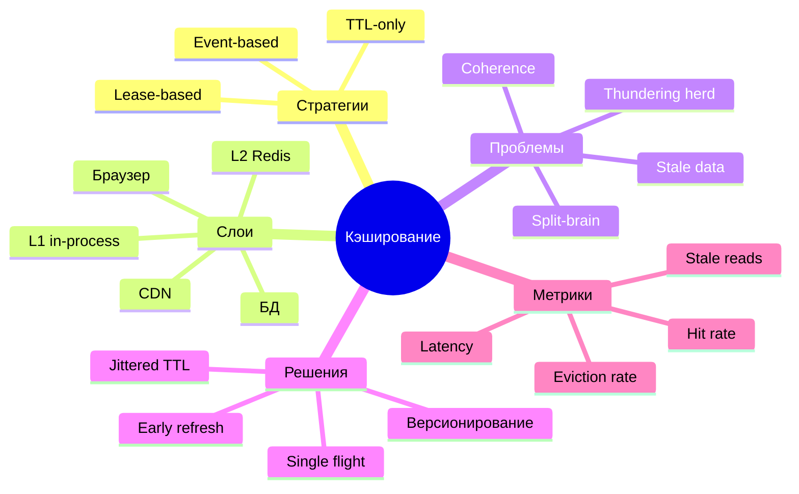
```mermaid
mindmap
  root((Кэширование))
    Стратегии
      TTL-only
      Event-based
      Lease-based
    Слои
      Браузер
      CDN
      L1 in-process
      L2 Redis
      БД
    Проблемы
      Thundering herd
      Stale data
      Coherence
      Split-brain
    Решения
      Single flight
      Jittered TTL
      Early refresh
      Версионирование
    Метрики
      Hit rate
      Latency
      Stale reads
      Eviction rate
```

### Полезные ссылки

**Теория:**
- Designing Data-Intensive Applications (Martin Kleppmann) — Chapter 5
- "Cache made consistent" — Meta Engineering
- "Distributed Caching Woes" — Medium

**Практика:**
- Redis documentation: Caching patterns
- Memcached documentation
- singleflight package (Golang)

**Доклады:**
- "Effective Caching Strategies" (YouTube)
- "Thundering Herd Problem" (conf talks)
- Highload++ доклады по кэшированию

---

**Конец сценария**