# Сценарий: Часть 1. Продвинутое кэширование и консистентность кэша

**Домен примеров:** Интернет-магазин / маркетплейс  
**Общее время:** 35-45 минут  
**Целевая аудитория:** Middle+ backend разработчики

---

## ВВЕДЕНИЕ (1-2 минуты)

Привет! Мы начинаем продвинутую часть курса по системному дизайну. В предыдущих главах мы говорили про кэш на уровне "вот Redis, он ускоряет запросы к базе". Это правда, но очень поверхностно.

На практике это ещё и опасное упрощение: неправильно спроектированный кэш легко делает обратное — замедляет сервис или под нагрузкой вообще кладёт систему. И делает это разными, неочевидными способами, к которым мы вернёмся в конце этой части.

В реальности кэш — это не просто "ускоритель". Это архитектурный компонент, который может как спасти вашу систему под нагрузкой, так и создать труднодебажимые баги, из-за которых пользователи видят неправильные данные.

В этой части мы разберём три ключевых вопроса:
1. Как правильно распределить данные по уровням кэша? (Многоуровневое кэширование)
2. Как держать копии данных синхронными в распределённой системе? (Cache Coherence)
3. Что делать, когда всё ломается под нагрузкой? (Сложные проблемы)

Для примеров я буду использовать маркетплейс с миллионами товаров, корзинами, заказами — всё как в реальной жизни.

Поехали!

---

## БЛОК 1. МОДЕЛЬ КЭША И БАЗОВЫЕ ПАТТЕРНЫ (3-5 минут)

### 1.1. Зачем нужен кэш в продакшене?

Давайте начнём с конкретной боли. Представьте: у вас маркетплейс, на оформление заказа нужно показать актуальный курс валют. Вы интегрировались с внешним сервисом курсов.

**Проблема:** Каждый пользователь при оформлении заказа дёргает этот API. У вас 200 тысяч активных пользователей. Внешний API не ваш, он может упасть, тормозить или банально заблокировать вас за DDoS.

**Решение:** Отдельный воркер раз в минуту запрашивает курсы и кладёт их в Redis. Все запросы пользователей читают из кэша, а не лупят внешний API.

Это типичный кейс. Кэш нужен для:
- **Разгрузки БД и внешних API** — вместо 100k запросов в секунду делаем 100
- **Ускорения горячих чтений** — карточка товара за 2ms вместо 50ms из БД
- **Переиспользования дорогих вычислений** — рекомендации, агрегаты, отчёты

Кэш в архитектурных терминах: **быстрый, ограниченный, потенциально устаревающий слой рядом с медленным источником истины**.

Ключевые метрики:
- **Hit rate** — процент запросов, которые нашли данные в кэше
- **Latency** — время ответа из кэша vs из БД
- **TTL** (Time To Live) — как долго данные живут в кэше

Базовая терминология:
- `cache hit` / `cache miss` — нашли/не нашли в кэше
- `hot key` — очень популярный ключ (например, товар дня)
- `stale data` — устаревшие данные в кэше

### 1.2. Слои кэширования: от браузера до базы данных

Теперь важный момент: у нас не один кэш, а **целая пирамида слоёв**.

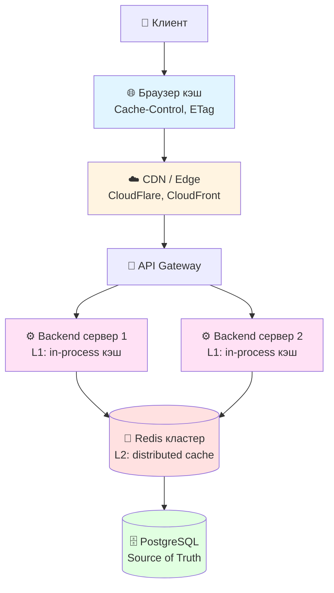
```mermaid
graph TB
    Client[👤 Клиент]
    Browser[🌐 Браузер кэш<br/>Cache-Control, ETag]
    CDN[☁️ CDN / Edge<br/>CloudFlare, CloudFront]
    Gateway[🚪 API Gateway]
    Backend1[⚙️ Backend сервер 1<br/>L1: in-process кэш]
    Backend2[⚙️ Backend сервер 2<br/>L1: in-process кэш]
    Redis[(🔴 Redis кластер<br/>L2: distributed cache)]
    DB[(🗄️ PostgreSQL<br/>Source of Truth)]
    
    Client --> Browser
    Browser --> CDN
    CDN --> Gateway
    Gateway --> Backend1
    Gateway --> Backend2
    Backend1 --> Redis
    Backend2 --> Redis
    Redis --> DB
    
    style Browser fill:#e1f5ff
    style CDN fill:#fff4e1
    style Backend1 fill:#ffe1f5
    style Backend2 fill:#ffe1f5
    style Redis fill:#ffe1e1
    style DB fill:#e1ffe1
```

**Что на каком уровне держим в маркетплейсе:**

| Слой | Что лежит | Типичный TTL |
|------|-----------|--------------|
| **Браузер** | JS/CSS/картинки, куски каталога | 1 день - 1 неделя |
| **CDN** | Медиа, страницы товаров, статика | 5-60 минут |
| **L1 (in-process)** | Справочники категорий, права, фича-флаги | 30-60 секунд |
| **L2 (Redis)** | Сессии, корзины, популярные товары, счётчики | 5 минут - 1 час |
| **БД** | Source of Truth, индексы, материализованные вьюхи | - |

### 1.3. Базовый паттерн: Cache-Aside

Давайте разберём самый популярный паттерн — **Cache-Aside** (lazy loading).

**Псевдокод для запроса карточки товара (PHP + Symfony):**

```php
<?php

use Doctrine\DBAL\Connection;
use Psr\Cache\CacheItemPoolInterface;

final class ProductService
{
    public function __construct(
        private Connection $connection,
        private CacheItemPoolInterface $cache, // Symfony Cache (Redis adapter)
    ) {}

    public function getProduct(int $productId): ?array
    {
        // Шаг 1: проверяем Redis (через Symfony Cache)
        $cacheKey = sprintf('product.%d', $productId);
        $item = $this->cache->getItem($cacheKey);

        if ($item->isHit()) {
            // Cache HIT — возвращаем данные из кэша
            return $item->get();
        }

        // Шаг 2: Cache MISS — идём в PostgreSQL
        $product = $this->connection->fetchAssociative(
            'SELECT * FROM products WHERE id = :id',
            ['id' => $productId],
        );

        if ($product === false) {
            return null; // Товар не найден
        }

        // Шаг 3: кладём в кэш с TTL 5 минут
        $item->set($product);
        $item->expiresAfter(300);
        $this->cache->save($item);

        return $product;
    }
}
```

**Flow запроса "товар ID=123":**

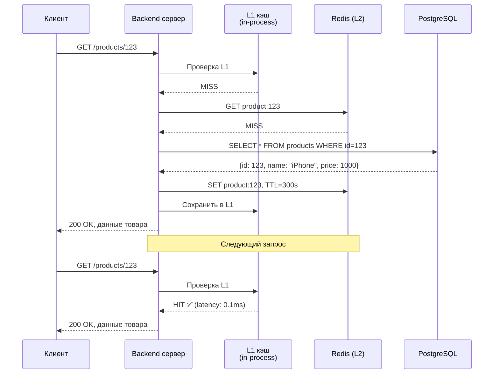
```mermaid
sequenceDiagram
    participant Client as Клиент
    participant Backend as Backend сервер
    participant L1 as L1 кэш<br/>(in-process)
    participant Redis as Redis (L2)
    participant DB as PostgreSQL
    
    Client->>Backend: GET /products/123
    Backend->>L1: Проверка L1
    L1-->>Backend: MISS
    Backend->>Redis: GET product:123
    Redis-->>Backend: MISS
    Backend->>DB: SELECT * FROM products WHERE id=123
    DB-->>Backend: {id: 123, name: "iPhone", price: 1000}
    Backend->>Redis: SET product:123, TTL=300s
    Backend->>L1: Сохранить в L1
    Backend-->>Client: 200 OK, данные товара
    
    Note over Backend,Redis: Следующий запрос
    Client->>Backend: GET /products/123
    Backend->>L1: Проверка L1
    L1-->>Backend: HIT ✅ (latency: 0.1ms)
    Backend-->>Client: 200 OK, данные товара
```

**Вопрос к аудитории:** Что произойдёт, если пока мы читали из БД, кто-то обновил цену товара?

→ Это подводка к нашей главной теме: **Cache Coherence**

### 1.4. Мост к следующим блокам

Итак, у нас теперь не один кэш, а пирамида слоёв. В каждом слое лежат копии одних и тех же данных.

**Три главных вызова:**

1. **Как держать эти копии синхронными?**  
   → Блок 2 (Cache Coherence)

2. **Как правильно распределить данные по уровням?**  
   → Блок 3 (Многоуровневое кэширование)

3. **Что делать, когда всё ломается под нагрузкой?**  
   → Блок 4 (Сложные проблемы)

Дальше у нас три подпункта, каждый отвечает на один из этих вопросов.

---

## БЛОК 2 (A). CACHE COHERENCE В РАСПРЕДЕЛЁННЫХ СИСТЕМАХ (10-15 минут)

### 2.1. Инцидент: почему пользователь видит старые данные?

Представьте ситуацию в том же маркетплейсе и с тем же товаром, про который мы говорили в блоке про Cache-Aside:

**08:00** — В админке меняют цену товара с 900₽ на 1000₽  
**08:00:05** — Цена обновляется в базе данных и основном Redis-кэше ✅  
**08:00:10** — Пользователь открывает карточку товара и видит новую цену 1000₽  
**08:00:11** — Тот же пользователь переходит в корзину/оформление заказа, а там по‑прежнему 900₽ ❌

**Что случилось?**

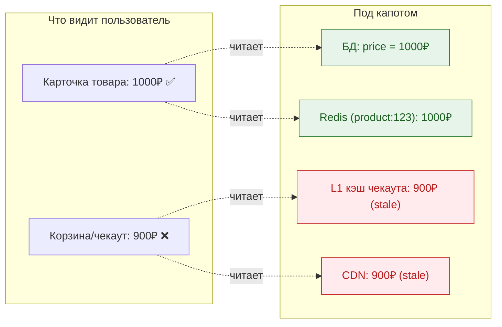
```mermaid
graph LR
    subgraph "Что видит пользователь"
        A["Карточка товара: 1000₽ ✅"]
        B["Корзина/чекаут: 900₽ ❌"]
    end

    subgraph "Под капотом"
        DB["БД: price = 1000₽"]
        R1["Redis (product:123): 1000₽"]
        R2["L1 кэш чекаута: 900₽ (stale)"]
        CDN["CDN: 900₽ (stale)"]
    end

    A -. читает .-> R1
    A -. читает .-> DB
    B -. читает .-> R2
    B -. читает .-> CDN

    classDef fresh fill:#e6f4ea,stroke:#2e7d32,color:#1b5e20;
    classDef stale fill:#ffebee,stroke:#c62828,color:#b71c1c;

    class DB,R1 fresh;
    class R2,CDN stale;
```

**Проблема:** Цена одного и того же товара живёт в нескольких местах:
- База данных (обновилась)
- Ключ `product:123` в Redis (обновился)
- L1 кэш бэкенда чекаута (не обновился!)
- Страница товара в CDN (не обновилась!)

Это классическая проблема **cache coherence** — когда копии одного и того же объекта расходятся между разными кэшами.

### 2.2. Что такое Cache Coherence?

**Cache coherence** — это свойство системы, при котором все копии одного и того же объекта данных в разных кэшах остаются согласованными.

**Важно:** Это не то же самое, что:
- **Консистентность БД** (ACID транзакции)
- **CAP-теорема** (консистентность в распределённой БД)

Cache coherence — это именно про **кэши**, а не про источник истины.

**Условие coherence:** Нет двух кэшей с противоречащими значениями одного объекта.

Но тут встаёт вопрос: **как быстро** мы требуем согласованности?
- Мгновенно (strong coherence)? — дорого
- В течение секунды (eventual coherence)? — реалистично
- В течение минуты? — зависит от бизнеса

### 2.3. Аналогия с процессорными кэшами

В CPU есть протоколы согласованности кэша, например **MESI**:
- **M**odified — ядро изменило данные
- **E**xclusive — только у одного ядра
- **S**hared — копии у нескольких ядер
- **I**nvalid — данные устарели

Это работает потому что:
✅ Жёсткий порядок операций  
✅ Надёжная шина связи  
✅ Микросекундные задержки

В распределённой системе всё хуже:
❌ Ненадёжная сеть (пакеты теряются)  
❌ Непредсказуемые задержки (от 1ms до 1 секунды)  
❌ Нет глобальных часов (сервера в разных ДЦ)

**Вывод:** Нам нужны другие подходы, которые работают в "грязном" мире распределённых систем.

### 2.4. Race Condition в Cache-Aside

Давайте посмотрим, как возникает классическая гонка при обновлении.

**Код обновления товара (PHP + Symfony, DBAL + Redis):**

```php
<?php

use Doctrine\DBAL\Connection;
use Predis\Client as RedisClient;

final class ProductPriceUpdater
{
    public function __construct(
        private Connection $connection,
        private RedisClient $redis,
    ) {}

    public function updateProduct(int $productId, float $newPrice): void
    {
        // Шаг 1: обновляем БД
        $this->connection->executeStatement(
            'UPDATE products SET price = :price WHERE id = :id',
            ['price' => $newPrice, 'id' => $productId],
        );

        // Шаг 2: инвалидируем кэш
        $cacheKey = sprintf('product.%d', $productId);
        $this->redis->del([$cacheKey]);
    }
}
```

**Timeline гонки:**

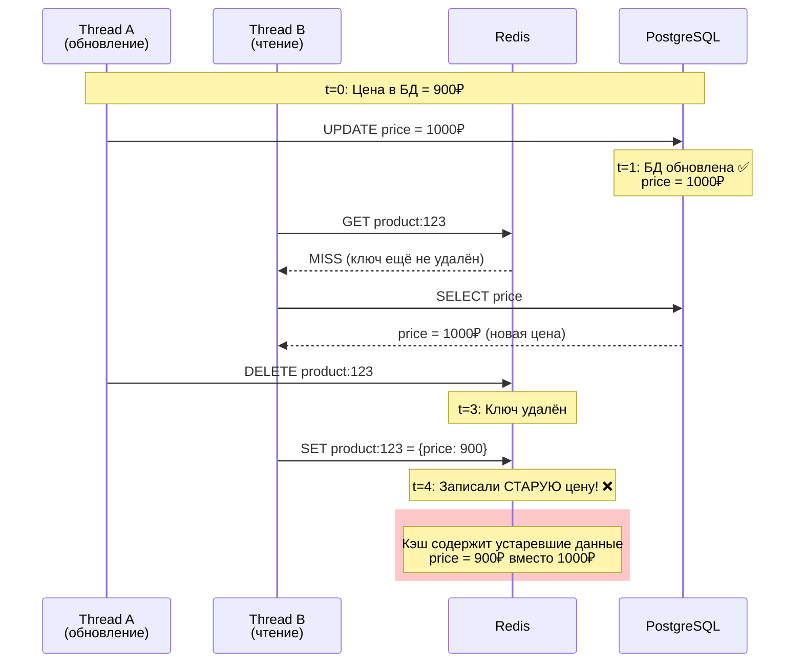
```mermaid
sequenceDiagram
    participant A as Thread A<br/>(обновление)
    participant B as Thread B<br/>(чтение)
    participant Redis as Redis
    participant DB as PostgreSQL
    
    Note over A,DB: t=0: Цена в БД = 900₽
    
    A->>DB: UPDATE price = 1000₽
    Note over DB: t=1: БД обновлена ✅<br/>price = 1000₽
    
    B->>Redis: GET product:123
    Redis-->>B: MISS (ключ ещё не удалён)
    
    B->>DB: SELECT price
    DB-->>B: price = 1000₽ (новая цена)
    
    A->>Redis: DELETE product:123
    Note over Redis: t=3: Ключ удалён
    
    B->>Redis: SET product:123 = {price: 900}
    Note over Redis: t=4: Записали СТАРУЮ цену! ❌
    
    rect rgb(255, 200, 200)
        Note over Redis: Кэш содержит устаревшие данные<br/>price = 900₽ вместо 1000₽
    end
```

**Численная оценка:**

При 10,000 RPS и окне гонки 100ms:
- ~1000 запросов попадают в проблемное окно
- Из них ~1% могут записать stale данные
- **= 10 багов в секунду** ❌

Для критичных данных (цены, балансы, лимиты) это неприемлемо!

### 2.5. Типичные архитектуры кэшей

Где coherence всплывает в разных архитектурах:

**Архитектура 1: Один Redis-кластер**

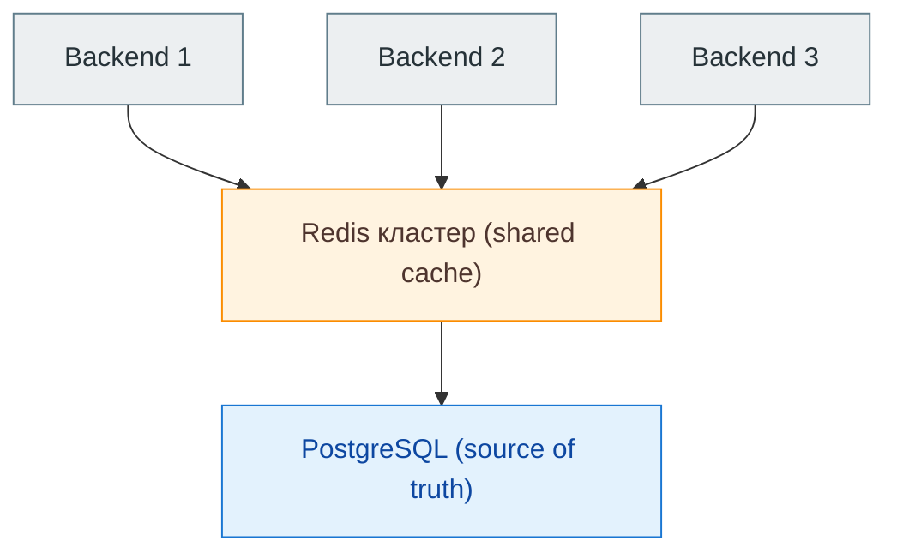
```mermaid
graph TB
    B1["Backend 1"]
    B2["Backend 2"]
    B3["Backend 3"]
    Redis["Redis кластер (shared cache)"]
    DB["PostgreSQL (source of truth)"]
    
    B1 --> Redis
    B2 --> Redis
    B3 --> Redis
    Redis --> DB

    classDef backend fill:#eceff1,stroke:#607d8b,color:#263238;
    classDef cache fill:#fff3e0,stroke:#fb8c00,color:#4e342e;
    classDef db fill:#e3f2fd,stroke:#1976d2,color:#0d47a1;

    class B1,B2,B3 backend;
    class Redis cache;
    class DB db;
```

**Плюсы:** Coherence проще — данные в одном месте  
**Минусы:** Есть TTL, репликация между нодами Redis, шардирование

**Архитектура 2: Многоуровневый кэш (L1 + L2)**

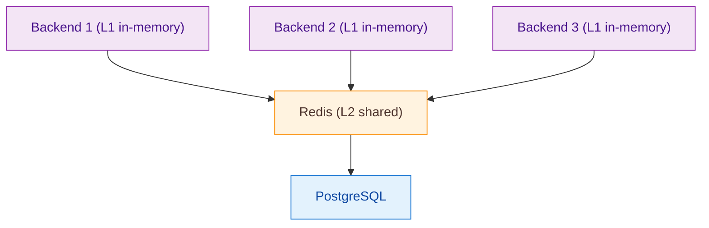
```mermaid
graph TB
    B1["Backend 1 (L1 in-memory)"]
    B2["Backend 2 (L1 in-memory)"]
    B3["Backend 3 (L1 in-memory)"]
    Redis["Redis (L2 shared)"]
    DB["PostgreSQL"]
    
    B1 --> Redis
    B2 --> Redis
    B3 --> Redis
    Redis --> DB

    classDef backendL1 fill:#f3e5f5,stroke:#8e24aa,color:#4a148c;
    classDef cache fill:#fff3e0,stroke:#fb8c00,color:#4e342e;
    classDef db fill:#e3f2fd,stroke:#1976d2,color:#0d47a1;

    class B1,B2,B3 backendL1;
    class Redis cache;
    class DB db;
```

**Плюсы:** Очень быстрый L1 (микросекунды)  
**Минусы:** Сложнее держать L1 всех серверов синхронными с L2 и БД

**Архитектура 3: С CDN/Edge**

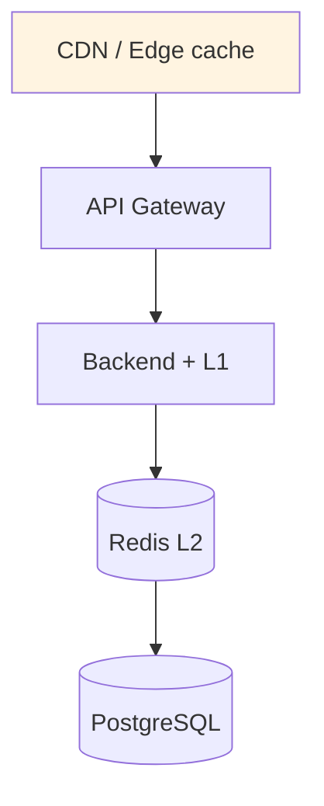
```mermaid
graph TB
    CDN[CDN / Edge cache]
    API[API Gateway]
    Backend[Backend + L1]
    Redis[(Redis L2)]
    DB[(PostgreSQL)]
    
    CDN --> API
    API --> Backend
    Backend --> Redis
    Redis --> DB
    
    style CDN fill:#fff4e1
```

**Плюсы:** Отличная latency для пользователей  
**Минусы:** CDN может кэшировать данные на часы — самый сложный случай для coherence

### 2.6. Стратегии обеспечения согласованности

Разберём 3 базовых подхода (не весь зоопарк, а ключевые идеи).

#### Стратегия A: TTL-only (ленивая согласованность)

**Идея:** Просто ждём, пока данные протухнут по TTL.

```php
<?php

use Doctrine\DBAL\Connection;
use Predis\Client as RedisClient;

final class TtlOnlyCache
{
    public function __construct(
        private Connection $connection,
        private RedisClient $redis,
    ) {}

    public function getProduct(int $productId): ?array
    {
        $cacheKey = sprintf('product.%d', $productId);
        $cached = $this->redis->get($cacheKey);

        if ($cached !== null) {
            return json_decode($cached, true, flags: JSON_THROW_ON_ERROR);
        }

        $product = $this->connection->fetchAssociative(
            'SELECT * FROM products WHERE id = :id',
            ['id' => $productId],
        );

        if ($product === false) {
            return null;
        }

        // Запись: кладём в Redis с TTL 60 секунд
        $this->redis->setex($cacheKey, 60, json_encode($product, JSON_THROW_ON_ERROR));

        return $product;
    }

    public function updateProduct(int $productId, float $newPrice): void
    {
        // Обновляем только БД — кэш протухнет сам по TTL
        $this->connection->executeStatement(
            'UPDATE products SET price = :price WHERE id = :id',
            ['price' => $newPrice, 'id' => $productId],
        );
    }
}
```

**Плюсы:**
- ✅ Максимально просто
- ✅ Нет дополнительной инфраструктуры
- ✅ Нет race conditions с инвалидацией

**Минусы:**
- ❌ Пользователи видят stale данные до истечения TTL

**Когда использовать:**
- Ленты новостей
- Счётчики лайков/просмотров
- Некритичная статистика
- Каталог товаров (если TTL 30-60 секунд приемлем)

#### Стратегия B: Event-based инвалидация

**Идея:** При изменении данных посылаем событие, которое инвалидирует кэш на всех серверах.

```php
<?php

use Doctrine\DBAL\Connection;
use Symfony\Component\Messenger\MessageBusInterface;
use Predis\Client as RedisClient;
use Psr\Cache\CacheItemPoolInterface;

final class ProductUpdatedEvent
{
    public function __construct(
        public readonly int $productId,
        public readonly \DateTimeImmutable $occurredAt,
    ) {}
}

final class ProductServiceWithEvents
{
    public function __construct(
        private Connection $connection,
        private MessageBusInterface $eventBus,
    ) {}

    // Обновление товара
    public function updateProduct(int $productId, array $data): void
    {
        // 1. Обновляем БД
        $this->connection->update('products', $data, ['id' => $productId]);

        // 2. Публикуем событие
        $this->eventBus->dispatch(
            new ProductUpdatedEvent($productId, new \DateTimeImmutable()),
        );
    }
}

// На ВСЕХ backend-серверах слушатель события:
final class InvalidateProductCacheListener
{
    public function __construct(
        private RedisClient $redis,
        private CacheItemPoolInterface $localCache,
    ) {}

    public function __invoke(ProductUpdatedEvent $event): void
    {
        // Инвалидируем во всех слоях
        $cacheKey = sprintf('product.%d', $event->productId);
        $this->redis->del([$cacheKey]);
        $this->localCache->deleteItem($cacheKey);
    }
}
```

**Архитектура с Pub/Sub:**

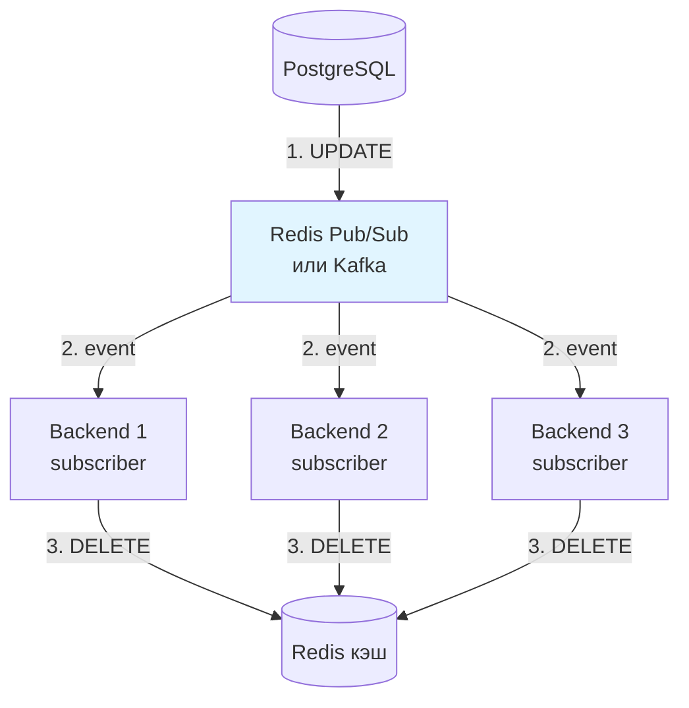
```mermaid
graph TB
    DB[(PostgreSQL)]
    PubSub[Redis Pub/Sub<br/>или Kafka]
    B1[Backend 1<br/>subscriber]
    B2[Backend 2<br/>subscriber]
    B3[Backend 3<br/>subscriber]
    Redis[(Redis кэш)]
    
    DB -->|1. UPDATE| PubSub
    PubSub -->|2. event| B1
    PubSub -->|2. event| B2
    PubSub -->|2. event| B3
    B1 -->|3. DELETE| Redis
    B2 -->|3. DELETE| Redis
    B3 -->|3. DELETE| Redis
    
    style PubSub fill:#e1f5ff
```

**Плюсы:**
- ✅ Предсказуемое окно рассинхрона (<1 секунды обычно)
- ✅ Работает для многоуровневых кэшей

**Минусы:**
- ❌ Нужна инфраструктура (Kafka, Redis Pub/Sub, RabbitMQ)
- ❌ Что если сообщение потеряется? (нужен fallback на TTL)

**Когда использовать:**
- Профили пользователей
- Корзины покупок
- Настройки аккаунта
- Inventory (остатки) с невысокой нагрузкой

#### Стратегия C: Lease-based подходы

**Идея:** Только владелец "лизинга" может обновить кэш. При обновлении в БД все лизинги аннулируются.

```php
<?php

use Doctrine\DBAL\Connection;
use Predis\Client as RedisClient;

final class LeaseBasedCache
{
    public function __construct(
        private Connection $connection,
        private RedisClient $redis,
    ) {}

    // Запрос с "лизингом"
    public function getProductWithLease(int $productId): ?array
    {
        $cacheKey = sprintf('product.%d', $productId);
        $leaseKey = sprintf('product.%d.lease', $productId);

        // Получаем lease token (версию)
        $leaseToken = (int) ($this->redis->get($leaseKey) ?? 0);
        $cached = $this->redis->get($cacheKey);

        if ($cached !== null) {
            return json_decode($cached, true, flags: JSON_THROW_ON_ERROR);
        }

        // Cache miss — читаем из БД
        $product = $this->connection->fetchAssociative(
            'SELECT * FROM products WHERE id = :id',
            ['id' => $productId],
        );

        if ($product === false) {
            return null;
        }

        // Пишем в кэш только если lease не изменился
        $currentLease = (int) ($this->redis->get($leaseKey) ?? 0);
        if ($currentLease === $leaseToken) {
            $this->redis->setex(
                $cacheKey,
                300,
                json_encode($product, JSON_THROW_ON_ERROR),
            );
        }

        return $product;
    }

    // Обновление — инвалидирует все "лизинги"
    public function updateProduct(int $productId, array $newData): void
    {
        $this->connection->update('products', $newData, ['id' => $productId]);

        // Увеличиваем lease версию: все старые токены считаются невалидными
        $leaseKey = sprintf('product.%d.lease', $productId);
        $this->redis->incr($leaseKey);
    }
}
```

**Плюсы:**
- ✅ Гарантия от race condition
- ✅ Strong coherence

**Минусы:**
- ❌ Высокая сложность реализации
- ❌ Overhead на управление лизингами
- ❌ Может снизить производительность

**Когда использовать:**
- Балансы счетов
- Лимиты (rate limiting, квоты)
- Inventory с высокой нагрузкой
- Любые финансовые данные

**Связь с distributed locks:**  
Lease-based кэширование похоже на fencing tokens в распределённых блокировках.

### 2.7. Сравнение стратегий

| Стратегия | Окно рассинхрона | Сложность | Примеры use-cases |
|-----------|------------------|-----------|-------------------|
| **TTL-only** | До TTL (секунды/минуты) | Низкая | Ленты, счётчики, каталоги |
| **Event-based** | <1 секунды | Средняя | Профили, корзины, настройки |
| **Lease-based** | Нет (strong coherence) | Высокая | Балансы, лимиты, финансы |

**Golden rule инвалидации:**

> При сомнении — инвалидируй (`DELETE`), а не обновляй (`SET`)

Почему?
- `DELETE` безопаснее — следующий запрос сам подгрузит свежие данные из БД
- `SET new_value` рискует записать stale данные при гонках

**Push vs Pull:**
- **Push** (pub/sub): кэш получает события → быстрее, но сложнее
- **Pull** (polling): кэш сам опрашивает БД → проще, но медленнее

### 2.8. Примеры сложных кейсов

#### Кейс 1: Профиль пользователя

**Требования:**
- Быстрое чтение (latency <10ms)
- Обновления редкие (раз в день-неделю)
- Допустимо eventual consistency до 5 секунд

**Решение:**
```php
// L1 (in-process): TTL 30 секунд
// L2 (Redis): TTL 5 минут
// Инвалидация: pub/sub при обновлении профиля
```

#### Кейс 2: Баланс пользователя

**Требования:**
- Критично показывать актуальное значение
- Высокая частота чтений и записей
- Strong consistency

**Решение:**
```php
// Кэш только для СНИЖЕНИЯ нагрузки, но НЕ источник истины
// L2 (Redis): TTL 5 секунд, lease-based
// При любой операции с деньгами — ВСЕГДА проверка по БД
```

#### Кейс 3: Остатки товара на складе

**Требования:**
- Нельзя продать больше, чем есть
- Высокая нагрузка (тысячи покупок в секунду)
- Допустимо показывать чуть завышенные остатки

**Решение:**
```php
// Показываем из кэша (TTL 10 секунд)
// При добавлении в корзину — проверка по БД
// При оплате — финальная проверка по БД с блокировкой
```

### 2.9. Наблюдаемость coherence

**Ключевые метрики:**

```php
<?php

// 1. Доля stale reads (через версионирование)
// Target: < 1% для некритичных данных, < 0.01% для критичных
$staleReadRate = $staleReads / $totalReads;

// 2. Hit rate по уровням
// Target: L1 = 60–80%, L2 = 80–95%
$l1HitRate = $l1Hits / $l1Requests;
$l2HitRate = $l2Hits / $l2Requests;

// 3. Latency инвалидации
// Target: < 1 секунда
$invalidationLatency = $timeCacheCleared - $timeEventPublished;

// 4. Частота инвалидаций
// Важны спайки — могут указывать на проблему с инвалидацией или данными
$invalidationRate = $eventsPerSecond;
```

**Chaos testing:**

```bash
# Тест: добавляем 500ms задержку в pub/sub
tc qdisc add dev eth0 root netem delay 500ms

# Смотрим: растёт ли stale_read_rate?
# Если да — нужен fallback на TTL или lease
```

**Типичные вопросы на собесе:**

**Q:** "Какие гарантии по свежести данных в кэше вы даёте?"

**A (хороший ответ):**
> "Для каталога товаров — eventual consistency с окном до 60 секунд через TTL.  
> Для балансов — read-through с БД на каждую операцию, кэш только для справки.  
> Для профилей — event-based инвалидация с окном до 5 секунд, fallback на TTL 5 минут."

**Q:** "Как убедиться, что кэш и БД не расходятся?"

**A (хороший ответ):**
> "1. Версионирование ключей (включаем updated_at в ключ)
> 2. Метрики stale reads через сравнение версий
> 3. Периодический reconciliation job — проходится по кэшу и сверяет с БД
> 4. Алерты на аномальный рост stale_read_rate"

### 2.10. Визуализация Multi-level cache с рассинхроном

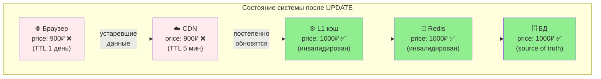
```mermaid
graph TB
    subgraph "Состояние системы после UPDATE"
        Browser["🌐 Браузер<br/>price: 900₽ ❌<br/>(TTL 1 день)"]
        CDN["☁️ CDN<br/>price: 900₽ ❌<br/>(TTL 5 мин)"]
        L1["⚙️ L1 кэш<br/>price: 1000₽ ✅<br/>(инвалидирован)"]
        Redis["🔴 Redis<br/>price: 1000₽ ✅<br/>(инвалидирован)"]
        DB["🗄️ БД<br/>price: 1000₽ ✅<br/>(source of truth)"]
    end
    
    Browser -.->|устаревшие<br/>данные| CDN
    CDN -.->|постепенно<br/>обновятся| L1
    L1 --> Redis
    Redis --> DB
    
    style Browser fill:#ffebee
    style CDN fill:#ffebee
    style L1 fill:#90EE90
    style Redis fill:#90EE90
    style DB fill:#90EE90
```

**Проблема:** Браузер и CDN не получили событие инвалидации!

**Решения:**
1. Короткий TTL на CDN (5-15 минут)
2. Версионирование URL: `/products/123?v=1702345678`
3. Cache-Control с `must-revalidate`
4. Webhook для CDN purge (дорого, но быстро)

---

*[Продолжение в следующем файле из-за ограничения размера]*
# Сценарий: Часть 1. Продвинутое кэширование (продолжение)

## БЛОК 3 (B). МНОГОУРОВНЕВОЕ КЭШИРОВАНИЕ И ОПТИМИЗАЦИИ (10-15 минут)

### 3.1. Боль многоуровневого кэширования


Про CDN здесь важно проговорить простую модель: провайдер держит копии наших ответов на edge‑узлах по миру — пользователи из Новосибирска, Берлина и Москвы попадают на ближайший к ним edge и читают кэш "локально", не долетая до нашего датацентра. За это платим тем, что инвалидация и обновление проходят через сеть до всех edge‑узлов, поэтому CDN почти всегда живёт с более длинным TTL и более слабой свежестью данных, чем backend‑кэш.

Вопрос: **какие данные на каком уровне держать?**

### 3.2. Heatmap: что где держим

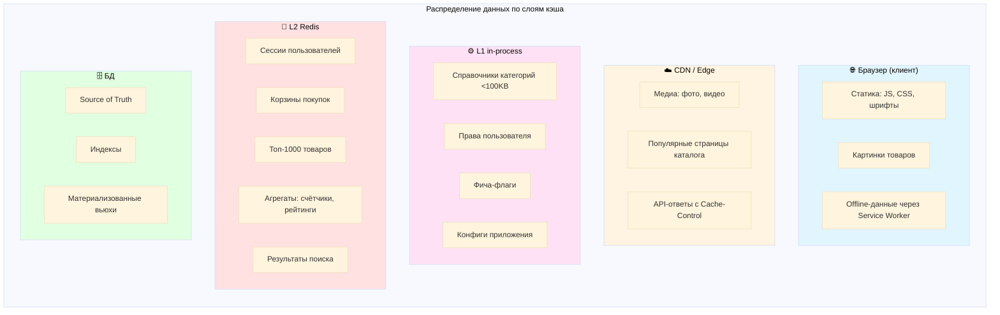
```mermaid
%%{init: {'theme':'base'}}%%
graph TB
    subgraph "Распределение данных по слоям кэша"
        direction TB
        
        subgraph Browser["🌐 Браузер (клиент)"]
            B1[Статика: JS, CSS, шрифты]
            B2[Картинки товаров]
            B3[Offline-данные через Service Worker]
        end
        
        subgraph CDN["☁️ CDN / Edge"]
            C1[Медиа: фото, видео]
            C2[Популярные страницы каталога]
            C3[API-ответы с Cache-Control]
        end
        
        subgraph L1["⚙️ L1 in-process"]
            L1_1[Справочники категорий <100KB]
            L1_2[Права пользователя]
            L1_3[Фича-флаги]
            L1_4[Конфиги приложения]
        end
        
        subgraph L2["🔴 L2 Redis"]
            L2_1[Сессии пользователей]
            L2_2[Корзины покупок]
            L2_3[Топ-1000 товаров]
            L2_4[Агрегаты: счётчики, рейтинги]
            L2_5[Результаты поиска]
        end
        
        subgraph DB["🗄️ БД"]
            DB1[Source of Truth]
            DB2[Индексы]
            DB3[Материализованные вьюхи]
        end
    end
    
    style Browser fill:#e1f5ff
    style CDN fill:#fff4e1
    style L1 fill:#ffe1f5
    style L2 fill:#ffe1e1
    style DB fill:#e1ffe1
```

**Критерии выбора слоя:**

| Критерий | Браузер | CDN | L1 | L2 | БД |
|----------|---------|-----|----|----|-----|
| **Размер данных** | <10MB | <100MB | <100KB | <10MB | Any |
| **Latency** | 0ms | 10-50ms | 0.1ms | 2-5ms | 20-100ms |
| **Частота обновлений** | Редко | Редко | Средне | Часто | Постоянно |
| **Допустимость stale** | Высокая | Высокая | Средняя | Низкая | N/A |
| **Стоимость** | Free | $$$ | $ | $$ | $$$ |

### 3.3. Read path через многоуровневый кэш

**Запрос карточки товара с полным проходом:**

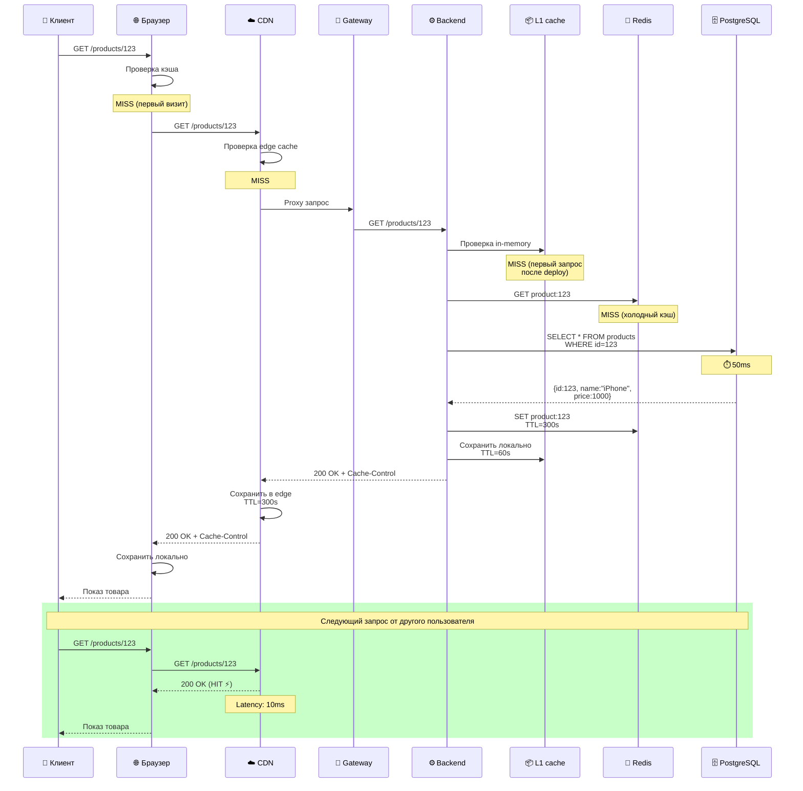
```mermaid
sequenceDiagram
    participant Client as 👤 Клиент
    participant Browser as 🌐 Браузер
    participant CDN as ☁️ CDN
    participant Gateway as 🚪 Gateway
    participant Backend as ⚙️ Backend
    participant L1 as 📦 L1 cache
    participant Redis as 🔴 Redis
    participant DB as 🗄️ PostgreSQL
    
    Client->>Browser: GET /products/123
    Browser->>Browser: Проверка кэша
    Note over Browser: MISS (первый визит)
    
    Browser->>CDN: GET /products/123
    CDN->>CDN: Проверка edge cache
    Note over CDN: MISS
    
    CDN->>Gateway: Proxy запрос
    Gateway->>Backend: GET /products/123
    
    Backend->>L1: Проверка in-memory
    Note over L1: MISS (первый запрос<br/>после deploy)
    
    Backend->>Redis: GET product:123
    Note over Redis: MISS (холодный кэш)
    
    Backend->>DB: SELECT * FROM products<br/>WHERE id=123
    Note over DB: ⏱️ 50ms
    DB-->>Backend: {id:123, name:"iPhone",<br/>price:1000}
    
    Backend->>Redis: SET product:123<br/>TTL=300s
    Backend->>L1: Сохранить локально<br/>TTL=60s
    Backend-->>CDN: 200 OK + Cache-Control
    CDN->>CDN: Сохранить в edge<br/>TTL=300s
    CDN-->>Browser: 200 OK + Cache-Control
    Browser->>Browser: Сохранить локально
    Browser-->>Client: Показ товара
    
    rect rgb(200, 255, 200)
        Note over Client,DB: Следующий запрос от другого пользователя
        Client->>Browser: GET /products/123
        Browser->>CDN: GET /products/123
        CDN-->>Browser: 200 OK (HIT ⚡)
        Note over CDN: Latency: 10ms
        Browser-->>Client: Показ товара
    end
```

**Метрики по слоям (типичные значения):**

```php
<?php

// Пример метрик за 1 час для товара #123
$totalRequests = 100_000;

// Браузер (разные пользователи)
$browserHits = 0; // Каждый пользователь свой браузер

// CDN
$cdnRequests = 100_000;
$cdnHits     = 95_000;  // 95% hit rate
$cdnMisses   = 5_000;

// L1 (на одном из 10 backend-серверов)
$l1Requests = 500;  // 5000 / 10 серверов
$l1Hits     = 400;  // 80% hit rate
$l1Misses   = 100;

// L2 Redis
$l2Requests = 100 + 4_900; // misses от всех L1 + свои запросы
$l2Hits     = 4_500;       // 90% hit rate
$l2Misses   = 500;

// DB
$dbRequests = 500; // Только холодные запросы

// Средняя latency (условные цифры для примера)
$avgLatencyMs = (
    95_000 * 10  + // CDN hits
    4_500 * 3   + // Redis hits
    500   * 50    // DB queries
) / $totalRequests; // ≈ 12.9ms ✅
```

**Без кэша:** 100k * 50ms = 5000 секунд CPU времени БД  
**С кэшем:** 500 * 50ms = 25 секунд CPU времени БД  
**Выигрыш:** 200x снижение нагрузки на БД! 🎉

### 3.4. Write path: как обновлять многоуровневый кэш

**Порядок обновления (правильный):**

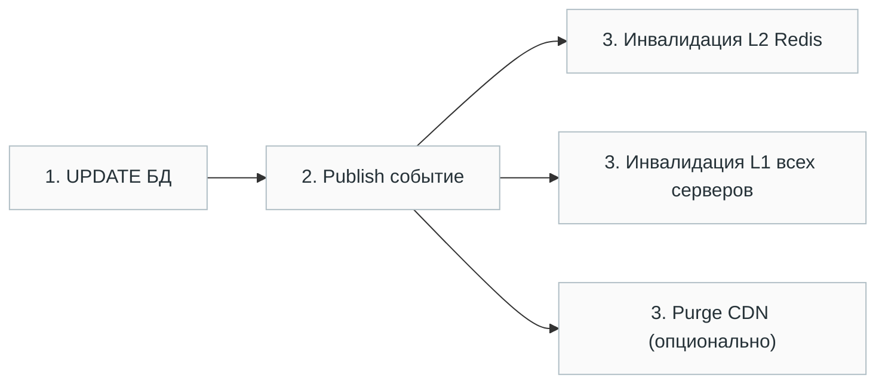
```mermaid
graph LR
    A["1. UPDATE БД"] --> B["2. Publish событие"]
    B --> C["3. Инвалидация L2 Redis"]
    B --> D["3. Инвалидация L1 всех серверов"]
    B --> E["3. Purge CDN (опционально)"]

    classDef step fill:#fafafa,stroke:#b0bec5,color:#263238;
    class A,B,C,D,E step;
```

**Псевдокод (PHP + Symfony):**

```php
<?php

use Doctrine\DBAL\Connection;
use Symfony\Component\Messenger\MessageBusInterface;
use Predis\Client as RedisClient;
use Psr\Cache\CacheItemPoolInterface;

final class ProductPriceUpdatedEvent
{
    public function __construct(
        public readonly int $productId,
        public readonly float $newPrice,
        public readonly ?float $oldPrice = null,
    ) {}
}

final class ProductPriceService
{
    public function __construct(
        private Connection $connection,
        private MessageBusInterface $eventBus,
    ) {}

    public function updateProductPrice(int $productId, float $newPrice): void
    {
        // 1. Обновляем source of truth
        $oldPrice = (float) $this->connection->fetchOne(
            'SELECT price FROM products WHERE id = :id',
            ['id' => $productId],
        );

        $this->connection->executeStatement(
            'UPDATE products SET price = :price, updated_at = NOW() WHERE id = :id',
            ['price' => $newPrice, 'id' => $productId],
        );

        // 2. Публикуем событие для всех подписчиков
        $this->eventBus->dispatch(
            new ProductPriceUpdatedEvent($productId, $newPrice, $oldPrice),
        );
    }
}

// На каждом backend-сервере:
final class ProductCacheInvalidationListener
{
    public function __construct(
        private CacheItemPoolInterface $l1Cache,
        private RedisClient $redis,
        private CdnApiClient $cdnApi,
    ) {}

    public function __invoke(ProductPriceUpdatedEvent $event): void
    {
        $productId = $event->productId;

        // Инвалидация L1 (локальный кэш этого сервера)
        $this->l1Cache->deleteItem(sprintf('product.%d', $productId));

        // Инвалидация L2 (Redis, shared)
        $this->redis->del([
            sprintf('product.%d', $productId),
            sprintf('product.card.%d', $productId),
        ]);

        // Опционально: CDN purge для критичных данных
        if ($event->oldPrice !== null && $event->newPrice < $event->oldPrice) {
            // Цена упала — важно показать быстрее!
            $this->cdnApi->purgeUrl(sprintf('/products/%d', $productId));
        }
    }
}
```

**Важно:** Инвалидация через `DELETE`, а не через `SET new_value`!

Почему?
- `DELETE` + lazy load безопаснее от гонок
- Следующий запрос сам подгрузит свежие данные
- `SET` может записать stale данные при race condition

### 3.5. Тегирование для массовой инвалидации

**Проблема:** Изменилась цена всей категории "Электроника" (10,000 товаров). Как инвалидировать?

**Наивный подход:**
```php
<?php

// ❌ Плохо: 10,000 DELETE запросов к Redis подряд
foreach ($electronicsProducts as $productId) {
    $redis->del([sprintf('product.%d', $productId)]);
}
```

**Лучше: тегирование ключей**

```php
<?php

// При записи в кэш добавляем теги
$redis->set(sprintf('product.%d', $productId), json_encode($data, JSON_THROW_ON_ERROR));
$redis->sadd('tag:category:electronics', [sprintf('product.%d', $productId)]);

// При обновлении категории
function updateCategoryPrices(int $categoryId, float $discountPercent, Connection $db, RedisClient $redis): void {
    // 1. Обновляем БД
    $db->executeStatement(
        'UPDATE products SET price = price * (1 - :discount) WHERE category_id = :category_id',
        ['discount' => $discountPercent, 'category_id' => $categoryId],
    );

    // 2. Массовая инвалидация по тегу
    $tagKey = sprintf('tag:category:%d', $categoryId);
    $taggedKeys = $redis->smembers($tagKey);

    if (\count($taggedKeys) < 1000) {
        // Мало ключей — удаляем по одному
        if ($taggedKeys !== []) {
            $redis->del($taggedKeys);
        }
    } else {
        // Много ключей — увеличиваем версию тега
        $redis->incr(sprintf('%s:version', $tagKey));
        // Старые ключи протухнут по TTL
    }
}
```

**Схема версионирования тегов:**

```php
<?php

// Чтение с версионированием
function getProductWithTag(int $productId, int $categoryId, Connection $db, RedisClient $redis): ?array {
    // Получаем текущую версию тега категории
    $tagVersion = $redis->get(sprintf('tag:category:%d:version', $categoryId)) ?? '0';

    // Ключ включает версию
    $cacheKey = sprintf('product.%d.v%s', $productId, $tagVersion);

    $cached = $redis->get($cacheKey);
    if ($cached !== null) {
        return json_decode($cached, true, flags: JSON_THROW_ON_ERROR);
    }

    // Cache miss
    $product = $db->fetchAssociative(
        'SELECT * FROM products WHERE id = :id',
        ['id' => $productId],
    );

    if ($product === false) {
        return null;
    }

    $redis->setex($cacheKey, 300, json_encode($product, JSON_THROW_ON_ERROR));

    return $product;
}

// При обновлении категории просто увеличиваем версию
$redis->incr(sprintf('tag:category:%d:version', $categoryId));
// Все старые ключи с v0 станут недоступны, новые запросы будут использовать v1
```

### 3.6. Версионирование при деплоях

**Проблема:** Деплоим новую версию кода, меняется схема данных в кэше.

**Пример:**
```php
<?php

// Старая версия кода
$productV1 = [
    'id'    => 123,
    'name'  => 'iPhone',
    'price' => 1000,
];

// Новая версия кода (добавили поле discount)
$productV2 = [
    'id'       => 123,
    'name'     => 'iPhone',
    'price'    => 1000,
    'discount' => 0.1,
];
```

**Решение: версионирование ключей**

```php
<?php

// Версия схемы в константе
const CACHE_SCHEMA_VERSION = 'v2';

function getProductWithSchemaVersion(int $productId, Connection $db, RedisClient $redis): ?array {
    $cacheKey = sprintf('product.%d.%s', $productId, CACHE_SCHEMA_VERSION);

    $cached = $redis->get($cacheKey);
    if ($cached !== null) {
        return json_decode($cached, true, flags: JSON_THROW_ON_ERROR);
    }

    $product = $db->fetchAssociative(
        'SELECT * FROM products WHERE id = :id',
        ['id' => $productId],
    );

    if ($product === false) {
        return null;
    }

    $redis->setex($cacheKey, 300, json_encode($product, JSON_THROW_ON_ERROR));

    return $product;
}
```

**Blue-Green deploy с кэшем:**

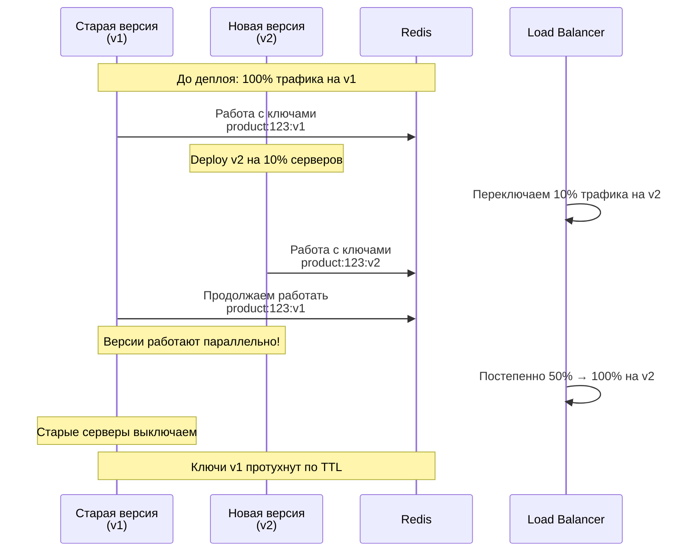
```mermaid
sequenceDiagram
    participant Old as Старая версия<br/>(v1)
    participant New as Новая версия<br/>(v2)
    participant Redis as Redis
    participant LB as Load Balancer
    
    Note over Old,Redis: До деплоя: 100% трафика на v1
    
    Old->>Redis: Работа с ключами<br/>product:123:v1
    
    Note over New: Deploy v2 на 10% серверов
    
    LB->>LB: Переключаем 10% трафика на v2
    
    New->>Redis: Работа с ключами<br/>product:123:v2
    Old->>Redis: Продолжаем работать<br/>product:123:v1
    
    Note over Old,New: Версии работают параллельно!
    
    LB->>LB: Постепенно 50% → 100% на v2
    
    Note over Old: Старые серверы выключаем
    Note over Old,Redis: Ключи v1 протухнут по TTL
```

**Преимущества:**
- ✅ Нет race conditions между версиями
- ✅ Можно откатиться без сброса кэша
- ✅ Постепенный rollout

**Недостатки:**
- ❌ Двойной расход памяти Redis (временно)
- ❌ Нужно планировать версионирование заранее

### 3.7. Оптимизации под реальные паттерны трафика

#### Проблема 1: Hot Keys (горячие ключи)

**Сценарий:** "Товар дня" — 100,000 запросов в секунду на один ключ.

**Проблема:** Даже Redis не справится с таким QPS на один ключ.

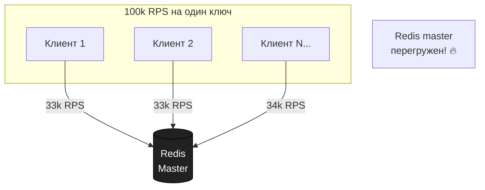
```mermaid
graph TB
    subgraph "100k RPS на один ключ"
        Client1[Клиент 1]
        Client2[Клиент 2]
        ClientN[Клиент N...]
    end
    
    Redis[(Redis<br/>Master)]
    
    Client1 -->|33k RPS| Redis
    Client2 -->|33k RPS| Redis
    ClientN -->|34k RPS| Redis

    classDef cacheHot fill:#212121,stroke:#000000,color:#ffffff;
    class Redis cacheHot;

    Note[Redis master<br/>перегружен! 🔥]
```

**Решение A: Репликация в L1**

```php
<?php

use Doctrine\DBAL\Connection;
use Predis\Client as RedisClient;

final class HotKeysProductService
{
    private const HOT_KEYS = ['product:12345']; // Товар дня

    public function __construct(
        private Connection $connection,
        private RedisClient $redis,
        private \Psr\SimpleCache\CacheInterface $l1Cache, // in-memory L1 (например, ArrayCache)
    ) {}

    public function getProduct(int $productId): ?array
    {
        $cacheKey = sprintf('product:%d', $productId);

        // Для hot keys — всегда проверяем L1 первым
        if (\in_array($cacheKey, self::HOT_KEYS, true)) {
            $data = $this->l1Cache->get($cacheKey);
            if ($data !== null) {
                return $data;
            }

            // L1 miss — идём в Redis, но с коротким TTL
            $cached = $this->redis->get($cacheKey);
            if ($cached !== null) {
                $product = json_decode($cached, true, flags: JSON_THROW_ON_ERROR);
                // Сохраняем в L1 с коротким TTL (30 секунд)
                $this->l1Cache->set($cacheKey, $product, 30);

                return $product;
            }
        }

        // Обычная логика для не-hot keys
        $product = $this->connection->fetchAssociative(
            'SELECT * FROM products WHERE id = :id',
            ['id' => $productId],
        );

        if ($product === false) {
            return null;
        }

        $this->redis->setex($cacheKey, 300, json_encode($product, JSON_THROW_ON_ERROR));

        return $product;
    }
}
```

**Результат:** 100k RPS распределяются по 10 backend-серверам = 10k RPS на сервер из L1 (легко).

**Решение B: Separate tier для hot keys**

Под `separate tier` здесь имеется в виду отдельный слой кэша, физически отделённый от основного Redis:
- либо отдельный кластер/пул Redis только под hot keys;
- либо несколько спец‑нод, через которые ходит именно трафик к «товару дня» и похожим ключам.

Идея: обычные ключи продолжают жить в основном Redis, а запросы к «разогретым» ключам размазываются по отдельному слою. Так мы не забиваем один инстанс Redis 100k RPS, а распределяем нагрузку и защищаем базовый кэш от перегрузки одним популярным ключом.

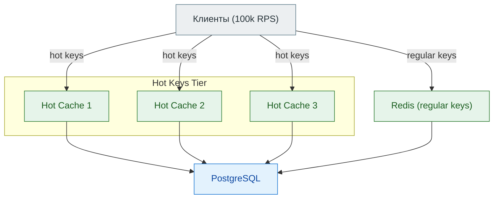
```mermaid
graph TB
    Clients["Клиенты (100k RPS)"]
    
    subgraph "Hot Keys Tier"
        Hot1["Hot Cache 1"]
        Hot2["Hot Cache 2"]
        Hot3["Hot Cache 3"]
    end
    
    Redis["Redis (regular keys)"]
    DB["PostgreSQL"]
    
    Clients -->|hot keys| Hot1
    Clients -->|hot keys| Hot2
    Clients -->|hot keys| Hot3
    Clients -->|regular keys| Redis
    
    Hot1 --> DB
    Hot2 --> DB
    Hot3 --> DB
    Redis --> DB

    classDef client fill:#eceff1,stroke:#607d8b,color:#263238;
    classDef cache fill:#e6f4ea,stroke:#2e7d32,color:#1b5e20;
    classDef db fill:#e3f2fd,stroke:#1976d2,color:#0d47a1;

    class Clients client;
    class Hot1,Hot2,Hot3,Redis cache;
    class DB db;
```

#### Проблема 2: Cache Stampede (thundering herd)

Разберём подробно в Блоке 4.

#### Проблема 3: Cold Start (холодный старт)

**Сценарий:** Деплой новой версии → весь in-memory кэш сбросился → БД получает 10x нагрузку.

**Решение: Batch pre-warming**

```php
<?php

use Doctrine\DBAL\Connection;
use Predis\Client as RedisClient;
use Psr\Log\LoggerInterface;

final class CacheWarmupCommand
{
    public function __construct(
        private Connection $connection,
        private RedisClient $redis,
        private LoggerInterface $logger,
    ) {}

    // При старте сервиса / отдельной команды
    public function warmup(): void
    {
        $this->logger->info('Starting cache warmup...');

        // Загружаем топ-1000 товаров из БД
        $topProducts = $this->connection->fetchAllAssociative(
            'SELECT * FROM products 
             ORDER BY views_last_24h DESC 
             LIMIT 1000',
        );

        // Кладём в кэш батчами по 100
        foreach (array_chunk($topProducts, 100) as $batch) {
            $this->redis->pipeline(function (RedisClient $pipe) use ($batch): void {
                foreach ($batch as $product) {
                    $key = sprintf('product:%d', $product['id']);
                    $pipe->setex($key, 300, json_encode($product, JSON_THROW_ON_ERROR));
                }
            });

            usleep(100_000); // 0.1s — не убиваем Redis
        }

        $this->logger->info(sprintf('Warmed up %d products', \count($topProducts)));
    }
}
```

**Метрики warmup:**

```php
<?php

// Цель: достичь 80% hit rate за 2 минуты после старта
$timeTo80PercentHitRate = measureWarmup(); // пользовательская метрика
// Хорошо: < 2 минуты
// Плохо: > 5 минут — нужно оптимизировать warmup
```

#### Проблема 4: Request Coalescing (single flight)

**Сценарий:** 100 запросов одновременно на один ключ, которого нет в кэше.

**Наивный код (PHP):**
```php
<?php

// ❌ Плохо: 100 запросов пойдут в БД одновременно
function getProductNaive(int $productId, Connection $db, RedisClient $redis): ?array {
    $cacheKey = sprintf('product:%d', $productId);
    $cached = $redis->get($cacheKey);

    if ($cached === null) {
        // 100 параллельных запросов в БД при stampede
        $product = $db->fetchAssociative(
            'SELECT * FROM products WHERE id = :id',
            ['id' => $productId],
        );

        if ($product === false) {
            return null;
        }

        $redis->setex($cacheKey, 300, json_encode($product, JSON_THROW_ON_ERROR));

        return $product;
    }

    return json_decode($cached, true, flags: JSON_THROW_ON_ERROR);
}
```

**С request coalescing (упрощённо, PHP):**

```php
<?php

final class SingleFlightCache
{
    /** @var array<string, \React\Promise\PromiseInterface> */
    private array $inFlight = [];

    public function __construct(
        private Connection $connection,
        private RedisClient $redis,
    ) {}

    public function getProduct(int $productId): \React\Promise\PromiseInterface
    {
        $cacheKey = sprintf('product:%d', $productId);

        // Если запрос уже летит в БД — возвращаем тот же Promise
        if (isset($this->inFlight[$cacheKey])) {
            return $this->inFlight[$cacheKey];
        }

        $this->inFlight[$cacheKey] = \React\Promise\resolve()->then(function () use ($cacheKey, $productId) {
            $cached = $this->redis->get($cacheKey);
            if ($cached !== null) {
                return json_decode($cached, true, flags: JSON_THROW_ON_ERROR);
            }

            // Идём в БД только один раз
            $product = $this->connection->fetchAssociative(
                'SELECT * FROM products WHERE id = :id',
                ['id' => $productId],
            );

            if ($product !== false) {
                $this->redis->setex($cacheKey, 300, json_encode($product, JSON_THROW_ON_ERROR));
            }

            unset($this->inFlight[$cacheKey]);

            return $product === false ? null : $product;
        });

        return $this->inFlight[$cacheKey];
    }
}
```

**Результат:** 100 запросов → 1 поход в БД ✅

### 3.8. Метрики и наблюдаемость

**Dashboard для многоуровневого кэша: что на нём должно быть**

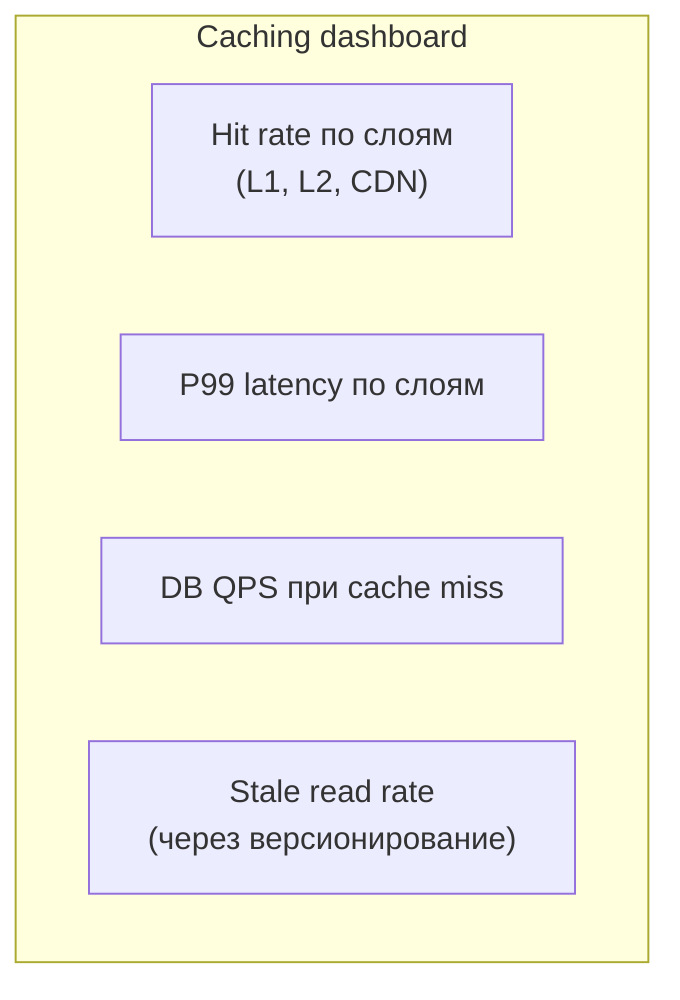
```mermaid
graph TB
    subgraph "Caching dashboard"
        HR["Hit rate по слоям\n(L1, L2, CDN)"]
        LAT["P99 latency по слоям"]
        DBQ["DB QPS при cache miss"]
        STALE["Stale read rate\n(через версионирование)"]
    end
```

Для реализации это обычно раскладывается в несколько метрик (Prometheus / Grafana):

```php
<?php

// Примеры имён метрик
// cache_hit_rate{layer="l1"}
// cache_hit_rate{layer="l2"}
// cache_hit_rate{layer="cdn"}

// cache_latency_p99{layer="l1"}
// cache_latency_p99{layer="l2"}
// cache_latency_p99{layer="cdn"}
// db_latency_p99

// cache_invalidations_per_sec
// cache_hot_keys_detected
// stale_read_rate
```

**Когда добавить/убрать слой кэша (как читать дэшборд):**

- Если `cache_hit_rate{layer="l2"}` высокий (>80%), но `cache_latency_p99{layer="l2"}` всё равно большая → имеет смысл добавить L1 in-process.
- Если `cache_hit_rate{layer="l1"}` стабильно <50% и при этом нет особой выгоды по latency → L1 даёт только накладные расходы, его можно упростить или убрать.
- Если `db_qps` растёт при падении hit rate CDN и `cache_latency_p99{layer="cdn"}` заметно ниже, чем у backend → пора думать о CDN.
- Если данные очень чувствительны к свежести (stale_read_rate растёт при любых задержках) → слой с длинным TTL (часто CDN) лучше отключить для этих эндпоинтов.

---

## БЛОК 4 (C). СЛОЖНЫЕ ПРОБЛЕМЫ И ПРАКТИКА (10-15 минут)

### 4.1. Thundering Herd / Cache Stampede

**Самая частая проблема в продакшене.**

**Сценарий:**

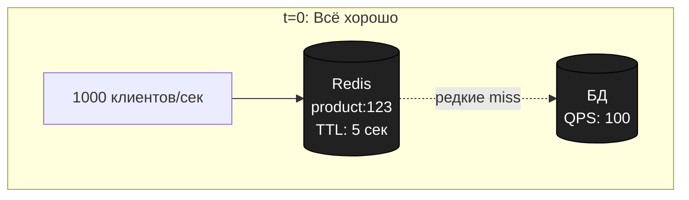
```mermaid
graph TB
    subgraph "t=0: Всё хорошо"
        C1[1000 клиентов/сек]
        Redis1[(Redis<br/>product:123<br/>TTL: 5 сек)]
        DB1[(БД<br/>QPS: 100)]
    end
    
    C1 --> Redis1
    Redis1 -.->|редкие miss| DB1

    classDef nodeDark fill:#212121,stroke:#000000,color:#ffffff;
    class Redis1,DB1 nodeDark;
```

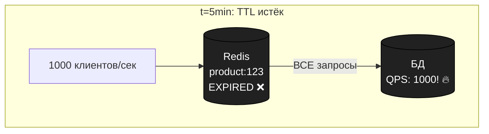
```mermaid
graph TB
    subgraph "t=5min: TTL истёк"
        C2[1000 клиентов/сек]
        Redis2[(Redis<br/>product:123<br/>EXPIRED ❌)]
        DB2[(БД<br/>QPS: 1000! 🔥)]
    end
    
    C2 --> Redis2
    Redis2 -->|ВСЕ запросы| DB2

    classDef nodeDark fill:#212121,stroke:#000000,color:#ffffff;
    class Redis2,DB2 nodeDark;
```

**Timeline инцидента:**

```
08:00:00 — Товар дня опубликован, QPS 1000/сек
08:00:30 — Первый запрос кладёт товар в кэш, TTL 300 сек
08:00:31 — 08:05:29 — Все запросы идут из кэша ✅
08:05:30 — TTL истёк, ключ удалён из Redis
08:05:30 — 1000 запросов одновременно идут в БД 🔥
08:05:31 — БД перегружена, latency 5 секунд
08:05:35 — Пользователи видят ошибки 500
08:06:00 — Кто-то положил товар обратно в кэш
08:06:01 — Система восстановилась
```

**График нагрузки:**

```
БД QPS
  ^
  |
1k|     *
  |    * *
  |   *   *
  |  *     *_______________
  | *
100|*
  +-----|-----|-----|------> время
     08:00  08:05  08:10
            ↑
         stampede!
```

#### Решение 1: Single Flight (request coalescing)

Уже разобрали выше — только один запрос идёт в БД.

Визуально это можно показать так:

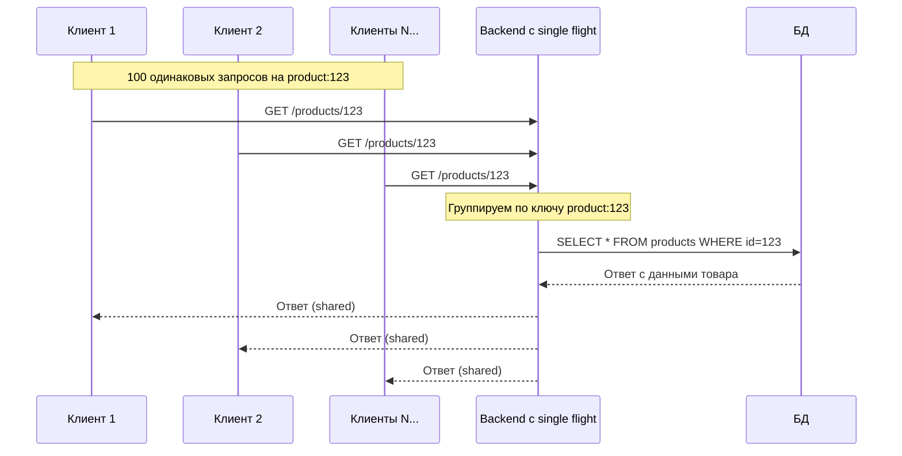
```mermaid
sequenceDiagram
    participant C1 as Клиент 1
    participant C2 as Клиент 2
    participant Cn as Клиенты N...
    participant S as Backend с single flight
    participant DB as БД

    Note over C1,Cn: 100 одинаковых запросов на product:123

    C1->>S: GET /products/123
    C2->>S: GET /products/123
    Cn->>S: GET /products/123

    Note over S: Группируем по ключу product:123

    S->>DB: SELECT * FROM products WHERE id=123
    DB-->>S: Ответ с данными товара

    S-->>C1: Ответ (shared)
    S-->>C2: Ответ (shared)
    S-->>Cn: Ответ (shared)
```

#### Решение 2: Early Refresh (заглядывание вперёд)

```php
<?php

use Doctrine\DBAL\Connection;
use Predis\Client as RedisClient;

final class EarlyRefreshCache
{
    private const TTL = 300; // 5 минут
    private const EARLY_REFRESH_WINDOW = 30; // 30 секунд до истечения

    public function __construct(
        private Connection $connection,
        private RedisClient $redis,
    ) {}

    public function getProductWithEarlyRefresh(int $productId): ?array
    {
        $cacheKey = sprintf('product:%d', $productId);

        // Получаем данные + timestamp их записи (храним как JSON-объект)
        $cached = $this->redis->get($cacheKey);

        if ($cached !== null) {
            $payload = json_decode($cached, true, flags: JSON_THROW_ON_ERROR);
            $data = $payload['data'];
            $cachedAt = $payload['cached_at'];

            $age = time() - $cachedAt;

            // Если до истечения TTL осталось < 30 секунд — триггерим refresh в фоне (через очередь/воркер)
            if ($age > (self::TTL - self::EARLY_REFRESH_WINDOW)) {
                // Здесь могла бы быть отправка сообщения в очередь на refresh
                // e.g. $this->refreshQueue->dispatch(new RefreshProductCache($productId));
            }

            // Возвращаем текущие данные (пусть чуть устаревшие)
            return $data;
        }

        // Cache miss — обычная загрузка
        $product = $this->connection->fetchAssociative(
            'SELECT * FROM products WHERE id = :id',
            ['id' => $productId],
        );

        if ($product === false) {
            return null;
        }

        $payload = [
            'data'      => $product,
            'cached_at' => time(),
        ];

        $this->redis->setex($cacheKey, self::TTL, json_encode($payload, JSON_THROW_ON_ERROR));

        return $product;
    }
}
```

**Результат:** Кэш обновляется до истечения TTL, stampede не происходит.

#### Решение 3: Jittered TTL (рандомизация)

```php
<?php

use Predis\Client as RedisClient;

// ❌ Плохо: все ключи истекают одновременно
// $redis->setex($key, 300, $data);  // Ровно 300 секунд

// ✅ Хорошо: добавляем случайный jitter ±10%
$baseTtl = 300;
$jitter  = random_int(-30, 30); // ±10%
$ttl     = $baseTtl + $jitter;

$redis->setex($key, $ttl, $data);
```

**Результат:** Ключи истекают равномерно во времени, нет одновременного stampede.

### 4.2. Stale Data (устаревшие данные)

**Где можно жить с stale данными:**

| Тип данных | Допустимое окно | Стратегия |
|------------|-----------------|-----------|
| Лента новостей | 1-5 минут | TTL-only |
| Счётчики лайков | 10-60 секунд | TTL-only |
| Рекомендации | 1-10 минут | TTL + периодический пересчёт |
| Каталог товаров | 30-60 секунд | Event-based + fallback TTL |

**Где НЕЛЬЗЯ жить с stale данными:**

| Тип данных | Требование | Стратегия |
|------------|------------|-----------|
| Баланс счёта | <1 секунды | Read-through с БД, lease-based |
| Остатки на складе | <5 секунд | Short TTL + проверка при checkout |
| Лимиты (rate limiting) | Real-time | Distributed counter, no cache |
| Права доступа (ACL) | <10 секунд | Event-based инвалидация |

**Пример: баланс пользователя**

```php
<?php

use Doctrine\DBAL\Connection;
use Predis\Client as RedisClient;

final class BalanceService
{
    public function __construct(
        private Connection $connection,
        private RedisClient $redis,
    ) {}

    // Кэш используем только для снижения нагрузки, НО не как source of truth
    public function getUserBalance(int $userId, bool $isFinancialOperation): float
    {
        $cacheKey = sprintf('balance:%d', $userId);
        $cachedBalance = $this->redis->get($cacheKey);

        // Для критичных операций ВСЕГДА проверяем БД
        if ($isFinancialOperation) {
            return (float) $this->queryBalance($userId, true);
        }

        // Для отображения можно использовать кэш
        if ($cachedBalance !== null) {
            return (float) $cachedBalance;
        }

        // Cache miss
        $balance = $this->queryBalance($userId, false);

        // Короткий TTL — несколько секунд
        $this->redis->setex($cacheKey, 5, (string) $balance);

        return $balance;
    }

    public function withdrawMoney(int $userId, float $amount): float
    {
        // Критичная операция — всегда из БД с блокировкой
        $this->connection->beginTransaction();
        try {
            $balance = (float) $this->connection->fetchOne(
                'SELECT balance FROM accounts WHERE user_id = :id FOR UPDATE',
                ['id' => $userId],
            );

            if ($balance < $amount) {
                throw new \RuntimeException('Insufficient funds');
            }

            $newBalance = $balance - $amount;

            $this->connection->executeStatement(
                'UPDATE accounts SET balance = :balance WHERE user_id = :id',
                ['balance' => $newBalance, 'id' => $userId],
            );

            // Инвалидируем кэш
            $this->redis->del([sprintf('balance:%d', $userId)]);

            $this->connection->commit();

            return $newBalance;
        } catch (\Throwable $e) {
            $this->connection->rollBack();
            throw $e;
        }
    }

    private function queryBalance(int $userId, bool $forUpdate): float
    {
        if ($forUpdate) {
            return (float) $this->connection->fetchOne(
                'SELECT balance FROM accounts WHERE user_id = :id FOR UPDATE',
                ['id' => $userId],
            );
        }

        return (float) $this->connection->fetchOne(
            'SELECT balance FROM accounts WHERE user_id = :id',
            ['id' => $userId],
        );
    }
}
```

### 4.3. Продакшен-инциденты (реальные истории)

#### Инцидент 1: Старая цена в кэше

**Компания:** Маркетплейс (анонимизировано)  
**Дата:** Чёрная пятница 2023

**Симптомы:**
- 12:00 — Начинается распродажа, цены на 10k товаров снижены на 50%
- 12:05 — Пользователи жалуются: "В каталоге цена 500₽, в корзине 1000₽"
- 12:10 — Поддержка завалена обращениями

**Root cause:**
```php
<?php

// Баг в коде обновления цен
function updatePricesForSale(array $productIds, float $discount, Connection $db, RedisClient $redis): void {
    foreach ($productIds as $productId) {
        // Обновили БД ✅
        $db->executeStatement(
            'UPDATE products SET price = price * (1 - :discount) WHERE id = :id',
            ['discount' => $discount, 'id' => $productId],
        );

        // Забыли инвалидировать кэш! ❌
        // $redis->del([sprintf("product:%d", $productId)]);
    }
}
```

**Timeline:**
```
11:50 — Маркетинг запускает скидки через admin-панель
11:55 — БД обновлена, цены снижены
12:00 — Пользователи заходят
12:01 — Каталог показывает старые цены из кэша (TTL 5 минут)
12:05 — Первые жалобы
12:10 — Инженеры обнаружили проблему
12:11 — FLUSHALL в Redis (сброс всего кэша)
12:12 — БД получила 10x нагрузку (холодный кэш)
12:15 — Система восстановилась, цены корректные
```

**Фикс:**
```php
<?php

function updatePricesForSaleFixed(array $productIds, float $discount, Connection $db, RedisClient $redis, MessageBusInterface $eventBus): void {
    // Батчовое обновление БД
    $db->executeStatement(
        'UPDATE products SET price = price * (1 - :discount) WHERE id IN (:ids)',
        ['discount' => $discount, 'ids' => $productIds],
        ['ids' => Connection::PARAM_INT_ARRAY],
    );

    // Инвалидация через событие
    $eventBus->dispatch(new PricesBulkUpdatedEvent($productIds, new \DateTimeImmutable()));

    // Немедленная инвалидация в Redis
    if (\count($productIds) < 1000) {
        $keys = array_map(fn (int $id): string => sprintf('product:%d', $id), $productIds);
        if ($keys !== []) {
            $redis->del($keys);
        }
    } else {
        // Слишком много ключей — увеличиваем версию тега
        $redis->incr('tag:sale:version');
    }
}
```

**Уроки:**
1. Всегда инвалидировать кэш при обновлении критичных данных
2. Иметь мониторинг расхождений кэш vs БД
3. Тестировать bulk-операции под нагрузкой

#### Инцидент 2: Split-brain в Redis кластере

**Компания:** SaaS платформа  
**Дата:** 2024

**Симптомы:**
- 03:00 — Сетевой сбой в ДЦ
- 03:05 — Половина пользователей видит корректные данные, половина — старые
- 03:10 — Система "раздвоилась"

**Root cause:**

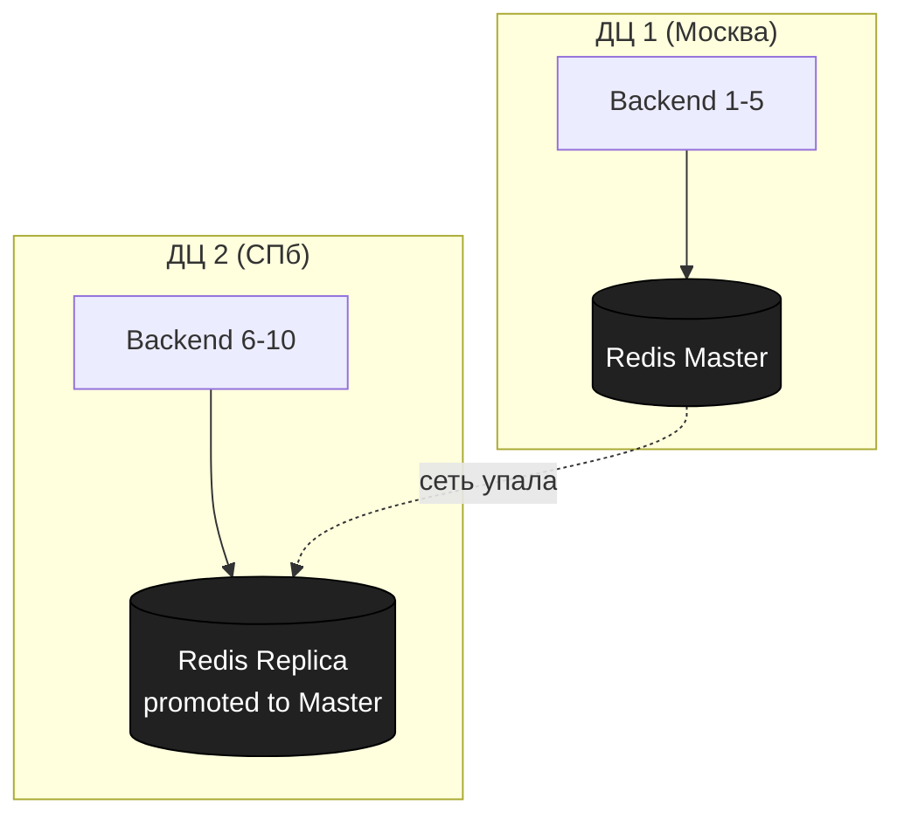
```mermaid
graph TB
    subgraph "ДЦ 1 (Москва)"
        B1[Backend 1-5]
        R1[(Redis Master)]
    end
    
    subgraph "ДЦ 2 (СПб)"
        B2[Backend 6-10]
        R2[(Redis Replica<br/>promoted to Master)]
    end
    
    B1 --> R1
    B2 --> R2
    
    R1 -.->|сеть упала| R2

    classDef redisDark fill:#212121,stroke:#000000,color:#ffffff;
    class R1,R2 redisDark;
```

**Timeline:**
```
03:00 — Сетевой сбой, Redis replica в СПб потеряла связь с master
03:01 — Redis Sentinel автоматически продвинул replica в master
03:02 — Теперь два master'а (split-brain!)
03:05 — Пользователи пишут в разные Redis
03:10 — Обнаружили проблему
03:15 — Вручную отключили один из master'ов
03:20 — Ресинхронизация данных
03:30 — Восстановлено
```

**Фикс:**
- Правильная настройка Redis Sentinel quorum
- Мониторинг split-brain ситуаций
- Автоматическое отключение "меньшинства" при partition

#### Инцидент 3: Cache всегда холодный

**Компания:** E-commerce  
**Дата:** 2023

**Симптомы:**
- Hit rate постоянно < 30%
- БД перегружена
- Latency P99 = 500ms (при норме 100ms)

**Root cause:**

```php
<?php

// Неправильная настройка Redis eviction
// redis.conf:
// maxmemory-policy allkeys-random  # ❌ Случайная эвикция!
```

Redis выбрасывал случайные ключи, включая горячие товары.

**Фикс:**
```php
<?php

// Правильная настройка в redis.conf:
// maxmemory-policy allkeys-lru  # ✅ LRU eviction
// maxmemory 10gb

// + Мониторинг eviction rate (псевдокод)
$evictedKeysPerSec = getRedisMetric('evicted_keys_per_sec');
if ($evictedKeysPerSec > 1000) {
    alert('Redis evicting too much! Increase memory.');
}
```

### 4.4. Кэш на собеседовании (подробный разбор)

**Задача от интервьюера:**

> "Спроектируйте систему для маркетплейса с 100k RPS.  
> Есть каталог (1M товаров), корзины (500k активных), заказы (10k/день).  
> Как будете использовать кэш?"

**❌ Плохой ответ (Junior/Middle без опыта):**

> "Поставлю Redis. Буду кэшировать всё с TTL 60 секунд.  
> Если база упадёт, кэш подхватит."

**Проблемы:**
- Нет уточняющих вопросов
- "Всё" — плохая стратегия (память, coherence)
- Redis не заменяет БД

**✅ Хороший ответ (Senior/Lead):**

*Шаг 1: Уточняющие вопросы*

> "Отлично, давайте уточню несколько моментов:
>
> 1. **Какие данные самые горячие?**
     >    - Карточки товаров? Корзины? Сессии?
>    - Есть ли "товары дня" с аномальным QPS?
>
> 2. **SLA по latency?**
     >    - P99 < 100ms? P50 < 50ms?
>    - Разные SLA для разных страниц?
>
> 3. **Требования к свежести данных?**
     >    - Цены — насколько критично показывать актуальные?
>    - Остатки на складе — можем ли oversell?
>    - Корзина — eventual consistency окей?
>
> 4. **Бюджет на инфраструктуру?**
     >    - Можем ли позволить CDN?
>    - Сколько памяти под Redis?
>
> 5. **Географическое распределение?**
     >    - Пользователи только в РФ или worldwide?"

*Интервьюер даёт ответы, например:*
- Горячие: топ-10k товаров (80% трафика), корзины, сессии
- SLA: P99 < 100ms для каталога, <50ms для корзины
- Цены: eventual consistency до 30 сек окей
- Остатки: критично, нельзя oversell
- Бюджет: средний, CDN можем
- География: РФ + СНГ

*Шаг 2: Архитектурное решение*

```
Предлагаю многоуровневую схему:

┌─────────────────────────────────────────┐
│ УРОВЕНЬ 1: CDN (CloudFlare)             │
├─────────────────────────────────────────┤
│ - Статика (JS/CSS/images): TTL 1 день   │
│ - Страницы каталога: TTL 5 минут        │
│ - Hit rate цель: >95%                    │
└─────────────────────────────────────────┘
            ↓ 5% miss
┌─────────────────────────────────────────┐
│ УРОВЕНЬ 2: L1 in-process кэш            │
│ (на каждом из 20 backend-серверов)      │
├─────────────────────────────────────────┤
│ - Справочники категорий: TTL 1 мин      │
│ - Права доступа: TTL 30 сек             │
│ - Топ-100 товаров: TTL 30 сек           │
│ - Размер: 100 MB/сервер, LRU            │
│ - Hit rate цель: >70%                    │
└─────────────────────────────────────────┘
            ↓ 30% miss
┌─────────────────────────────────────────┐
│ УРОВЕНЬ 3: Redis кластер (6 нод)        │
├─────────────────────────────────────────┤
│ - Горячие товары (top-10k): TTL 5 мин   │
│ - Корзины: TTL 1 час                     │
│ - Сессии: TTL по токену                  │
│ - Агрегаты (счётчики): TTL 30 сек       │
│ - Размер: 64 GB, LRU eviction           │
│ - Hit rate цель: >90%                    │
└─────────────────────────────────────────┘
            ↓ 10% miss
┌─────────────────────────────────────────┐
│ УРОВЕНЬ 4: PostgreSQL                    │
├─────────────────────────────────────────┤
│ - Source of Truth                        │
│ - Master-Replica setup                   │
│ - Reads: replica, Writes: master         │
└─────────────────────────────────────────┘
```

*Шаг 3: Особые случаи*

> "**Для критичных данных** (остатки товара):
> - В кэше храним только для отображения, TTL 10 секунд
> - При добавлении в корзину: проверка по БД
> - При оплате: SELECT FOR UPDATE (пессимистичная блокировка)
> - После продажи: event-based инвалидация
>
> **Для товаров дня** (hot keys):
> - Реплицируем в L1 всех серверов
> - Отдельный tier Redis для супер-горячих ключей
> - Request coalescing через singleflight
>
> **Защита от проблем:**
> - Thundering herd: jittered TTL + early refresh
> - Cold start: batch pre-warming топ-1000 товаров при deploy
> - Coherence: event-based инвалидация через Kafka"

*Шаг 4: Наблюдаемость*

> "**Метрики:**
> - Hit rate по каждому слою (CDN/L1/L2)
> - P99 latency breakdown
> - Stale read rate (через версионирование)
> - Redis memory usage & eviction rate
> - Hot keys detection (>10k RPS)
>
> **Alerts:**
> - Hit rate < 80% → проверить TTL, память
> - QPS на БД > 2x baseline → stampede?
> - Eviction rate > 1000/sec → увеличить память
>
> **Тестирование:**
> - Load test: 100k RPS, P99 < 100ms ✅
> - Chaos: Redis restart, проверка graceful degradation
> - Deploy: проверка cache warming < 2 минуты"

*Шаг 5: Trade-offs*

> "**Преимущества этого подхода:**
> - ✅ Низкая latency (90% запросов < 20ms)
> - ✅ Снижение нагрузки на БД в 100x
> - ✅ Устойчивость к stampede
> - ✅ Geographical distribution через CDN
>
> **Недостатки:**
> - ❌ Сложность поддержки многоуровневого кэша
> - ❌ Eventual consistency (до 30 сек)
> - ❌ Стоимость инфраструктуры (CDN + Redis)
>
> **Когда эта архитектура не подходит:**
> - Strong consistency критична (финтех)
> - Данные меняются слишком часто
> - Малая нагрузка (<1k RPS)"

**Что видит интервьюер:**
- ✅ Структурное мышление (вопросы → архитектура → детали)
- ✅ Понимание trade-offs
- ✅ Знание реальных проблем (stampede, hot keys, coherence)
- ✅ Практический опыт (метрики, тесты, мониторинг)
- ✅ Готовность к продакшену

### 4.5. Tricky кейсы

#### Кейс 1: Кэширование негативных результатов

**Проблема:** Пользователь ищет "асдфасдф" → пустая выдача → запрос в БД. Повторяет 100 раз → 100 запросов в БД.

**Решение:**

```php
<?php

use Doctrine\DBAL\Connection;
use Predis\Client as RedisClient;

final class SearchService
{
    public function __construct(
        private Connection $connection,
        private RedisClient $redis,
    ) {}

    public function searchProducts(string $query): array
    {
        $cacheKey = sprintf('search:%s', $query);

        $cached = $this->redis->get($cacheKey);
        if ($cached !== null) {
            return json_decode($cached, true, flags: JSON_THROW_ON_ERROR);
        }

        // Поиск в БД
        $products = $this->connection->fetchAllAssociative(
            'SELECT * FROM products WHERE name ILIKE :q',
            ['q' => '%'.$query.'%'],
        );

        if ($products === []) {
            // Кэшируем ПУСТОЙ результат с коротким TTL
            $this->redis->setex($cacheKey, 60, '[]'); // 60 секунд
        } else {
            $this->redis->setex($cacheKey, 300, json_encode($products, JSON_THROW_ON_ERROR));
        }

        return $products;
    }
}
```

**Важно:** TTL для пустых результатов должен быть короче!

#### Кейс 2: Multi-tenant системы

**Баг:**

```php
<?php

// ❌ Забыли добавить tenant_id в ключ!
function getUserSettingsBroken(int $userId, RedisClient $redis): array {
    $key = sprintf('settings:%d', $userId);  // БАГ!
    // ...
}
```

**Проблема:** User #123 в tenant A видит данные user #123 из tenant B!

**Фикс:**

```php
<?php

// ✅ Всегда включаем tenant_id
function getUserSettings(string $tenantId, int $userId, RedisClient $redis): array {
    $key = sprintf('settings:%s:%d', $tenantId, $userId);
    // ...
}
```

#### Кейс 3: Кэш и права доступа

**Опасность:**

```php
<?php

// Пользователь был admin, закэшировали права
$cache->set(sprintf('acl:%d', $userId), ['role' => 'admin'], 3600); // 1 час!

// Через 10 минут понизили до user
$connection->executeStatement(
    'UPDATE users SET role = :role WHERE id = :id',
    ['role' => 'user', 'id' => $userId],
);

// Но кэш ещё 50 минут будет показывать admin! ❌
```

**Решение:**

```php
<?php

// Короткий TTL для прав
const ACL_TTL = 60; // 1 минута

// + Event-based инвалидация при изменении прав
final class UserRoleChangedEvent
{
    public function __construct(
        public readonly int $userId,
    ) {}
}

final class AclCacheInvalidationListener
{
    public function __construct(private RedisClient $redis) {}

    public function __invoke(UserRoleChangedEvent $event): void
    {
        $this->redis->del([sprintf('acl:%d', $event->userId)]);
    }
}
```

### 4.6. Чеклист перед продакшеном

Проходите перед запуском:

✅ **1. Source of truth определён**
```
Где хранится истина? PostgreSQL
Допустимое окно рассинхрона?
- Каталог: 60 секунд
- Корзина: 5 секунд  
- Баланс: 1 секунда
```

✅ **2. Что кэшируем / что НЕ кэшируем**
```
КЭШИРУЕМ:
- Карточки товаров (TTL 5 мин)
- Каталог (TTL 1 мин)
- Агрегаты (TTL 30 сек)

НЕ КЭШИРУЕМ:
- Остатки (read-through с БД)
- Баланс (read-through с БД)
- Критичные финансовые операции
```

✅ **3. Стратегия инвалидации работает**
```
Механизм: Kafka events + fallback TTL
Тест: Вносим 500ms задержку → stale rate < 1% ✅
Fallback: При отказе Kafka — полагаемся на TTL
```

✅ **4. Защита от stampede**
```
- Single-flight: ✅ (singleflight.Group)
- Jittered TTL: ✅ (±10% рандом)
- Early refresh: ✅ (за 30 сек до истечения)
```

✅ **5. Мониторинг настроен**
```
Метрики:
- cache_hit_rate{layer} > 80%
- cache_latency_p99{layer} < 10ms
- db_qps < 1000 (baseline: 500)
- stale_read_rate < 0.01

Alerts:
- Hit rate drop >20% за 5 мин
- QPS spike >2x
- Hot key detected (>10k RPS)
```

✅ **6. Load tests пройдены**
```
Тест 1: 100k RPS → P99 < 100ms ✅
Тест 2: FLUSHALL Redis → recovery < 2 min ✅
Тест 3: Deploy с cache warming → hit rate 80% за 1 мин ✅
```

✅ **7. Runbook готов**
```
Если hit rate < 50%:
1. Проверить Redis memory (redis-cli INFO memory)
2. Проверить eviction rate (evicted_keys)
3. Если eviction >1000/sec → увеличить память
4. Escalate к SRE если не помогло

Если stampede:
1. Временно увеличить TTL (снизить частоту истечения)
2. Включить early refresh
3. Добавить jitter если нет
4. В крайнем случае — FLUSHALL и прогрев по батчам
```

---

## ЗАКЛЮЧЕНИЕ (2-3 минуты)

Мы разобрали три ключевых аспекта продвинутого кэширования:

1. **Cache Coherence** — как держать копии данных синхронными
    - Стратегии: TTL-only, event-based, lease-based
    - Trade-off между consistency и performance

2. **Многоуровневое кэширование** — как правильно распределить данные
    - Браузер → CDN → L1 → L2 → БД
    - Оптимизации: hot keys, request coalescing, cache warming

3. **Сложные проблемы** — что ломается в продакшене
    - Thundering herd, stale data, split-brain
    - Как это решать и мониторить

**Ключевые takeaways:**

- Кэш — это не просто "ускоритель", а архитектурный компонент
- Всегда есть trade-off между производительностью и согласованностью
- Инвалидация сложнее, чем кажется (race conditions, events, TTL)
- Мониторинг критически важен (hit rate, latency, stale reads)
- На собеседовании важнее задавать правильные вопросы, чем давать "готовое решение"

**Что дальше:**

В следующих частях мы разберём:
- Распределённые транзакции (2PC, Saga, Outbox pattern)
- Продвинутое шардирование (consistent hashing, rebalancing)
- Performance optimization (tail latency, throughput scaling)

**Практика:**

1. Возьмите свой проект — нарисуйте схему кэширования
2. Ответьте на 7 вопросов чеклиста
3. Добавьте метрики hit rate и stale reads
4. Проведите load test с симуляцией stampede

Спасибо за внимание! Вопросы?

---

## ДОПОЛНИТЕЛЬНЫЕ МАТЕРИАЛЫ

### Диаграммы для заметок

```mermaid
mindmap
  root((Кэширование))
    Стратегии
      TTL-only
      Event-based
      Lease-based
    Слои
      Браузер
      CDN
      L1 in-process
      L2 Redis
      БД
    Проблемы
      Thundering herd
      Stale data
      Coherence
      Split-brain
    Решения
      Single flight
      Jittered TTL
      Early refresh
      Версионирование
    Метрики
      Hit rate
      Latency
      Stale reads
      Eviction rate
```

### Полезные ссылки

**Теория:**
- Designing Data-Intensive Applications (Martin Kleppmann) — Chapter 5
- "Cache made consistent" — Meta Engineering
- "Distributed Caching Woes" — Medium

**Практика:**
- Redis documentation: Caching patterns
- Memcached documentation
- singleflight package (Golang)

**Доклады:**
- "Effective Caching Strategies" (YouTube)
- "Thundering Herd Problem" (conf talks)
- Highload++ доклады по кэшированию

---

**Конец сценария**
