## Часть 1: Продвинутое кэширование и консистентность кэша

## Введение в кеш

Привет! Мы начинаем продвинутую часть курса по системному дизайну. В предыдущих главах мы говорили про кэш на уровне "вот Redis, он ускоряет запросы к базе". Это правда, но очень поверхностно.

На практике это ещё и опасное упрощение: неправильно спроектированный кэш легко делает обратное — замедляет сервис или под нагрузкой вообще кладёт систему. И делает это разными, неочевидными способами, к которым мы вернёмся в конце этой части.

Для примеров я буду использовать маркетплейс с миллионами товаров, корзинами, заказами — всё как в реальной жизни.

Зачем нужен кэш в продакшене?
Кэш нужен для:
- **Разгрузки БД и внешних API** — вместо 100k запросов в секунду делаем 100 и не DDoS'им систему
- **Ускорения чтений** — карточка товара за 2ms вместо 50ms из БД
- **Переиспользования дорогих вычислений** — рекомендации, агрегаты, отчёты

Представьте: у вас маркетплейс, на оформление заказа нужно показать актуальный курс валют. Вы интегрировались с внешним сервисом курсов.

**Проблема:** Каждый пользователь при оформлении заказа дёргает этот API. У вас 200 тысяч активных пользователей. Внешний API не ваш, он может упасть, тормозить или банально заблокировать вас за DDoS.

**Решение:** Отдельный воркер раз в минуту запрашивает курсы и кладёт их в Redis. Все запросы пользователей читают из кэша, а не лупят внешний API.

Также кеш может позволить пережить краткосрочное падение бэка/базы - например nginx может отдавать закешированные ответы даже если они устарели при проблемах с upstream через директиву proxy_cache_use_stale

Базовая терминология:
- `cache hit` - попадание в кеш (искомый ключ имелся в кеше)
- `cache miss` — промах в кеше - не нашли искомый элемент
- `hot key` — очень популярный ключ (например, товар дня)
- `stale data` — устаревшие данные в кэше
- `Hit rate` — процент запросов, которые нашли данные в кэше
- `TTL` (Time To Live) — как долго данные живут в кэше
- `Latency` — время ответа из кэша vs из БД

## A. Многоуровневое кэширование и оптимизации

### Архитектура слоёв

Касательно latency - мы хотим отдавать данные как можно ближе к пользователю. Зачем тянуть картинку из S3 в БД, если её может отдать CDN за 10ms?
Зачем каждый раз ходить в Redis (2-5ms), если можно держать маленький L1-кэш прямо в памяти сервера (<1ms)?
Вдобавок ем раньше мы отдадим что-то из кеша, тем меньше мы нагрузим дальнейшие слои системы

Но чем больше слоёв, тем сложнее поддерживать согласованность.

Вопрос: **какие данные на каком уровне держать?**

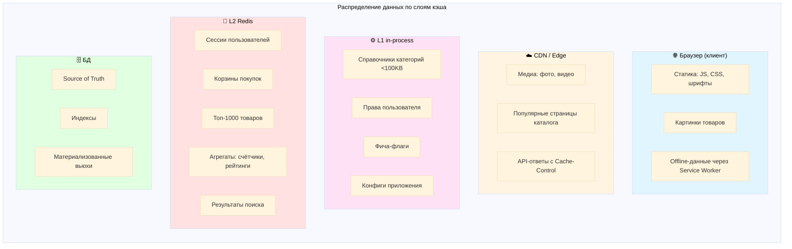

Важны метрики hit rate, latency по слоям, подробнее о мониторинге поговорим в конце


## B. Cache Coherence в распределённых системах

### B1. Проблема расхождения слоёв

Теперь предположим такую ситуацию

08:00:00 — Пользователь Иван заходит в "Мой профиль", меняет адрес доставки:
```text
Было: "Москва, ул. Ленина, 10"
Стало: "Санкт-Петербург, Невский пр., 25"
```

08:00:02 — Адрес успешно обновился, Иван видит сообщение: ✅ "Адрес сохранён"

08:00:10 — Иван переходит в корзину, чтобы оформить заказ
08:00:11 — В корзине показывается старый адрес: "Москва, ул. Ленина, 10" ❌

Иван пишет в техподдержку
```text
Все фигня ничего не работает верните деньги!
```

Что произошло под капотом?

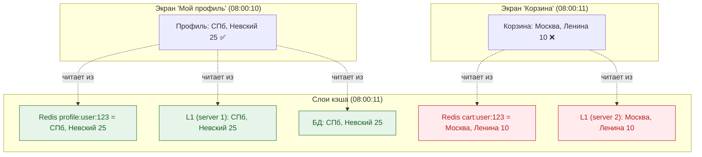

То есть информация об адресе пользователя хранилась в нескольких слоях (и инстансах)

| Слой | Ключ | Значение | Статус |
|------|------|----------|--------|
| **БД** | `users.address` | СПб, Невский 25 | ✅ Обновлён |
| **Redis** | `profile:user:123` | СПб, Невский 25 | ✅ Инвалидирован, перезагружен |
| **Redis** | `cart:user:123` | Москва, Ленина 10 | ❌ **НЕ инвалидирован!** |
| **L1 APCu** | `profile:user:123` (server 1) | СПб, Невский 25 | ✅ Инвалидирован |
| **L1 APCu** | `cart:user:123` (server 2) | Москва, Ленина 10 | ❌ **НЕ инвалидирован!** |

Получилось так, что при обновлении мы инвалидировали только часть слоев

Вдобавок к тому что разные экраны показывают разные данные, так еще и экран пользователя может показывать то одно значение то другое в зависимости от того на какой инстанс его кинет 

Здесь мы приходим к понятию Cache Coherence
Cache Coherence — это свойство системы, при котором все копии одного и того же объекта данных в разных кэшах остаются согласованными.

Вопросы для размышления

Q1: Как быстро мы требуем согласованность?

* Мгновенно (strong coherence)? — дорого
* В течение секунды (eventual coherence)? — реалистично
* В течение минуты? — зависит от бизнеса

Q2: Какие данные критичны к coherence?

* Адрес доставки: средняя критичность (eventual до 5 секунд окей)
* Баланс счёта: высокая критичность (<1 секунды)
* Лента новостей: низкая критичность (до 5 минут окей)

Q3: Как проверить, что coherence нарушена?

* Метрика stale_read_rate (об этом расскажу в разделе D)


### B2. Стратегии наполнения кэша

Так как мы можем бороться с расхождением кеша? Сначала надо определиться кто в системе будет отвечать за это

Есть два разных подхода:

| Подход | Кто управляет | Плюсы | Минусы |
|--------|---------------|-------|--------|
| **Сервис-driven** | Код сервиса явно работает с кэшем | Полный контроль | Легко ошибиться |
| **Cache-driven** | Кэш-слой прозрачно работает с БД | Меньше кода | Меньше гибкости |

В свою очередь из этих подходов рождаются 4 разных стратегии наполнения кеша

#### Стратегия 1: Cache-Aside (Lazy Loading)
Он Самый простой

При этом подходе всем управляет сервис. То есть наш код явно

1. Проверяет кэш
2. Если нет — ходит в БД
3. Кладёт в кэш
4. Сам же делает invalidate

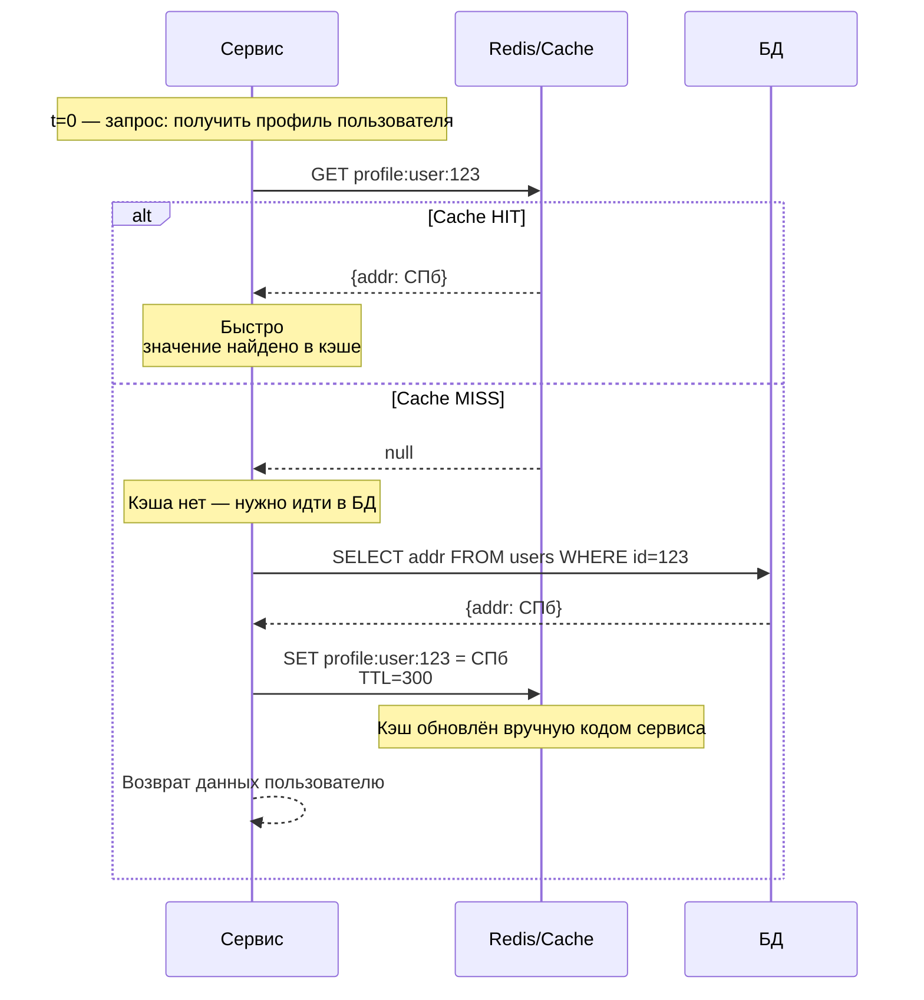

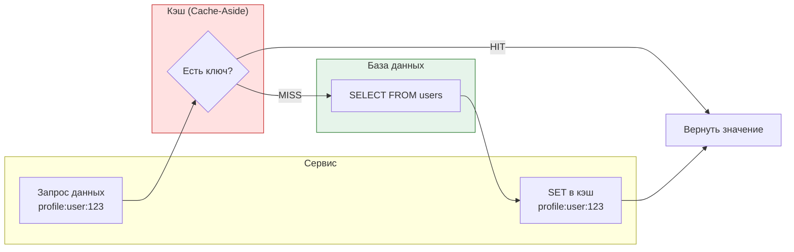
Все очень прозрачно

Но возникает ряд проблем:
- так как вероятно мы дублируем это поведение в разных местах бизнес логики, то мы можем забыть где-то инвалидировать какой-то из связанных ключей, как это было в примере выше про адрес пользователя
    ```php
    // ❌ Забыли инвалидировать связанные ключи
    $this->cache->delete("product:{$productId}"); // ✅
    // Забыли:
    // $this->cache->delete("cart:user:123"); // адрес был тут
    // $this->cache->delete("search:results"); // товар был тут
    ```
- либо мы можем забыть инвалидировать какой-то из слоев
- вдобавок можем столкнуться с race condition: Запрос A обновил БД, удалил ключ, запрос B успел прочитать старые данные и записал их обратно в кэш. подробнее об этом поговорим позже

Cache-aside работает, пока у тебя 2 экрана, потом становится все сложнее этим управлять, так как размазано по коду

Из плюсов:
✅ Полный контроль над логикой 
✅ Простая реализация

#### Стратегия 2: Read-Through Cache

В какой-то момент становится более поддерживаемым решением двинуть эту логику в редис
То есть для нашего сервиса все становится проще и прозрачнее: мы обращаемся к кешу, если у кеша нет такого ключа то он идет в бд и сам себя обновляет

Получается лучше:
- меньше или вообще нет duplicate логики - Не нужно бегать по всему коду чтоб добавить/убрать инвалидацию
- согласованность между Redis и DB стала стабильнее
- исчезает часть race conditions - Нет шансов записать в кэш устаревшие данные руками

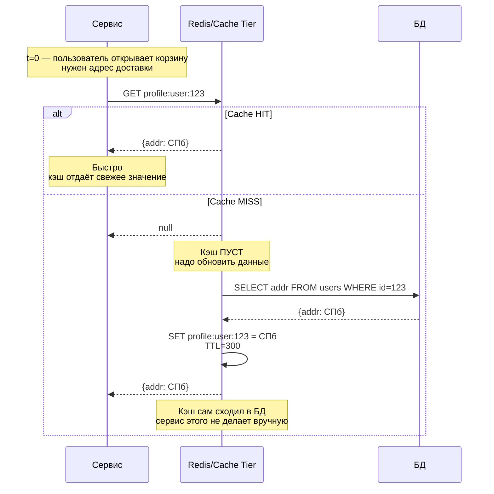

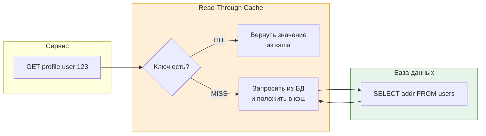
Но взамен мы получаем новые проблемы:
Кеш не знает когда запись в базе обновляется, он обновляется только при чтении при cache-miss
То есть пользователь, который только что обновил адрес, увидит старый значение до следующего cache miss.

То есть мы закрыли часть проблем, но получили новые

#### 3. Write-Through Cache

Эту проблему можно исправить используя стратегию  Write-Through

Как работает:

1. Запись идёт в кэш
2. Кэш синхронно пишет в БД
3. Только после этого запрос считается успешным

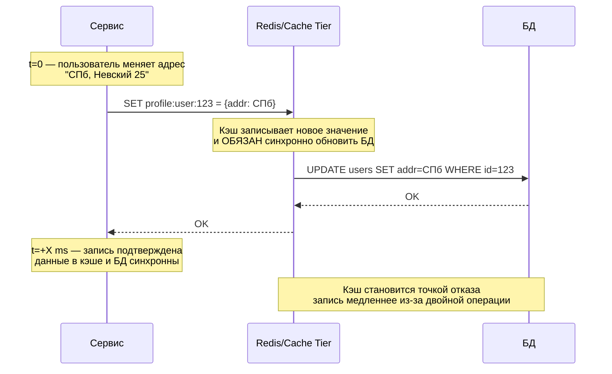
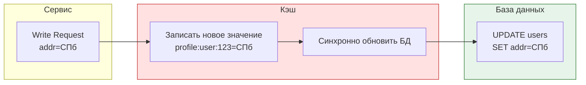

Теперь Рабочие данные **всегда** согласованы с бд (источником истины)

Из минусов - кеш становится точкой отказа. Если редис упадет, то мы не сможем писать в базу
И если база тормозит, то редису приходится ждать 

Следующая проблема - Высокая латентность на write
Раньше мы писали только в бд, теперь сначала в кеш, и только потом в бд

В write-heavy системах (балансы, корзины) это прям дорого.

Таким образом согласованнасть у нас почти идеальная, но стоимость такого решения высокая

#### 4. Write-Behind (Write-Back Cache)

Для решения этой проблемы можем перейти к Write-Behind стратегии

Как работает:

1. Запись делается только в кэш
2. Кэш кладёт операцию в очередь
3. БД обновляется фоном (через батчи)

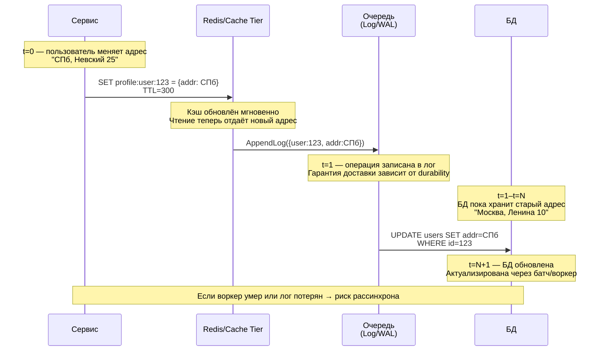
```mermaid
  flowchart LR
  subgraph S["Сервис"]
    A["Write Request<br/>addr=СПб"]
  end

  subgraph C["Кэш"]
    B["Записать новое значение<br/>profile:user:123=СПб"]
  end

  subgraph Q["Очередь / WAL"]
    D["Записать событие<br/>&#123;user:123, addr:СПб&#125;"]
  end

  subgraph DB["База данных"]
    E["Позднее обновление<br/>UPDATE..."]
  end

  A -- SET --> B
  B -- Append --> D
  D -- async batch --> E

  style C fill:#ffe1e1,stroke:#c62828
  style Q fill:#fff3cd,stroke:#d39e00
  style DB fill:#e6f4ea,stroke:#2e7d32

```

Таким образом запись у нас снова становится быстрой, бд можно наполнять батчами, что дешево к ресурсам

Из минусов - происходит неконсистентность в обратную сторону - в кеше данные свежее чем в базе. Но это менее страшно для пользователя, так как данные он получает из кеша
Так же возникает риск потерять данные, если упадет очередь, что в целом решаемо через durable queue или  Kafka.

Итого:

| Стратегия         | Где используется      | Что решает                     | Что ломает             | Coherence  |
| ----------------- | --------------------- | ------------------------------ | ---------------------- | ---------- |
| **Cache-Aside**   | стартапы, быстрые MVP | простота                       | stale data everywhere  | ❌ слабая   |
| **Read-Through**  | средние проекты       | уменьшает ошибки разработчиков | invalidate тяжёлый     | ◒ средняя  |
| **Write-Through** | финансы, лимиты       | сильная согласованность чтения | write дорого           | ✔ высокая  |
| **Write-Behind**  | high-load, аналитика  | дешёвые записи, батчи          | сложность, риск потерь | ◒ eventual |


### B3. Инвалидация и гонки
[//]: # (Стратегии инвалидации TTL-only/Event-based &#40;pub/sub&#41;/Lease-based)
[//]: # (тегирование для инвалидации в отношение когерентности , лучше б скрин какой)

### B4. Метрики и сигналы
[//]: # (объяснить что надо покрывать метриками и следить за метриками а не на глаз выбирать че кешируем че нет)

## C. Решение сложных проблем кэширования
### История 0 : состояние гонки

Решение 1: Оптимистичные блокировки (versioning)
├─ Compare-And-Swap (CAS) в Redis
├─ ETags / версии в ключах
└─ Код примера

Решение 2: Пессимистичные блокировки (distributed locks)
├─ Redlock, Zookeeper
├─ Lease-based кэширование
└─ Код примера


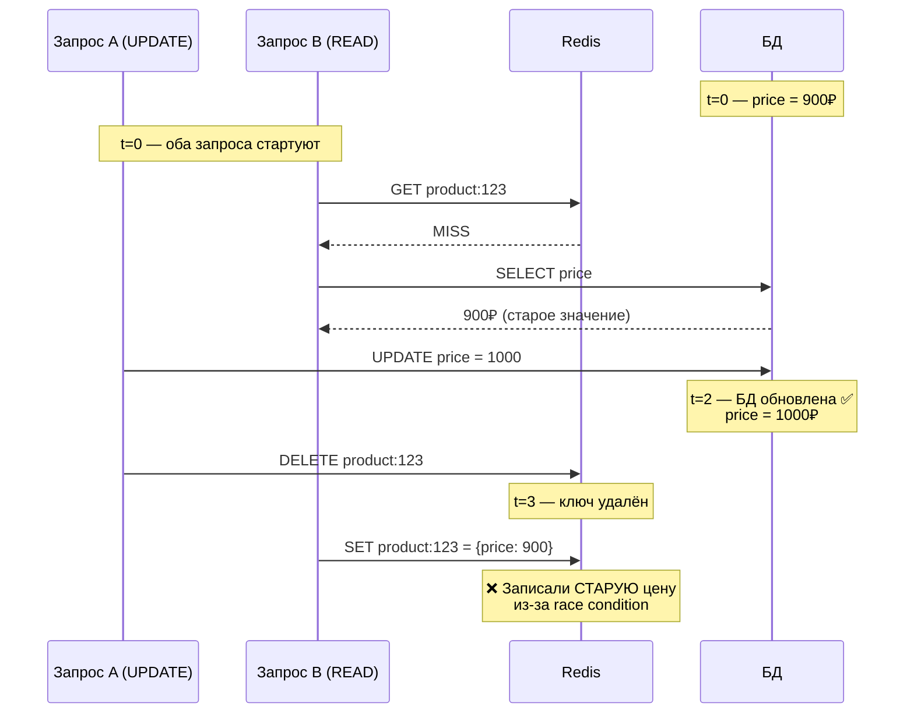


### История 1: stale data / forever cache
[//]: # (stale data -> polaris)
[//]: # (forever cache)
[//]: # (eviction policies + example redis)

### История 2: thundering herd
[//]: # (грохочущее стадо)
[//]: # (Jittered TTL &#40;рандомизация&#41;)
[//]: # (пример для стада про життер)
[//]: # (Early Refresh)
[//]: # (request coalescing)

### История 3: инцидент на деплое / blue-green
[//]: # (прогрев кеша)
[//]: # (blue green deploy)
[//]: # (версионирование)

### История 4: split-brain / кластеры
[//]: # (split brain)

### Другое
[//]: # (doom loop)
[//]: # (Кэширование негативных результатов)
[//]: # (hot keys + Separate tier для hot keys)

___

## D. Observability и Production Readiness (новый раздел!)

D1. Архитектура мониторинга (2-3 мин)
- Кто экспортирует (PHP exporter, Redis exporter)
- Куда экспортирует (Prometheus)
- Кто показывает (Grafana)
- Схема потока метрик

D2. Ключевые метрики (3-4 мин)
- По слоям: hit rate, latency, size
- По проблемам: stale_read_rate, eviction_rate, QPS spike
- Таблица: метрика → что показывает → целевое значение

D3. Дашборды (2-3 мин) 🎨
- Скрин 1: Cache Overview Dashboard
(панели: hit rate по слоям, latency, operations/sec)
- Скрин 2: Cache Health Dashboard
(панели: stale reads, evictions, memory usage)
- Скрин 3: Incident Investigation Dashboard
(панели: QPS spike detection, hot keys, errors)

D4. Алерты (2-3 мин)
- Примеры Prometheus alert rules
- Пороговые значения с обоснованием
- Примеры runbook: "Если алерт X, делай Y"

D5. Decision Tree (1-2 мин)
- Блок-схема диагностики
- "Hit rate < 80%? → Проверь A, B, C"
- "Stale reads > 1%? → Проверь D, E, F"
