## Часть 1: Продвинутое кэширование и консистентность кэша

## Введение в кеш

Привет! Мы начинаем продвинутую часть курса по системному дизайну. В предыдущих главах мы говорили про кэш на уровне "вот Redis, он ускоряет запросы к базе". Это правда, но очень поверхностно.

На практике это ещё и опасное упрощение: неправильно спроектированный кэш легко делает обратное — замедляет сервис или под нагрузкой вообще кладёт систему. И делает это разными, неочевидными способами, к которым мы вернёмся в конце этой части.

Для примеров я буду использовать маркетплейс с миллионами товаров, корзинами, заказами — всё как в реальной жизни.

Зачем нужен кэш в продакшене?
Кэш нужен для:
- **Разгрузки БД и внешних API** — вместо 100k запросов в секунду делаем 100 и не DDoS'им систему
- **Ускорения чтений** — карточка товара за 2ms вместо 50ms из БД
- **Переиспользования дорогих вычислений** — рекомендации, агрегаты, отчёты

Представьте: у вас маркетплейс, на оформление заказа нужно показать актуальный курс валют. Вы интегрировались с внешним сервисом курсов.

**Проблема:** Каждый пользователь при оформлении заказа дёргает этот API. У вас 200 тысяч активных пользователей. Внешний API не ваш, он может упасть, тормозить или банально заблокировать вас за DDoS.

**Решение:** Отдельный воркер раз в минуту запрашивает курсы и кладёт их в Redis. Все запросы пользователей читают из кэша, а не лупят внешний API.

Также кеш может позволить пережить краткосрочное падение бэка/базы - например nginx может отдавать закешированные ответы даже если они устарели при проблемах с upstream через директиву proxy_cache_use_stale

Базовая терминология:
- `cache hit` - попадание в кеш (искомый ключ имелся в кеше)
- `cache miss` — промах в кеше - не нашли искомый элемент
- `hot key` — очень популярный ключ (например, товар дня)
- `stale data` — устаревшие данные в кэше
- `Hit rate` — процент запросов, которые нашли данные в кэше
- `TTL` (Time To Live) — как долго данные живут в кэше
- `Latency` — время ответа из кэша vs из БД

### Кэширование негативных результатов

Техника когда мы можем кешировать например 404 ответы от сторонних апишек, чтобы снизить на них нагрузку. Главное не кешировать это навечно

[//]: # (что не надо кешировать?)

## A. Многоуровневое кэширование и оптимизации

### Архитектура слоёв

Касательно latency - мы хотим отдавать данные как можно ближе к пользователю. Зачем тянуть картинку из S3 в БД, если её может отдать CDN за 10ms?
Зачем каждый раз ходить в Redis (2-5ms), если можно держать маленький L1-кэш прямо в памяти сервера (<1ms)?
Вдобавок ем раньше мы отдадим что-то из кеша, тем меньше мы нагрузим дальнейшие слои системы

Но чем больше слоёв, тем сложнее поддерживать согласованность.

Вопрос: **какие данные на каком уровне держать?**

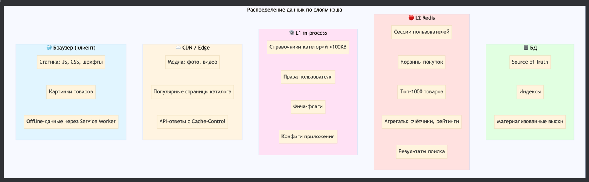

Важны метрики hit rate, latency по слоям, подробнее о мониторинге поговорим в конце


## B. Cache Coherence в распределённых системах

### B1. Проблема расхождения слоёв

Теперь предположим такую ситуацию

08:00:00 — Пользователь Иван заходит в "Мой профиль", меняет адрес доставки:
```text
Было: "Москва, ул. Ленина, 10"
Стало: "Санкт-Петербург, Невский пр., 25"
```

08:00:02 — Адрес успешно обновился, Иван видит сообщение: ✅ "Адрес сохранён"

08:00:10 — Иван переходит в корзину, чтобы оформить заказ
08:00:11 — В корзине показывается старый адрес: "Москва, ул. Ленина, 10" ❌

Иван пишет в техподдержку
```text
Все фигня ничего не работает верните деньги!
```

Что произошло под капотом?


То есть информация об адресе пользователя хранилась в нескольких слоях (и инстансах)

| Слой | Ключ | Значение | Статус |
|------|------|----------|--------|
| **БД** | `users.address` | СПб, Невский 25 | ✅ Обновлён |
| **Redis** | `profile:user:123` | СПб, Невский 25 | ✅ Инвалидирован, перезагружен |
| **Redis** | `cart:user:123` | Москва, Ленина 10 | ❌ **НЕ инвалидирован!** |
| **L1 APCu** | `profile:user:123` (server 1) | СПб, Невский 25 | ✅ Инвалидирован |
| **L1 APCu** | `cart:user:123` (server 2) | Москва, Ленина 10 | ❌ **НЕ инвалидирован!** |

Получилось так, что при обновлении мы инвалидировали только часть слоев

Вдобавок к тому что разные экраны показывают разные данные, так еще и экран пользователя может показывать то одно значение то другое в зависимости от того на какой инстанс его кинет 

Здесь мы приходим к понятию Cache Coherence
Cache Coherence — это свойство системы, при котором все копии одного и того же объекта данных в разных кэшах остаются согласованными.

Вопросы для размышления

Q1: Как быстро мы требуем согласованность?

* Мгновенно (strong coherence)? — дорого
* В течение секунды (eventual coherence)? — реалистично
* В течение минуты? — зависит от бизнеса

Q2: Какие данные критичны к coherence?

* Адрес доставки: средняя критичность (eventual до 5 секунд окей)
* Баланс счёта: высокая критичность (<1 секунды)
* Лента новостей: низкая критичность (до 5 минут окей)

Q3: Как проверить, что coherence нарушена?

* Метрика stale_read_rate (об этом расскажу в разделе D)


### B2. Стратегии наполнения кэша

Так как мы можем бороться с расхождением кеша? Сначала надо определиться кто в системе будет отвечать за это

Есть два разных подхода:

| Подход | Кто управляет | Плюсы | Минусы |
|--------|---------------|-------|--------|
| **Сервис-driven** | Код сервиса явно работает с кэшем | Полный контроль | Легко ошибиться |
| **Cache-driven** | Кэш-слой прозрачно работает с БД | Меньше кода | Меньше гибкости |

В свою очередь из этих подходов рождаются 4 разных стратегии наполнения кеша

#### Стратегия 1: Cache-Aside (Lazy Loading)
Он Самый простой

При этом подходе всем управляет сервис. То есть наш код явно

1. Проверяет кэш
2. Если нет — ходит в БД
3. Кладёт в кэш
4. Сам же делает invalidate

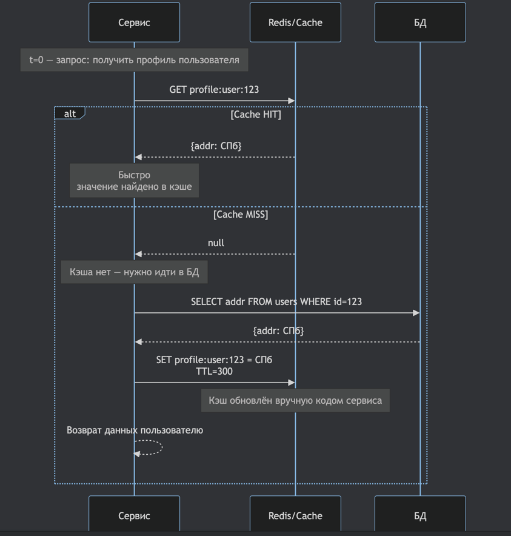

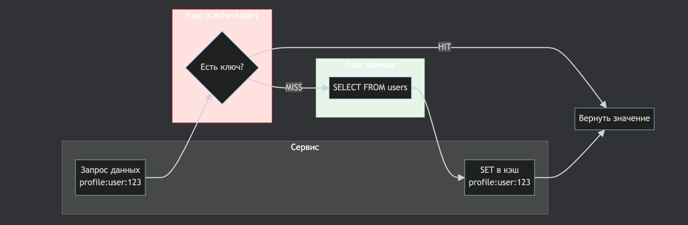

пример псевдокода


Все очень прозрачно

Но возникает ряд проблем:
- так как вероятно мы дублируем это поведение в разных местах бизнес логики, то мы можем забыть где-то инвалидировать какой-то из связанных ключей, как это было в примере выше про адрес пользователя

  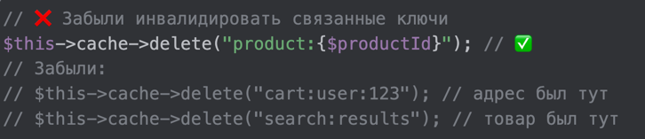
- либо мы можем забыть инвалидировать какой-то из слоев
- вдобавок можем столкнуться с race condition: Запрос A обновил БД, удалил ключ, запрос B успел прочитать старые данные и записал их обратно в кэш. подробнее об этом поговорим позже

Cache-aside работает, пока у тебя 2 экрана, потом становится все сложнее этим управлять, так как размазано по коду

Из плюсов:
✅ Полный контроль над логикой 
✅ Простая реализация

#### Стратегия 2: Read-Through Cache

В какой-то момент становится более поддерживаемым решением двинуть эту логику в редис
То есть для нашего сервиса все становится проще и прозрачнее: мы обращаемся к кешу, если у кеша нет такого ключа то он идет в бд и сам себя обновляет

Получается лучше:
- меньше или вообще нет duplicate логики - Не нужно бегать по всему коду чтоб добавить/убрать инвалидацию
- согласованность между Redis и DB стала стабильнее
- исчезает часть race conditions - Нет шансов записать в кэш устаревшие данные руками

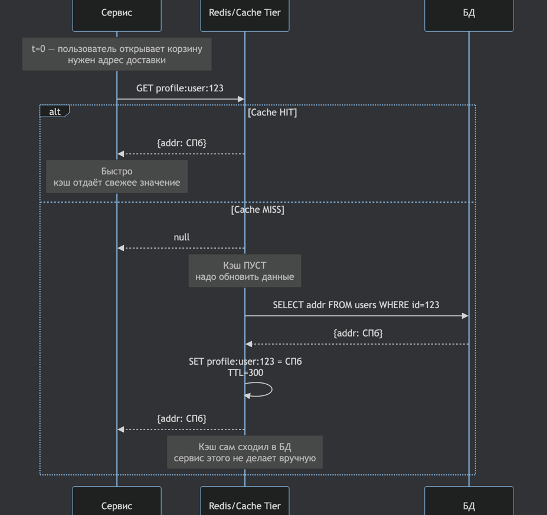

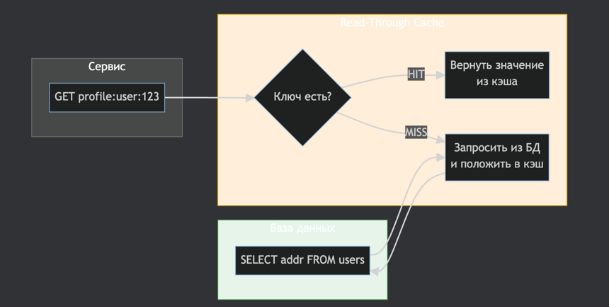

Это не магическая возможность редиса а скорее паттерн в коде обертке над кешом:

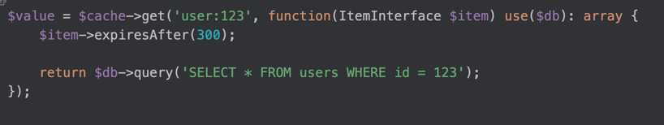

Но взамен мы получаем новые проблемы:
Кеш не знает когда запись в базе обновляется, он обновляется только при чтении при cache-miss
То есть пользователь, который только что обновил адрес, увидит старый значение до следующего cache miss.

То есть мы закрыли часть проблем, но получили новые

#### 3. Write-Through Cache

Эту проблему можно исправить используя стратегию  Write-Through

Как работает:

1. Запись идёт в кэш
2. Кэш синхронно пишет в БД
3. Только после этого запрос считается успешным


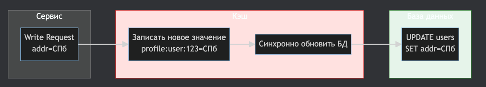

пример кода

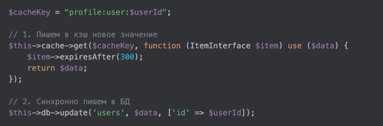

Теперь Рабочие данные **всегда** согласованы с бд (источником истины)

Из минусов - кеш становится точкой отказа. Если редис упадет, то мы не сможем писать в базу
И если база тормозит, то редису приходится ждать 

Следующая проблема - Высокая латентность на write
Раньше мы писали только в бд, теперь сначала в кеш, и только потом в бд

В write-heavy системах (балансы, корзины) это прям дорого.

Таким образом согласованнасть у нас почти идеальная, но стоимость такого решения высокая

#### 4. Write-Behind (Write-Back Cache)

Для решения этой проблемы можем перейти к Write-Behind стратегии

Как работает:

1. Запись делается только в кэш
2. Кэш кладёт операцию в очередь
3. БД обновляется фоном (через батчи)


Пример кода


Таким образом запись у нас снова становится быстрой, бд можно наполнять батчами, что дешево к ресурсам

Из минусов - 
- То есть write-behind — это сознательный уход от сильной консистентности  в пользу latency & throughput, так как инструменты сохранения consistency из ACID у нас исчезают. пользователь видит что все ок, хотя в базу никогда не ляжет запись
  то есть можем использовать либо в event sourcing/eventual consistency вроде saga, либо для данных которые допустимо терять: аналитика, логи и тп
- происходит неконсистентность в обратную сторону - в кеше данные свежее чем в базе. Но это менее страшно для пользователя, так как данные он получает из кеша
- Так же возникает риск потерять данные, если упадет очередь, что в целом решаемо через durable queue или  Kafka.

Итого:

| Стратегия         | Где используется      | Что решает                     | Что ломает             | Coherence  |
| ----------------- | --------------------- | ------------------------------ | ---------------------- | ---------- |
| **Cache-Aside**   | стартапы, быстрые MVP | простота                       | stale data everywhere  | ❌ слабая   |
| **Read-Through**  | средние проекты       | уменьшает ошибки разработчиков | invalidate тяжёлый     | ◒ средняя  |
| **Write-Through** | финансы, лимиты       | сильная согласованность чтения | write дорого           | ✔ высокая  |
| **Write-Behind**  | high-load, аналитика  | дешёвые записи, батчи          | сложность, риск потерь | ◒ eventual |


### B3. Инвалидация

Мы разобрали как писать в кеш с нужным уровнем когерентности

А как удалять данные из кеша?

Есть даже известная фраза Фила Карлтона сказанная 28 лет назад
“В программировании есть только две сложные проблемы: инвалидация кеша и придумывание названий” 

Здесь нам доступны три основных подхода.

#### 1) TTL-only: “пусть всё само протухает”

Самый простой, но самый неэффективный
При этом подходе мы вообще не инвалидируем кэш явно, а просто ждем пока его срок жизни истечет. Зато нам не нужно писать лишний код или придумывать какую-то архитектуру

Из минусов:
1. stale data гарантирована
2. время невалидности = время TTL - если TTL 5 минут, то 5 минут у вас всё рассинхронизировано
3. никаких гарантий когерентности между разными слоями (L1, Redis, CDN, браузер)

Этот подход окей для ленты новостей, популярных товаров, каталога.
Но ужасен для адресов доставки, балансов, лимитов.

#### 2) Event-based invalidation (Pub/Sub)

Для борьбы со stale data мы переходим к Event-based invalidation

Здесь сразу после изменения данных мы отправляем событие, например user.updated

И все подписчики решают, что делать:
* удалить ключ
* обновить кэш
* сбросить локальный L1
* отправить обновление в CDN
* инвалидировать связанные ключи

Таким образом у нас возрастает cache coherence - одно событие инвалидирует все слои (L1, Redis, CDN)
stale-read окно уменьшается с минут до миллисекунд

#### Tag-based invalidation

Вот мы сказали что подписчики умеют инвалидирвоать связанные ключи
Но как это работает?
Для решения такой задачи есть возможность помечать разные ключи одинаковыми тегами, если такая возможность есть в вашем фреймворке

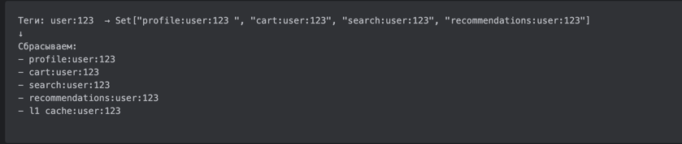

В контексте coherence это критично, потому что:
* все слои обновляются атомарно
* нет риска забыть один ключ

## C. Решение сложных проблем кэширования

Кроме перечисленных проблем мы имеем еще с полдюжины других. Сейчас разберем подробнее, и первая из них - race condition

### История 0 : состояние гонки

Представим ситуацию:

[//]: # (расписать че на диаграмме)


Есть два вида решений это проблемы: оптимистичная и пессимистичная блокировки

#### Решение 1: Оптимистичные блокировки (Versioning)

К каждому элементу кеша добавляется поле version

Мы обновляем данные только если версия та же, что у нас в руках
Если версия изменилась — значит кто-то обновил данные раньше, и мы НЕ имеем права писать.

Оптимистичная она потому что никаких локов не ставится, и никто никого не ждет

Есть 3 способа реализации

1. CAS (Compare-And-Set) в Redis
2. версионные ключи — product:123:v7

##### 1. CAS (Compare-And-Set) в Redis

CAS - способ обнаружить гонку при записи.
Оно не запрещает параллельность,
но гарантирует, что никто не перезапишет новое старым.

Допустим, у тебя есть значение:
```
value = 100
```

Ты хочешь увеличить на 10:

1. читаешь старое значение (100)
2. считаешь новое (110)
3. CAS делает:
```
если value == 100 → поставь 110
если НЕ == 100 → верни false
```

Пример кода

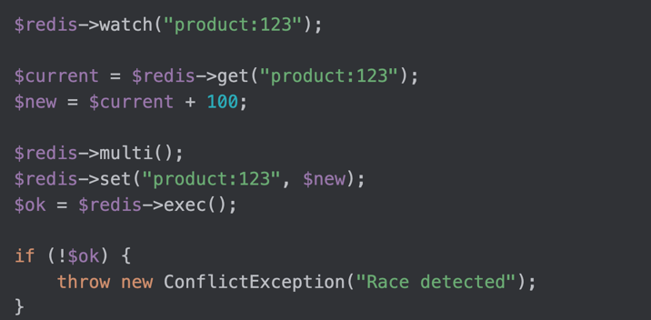

* WATCH в редисе ставит “наблюдателя” за ключом
* MULTI - откладывает команды
* EXEC - пытается выполнить, но только если ничего не изменилось

Если кто-то другой успел изменить значение между шагом (1) и (3), CAS не даст тебе перезаписать свежие данные старыми. Тебе нужно перечитать данные и попробовать снова

##### 2. Версионные ключи — product:123:v7

Вместо того чтобы хранить данные в одном ключе, мы храним каждую версию под отдельным ключом:

```
product:123:v5
product:123:v6
product:123:v7
```

А текущая версия хранится в отдельном ключе:

```
product:123:version = 7
```

Тогда обновлять значение будем вот так

```php
$version = $redis->incr("product:123:version"); // атомарно → 8
$key = "product:123:v$version";

$redis->set($key, json_encode($data));
```

INCR здесь гарантирует со стороны редиса, что два параллельных запроса никогда не получат одну и ту же версию

каждая запись пишет в свой ключ

старая версия не может перезаписать новую, потому что версии разные

клиенты всегда читают только последнюю версию:

```php
$version = $redis->get("product:123:version");
$data = $redis->get("product:123:v$version");
```

#### Решение 2: Пессимистичные блокировки (Distributed Locks)

Оптимистичные блокировки хороши при низкой конкуренции (<10 RPS на ключ).
Но при высокой конкуренции, длительных операциях лучше подходят Пессимистичные блокировки, иначе будут долгие ретраи

Пессимистичная блокировка запрещает параллелизм для конкретного ресурса, чтобы кто-то не затёр состояние под тобой.

В распределённых системах такое делают через Distributed Locks.
Это работает так

1. Запрос пытается захватить лок lock:product:123
2. Если лок свободен — он становится владельцем
3. Выполняет критическую секцию (обновление БД + кэша)
4. Освобождает лок

Если лок уже захвачен — все остальные ждут, либо падают с ошибкой, либо делают retry.
Для реализации распределенного лока существует несколько вариантов:

1. Redlock (Redis)
2. Zookeeper / etcd locks
3. Lease-based (арендные) блокировки

##### 1) Redlock — распределённый лок на Redis

Redlock — это алгоритм, реализующий механизм эксклюзивного владения ресурсом.

Он гарантирует что
* только один процесс может владеть lock:resource
* владелец знает, что он владелец (по токену)
* никто другой не может захватить лок, пока TTL не истёк
* чужой процесс не может освободить наш лок (токен защищает)

Работает следующим образом:

1. создаём ключ lock:resource
2. ставим TTL (чтобы лок не завис навсегда)
3. пишем не просто "1", а уникальный токен владельца
4. удаляем лок только если токен совпадает

Пример кода


* NX гарантирует, что ключ создастся только если его нет
* PX=5000 даёт TTL (лок умрёт, если владелец погибнет)
* токен защищает от того, что один клиент удалит чужой лок
* критическая секция безопасна: больше никто не пишет

Но Redlock не знает жив ли владелец
то есть возможен баг следующего вида:

1. Процесс A захватил лок на 5 секунд
2. Начал обновлять агрегат (тяжёлая операция)
3. На 4-й секунде внезапно умер / завис / попал в GC stop
4. TTL истёк → Redlock считает, что лок свободен
5. Процесс B захватывает лок
6. Процесс A “оживает” и продолжает писать данные
7. Процесс B тоже пишет данные
8. У тебя двойная запись, конфликт, повреждённый кэш

Это называется split-brain lock.

Здесь токен нас не спасает так как мы уже прошли этап проверки создания токена, и считаем что можем писать. Токен только не позволит удалить лок процесса В
Но процесс В тоже считает что он может писать
Поэтому и писать мы можем вдвоем

Эту проблему мы можем решить с помощью lease-based блокировки

##### 2) Lease-based (арендные) блокировки

Lease переводится как аренда, и отражает суть подхода - процесс должен постоянно подтверждать свое право на лок, то есть сообщать что он жив
Если хочешь владеть ресурсом — продлевай аренду регулярно.
Если ты не продлил — мы считаем тебя умершим и забираем лок.

Таким образом в отличие от redlock'a если процесс умер или временно завис то право владения у него отберут. В redlock есть ttl то он может истечь и в середине операции

пример кода (только продление, установка аналогичная и удаление тоже)

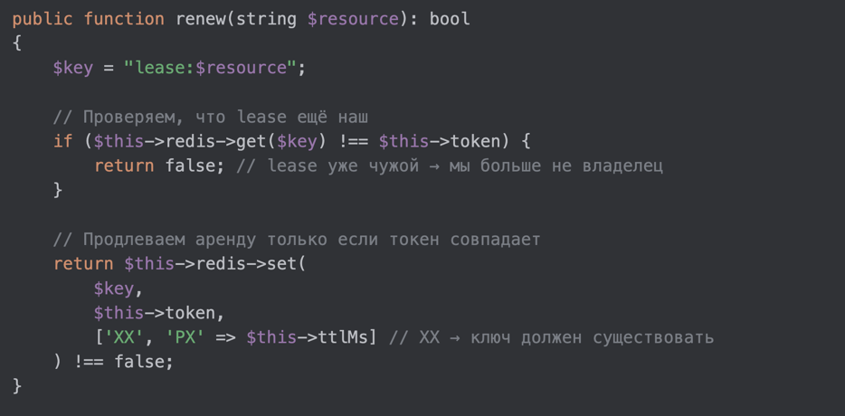

* XX гарантирует, что мы НЕ создаём новый lock, если старый истёк
* мы продлеваем lease только если всё ещё наш токен
* если токен уже чужой → мы обязаны оборвать операцию

Разберем наш пример но с lease based блокировкой

1. Процесс A получил lease на 5 секунд
2. Каждые 2 секунды он делает renew(lease)
3. Если процесс A завис или умер → он не продлит lease
4. Система автоматически считает его мёртвым
5. Только тогда процесс B может получить lease
6. A уже НЕ сможет продолжить операцию, потому что не имеет действующего lease-token

Lease делает запись безопасной, потому что:
* владелец обязателен живой
* все операции проходят только с проверкой lease-token

Таким образом
Используй Redlock, если:

* операции короткие
* TTL гарантированно покрывает критическую секцию
* конкуренция низкая
* split-brain почти невозможен

Используй Lease, если:

* операции могут быть длинными
* поток может зависнуть
* система под высокой нагрузкой
* важно знать, что владелец жив

##### 3) Zookeeper / etcd Distributed Lock

[//]: # (чет сложна, сомневаюсь в профите это рассказывать)

### История 1: stale data (устаревшие данные) / forever cache

#### определение

stale data — это симптом отсутствия coherence - большие ттл, гонки, забыли инвалидировать что-то

forever cache (зависший навсегда) 

Самая главная причина возникновения - отсутствие ттл и так он может жить хоть годами

Приводит к таким ситуациям

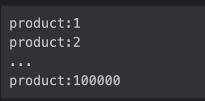

Основное решение - ттл и наличие метрик

#### метрики

Netflix в своё время придумал термин stale_read_rate.
Он показывает сколько % чтений были сделаны по устаревшим ключам.

Ты просто сравниваешь timestamp/версию кэша и timestamp/версию в source-of-truth.

Примерный формат:

```
cached_version = 17
version_incr = 19
→ stale_read
```

Эта метрика оголяет правду:
насколько кэшу вообще можно доверять.

Если `stale_read_rate > 1%` — у тебя не кэш, а русская рулетка.

Можно еще брать один ключ и проверять его значение сразу во всех репликах/слоях и так измерять расхождение. В мета был инструмент Polaris под такое

#### Eviction policy

Так же может помочь наличие cache eviction policy в кеше (стратегии вытеснения)

Так как редис использует оперативку и она далеко не безгранична, в какой-то момент встает вопрос а как записать новый ключ если места нет?

Мы можем сказать редису с помощью конфига как выбрать ключ который он удалит

вот некоторые варианты:

* volatile-ttl - Удаляет только ключи с TTL, начиная с ближайшего истечения.
* noeviction - никого не выселяет.
* allkeys-lru - Удаляет любой ключ, у которого самый старый last-access time.
* allkeys-random - Удаляет вообще случайный ключ.
* volatile-lru - Удаляет ключи с TTL, которые меньше всего использовались.
* volatile-random - Удаляет случайный ключ из тех, у кого есть TTL.
* volatile-lfu - Удаляет ключи с TTL, которые реже всего использовались (LFU: least frequently used)
* allkeys-lfu - Удаляет ключи, которые реже всего читают/используют, вне зависимости от TTL.

Если у тебя большой маркетплейс, кеш каталога, поисковые запросы, рекомендации — allkeys-lfu — лучший выбор.

### История 2: thundering herd (грохочущее стадо)

Это один из самых неприятных эффектов кэширования — когда один момент времени превращается в обвал всей системы.
Представим ситуацию:

1. у нас есть популярный ключ
2. на него идёт, например, 10 000 RPS
3. TTL = 5 минут
4. TTL истёк в конкретную миллисекунду
5. Все 10 000 запросов получают cache miss
6. Все одновременно идут в базу
7. База не выдерживает такой вспышки нагрузки → растёт latency
8. Даже если база выживает, все 10 000 запросов потом одновременно пишут в Redis
9. Redis получает огромный write spike и тоже проседает

Это и называется thundering herd — когда кэш-мисс запускает лавину запросов, которые добивают все слои системы.

Хотя Thundering herd  это проблема синхронности истечения ключей, Но есть два принципиально разных случая:

1) Один очень горячий ключ (например, product:hot-deal)
2) Много горячих ключей с одинаковыми TTL
Например:


И все они имели TTL = 300 секунд.

Если TTL одинаковый → они истекут практически одновременно → система получит сотни тысяч одновременных miss — вот тут jitter отлично помогает.

Для борьбы с этой проблемой у нас есть четыре рабочих техники

#### Решение 1: Jittered TTL (рандомизированный TTL)
Это решение работает только в сценарии, когда много разных ключей.
Вместо:

```
TTL = 300
```

делаем:

```
TTL = 300 ± 20%
```

Что это даёт?

Ключи истекают не одновременно, а распределено, поэтому нет единого пика нагрузки - она размазывается во времени

Но Jitter не решает проблему одного горячего ключа.

#### Решение 2: Early Refresh (раннее обновление ключа)

Работает и для одиночных ключей, и для массивных наборов.

Идея следующая -  Если TTL скоро истечёт — обновляем значение заранее, пока всё спокойно.

```
TTL = 300 сек
если ttl < 10% → фоновый refresh
```

Благодаря этому мы не получаем вспышки нагрузки. Разве что если наш фоновый рефреш не затупит

#### Решение 3: Request Coalescing

Работает при одиночном горячем ключе.

Идея в следующем - Если MISS, то только один запрос идёт в БД, остальные ждут.

Работает это так:

1. первый запрос ставит лок → идёт в БД
2. остальные запросы видят лок → ждут
3. первый запрос заполняет кэш
4. остальные читают из кэша

пример псевдокода

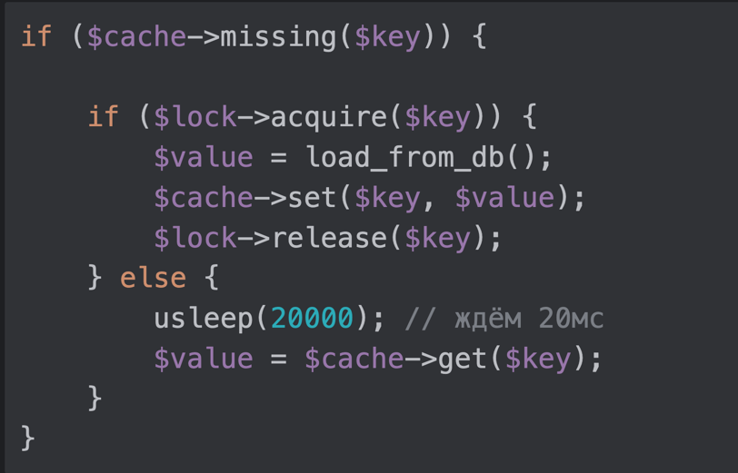

Благодаря этому читать в базу идет один запрос а не 10к, и пишет в кеш тоже только один запрос

#### Решение 4: Stale-While-Revalidate (отдаём старое, обновляем новое)

Идея следующая TTL истёк? Ничего страшного. Отдаём старое значение, а новое обновляем в фоне.

То есть MISS превращается в STALE-HIT

Это немного снижает когерентность, но зато система стабильна, и клиент быстро получает ответ

### История 3: несовместимость релизов через кэш

#### проблема
Если мы используем blue-green деплой либо канареечный, то если наши версии будут создавать кеш айтемы с разной структурой то они не смогут сосуществовать

например:

1. версия v1 пишет в кэш структуру старого формата
2. версия v2 пишет новую структуру
3. оба читают из одного Redis
4. естественно, кто-то недосчитывается нужного поля, либо не может новое поле смапить на структуру в коде

В итоге кеш сломал релиз, а релиз сломал кеш

#### решение

Единственное решение - версионирование ключей

До (плохо)

```php
product:123  // v1 пишет старый формат, v2 пишет новый
```

После (правильно)

```php
product:123:v1
product:123:v2
```

Главное не перепутать с версионированием которое мы делали выше для оптимистичной блокировки

### История 4: релиз создаёт всплески нагрузки

Другая проблема но возникает тоже при релизе

Сценарий такой:
- релизим новую версию приложения -> кеш под нее не существует
- трафик направляется на эту версию -> везде cache miss -> нагрузка в базу
- latency растет, база перегружена -> подобно thundering herd проблеме

Здесь нам помог бы прогрев кеша - когда мы при деплое заполняем кеш чтоб сразу после релиза он начал работать

Есть три вида прогрева:

1) Passive (ленивый) - Дёргаем по мере запросов. Самый неэффективный для решения проблемы.

2) Active - скрипт заранее генерирует популярные ключи

3) Shadow Warmup - новая версия получает копию трафика, нагревает свой кеш и не мешает основному трафику

### История 4: split-brain / кластеры

Split-brain — это ситуация, когда кластер Redis разваливается на две части, и обе считают себя главным узлом. Оба принимают записи, оба хранят разные значения, а затем сеть восстанавливается — и у нас два противоречивых состояния кэша.

Это ломает всё: когерентность данных, блокировки, write-through/write-behind и любые инварианты.

Причина в том, что Redis не использует консенсусные протоколы вроде Raft или Paxos, и в условиях сетевых перегородок может назначить второго мастера.

Чтобы избежать split-brain, используют: quorum-системы (etcd/Zookeeper/Consul), хранение критичных локов вне Redis, ручной failover или отказ от автоматической промоции мастера.

### doom loop (петля гибели кэша)

1. деплой → прогрев кэша не сделали
2. первые 30 секунд уровень miss = 70%
3. база словила пики → latency вырос
4. запросы стали жить дольше
5. прогрев стал ещё медленнее
6. потоки забили PHP-FPM → 502
7. мониторинг красный → «кэш умер»

как бороться?

1. Early refresh
2. Shadow warmup
3. Request coalescing
4. Stale-while-revalidate

### hot keys + Separate tier для hot keys

Примеры горячих ключей:

1. top-products
2. exchange-rate-USD
3. homepage:blocks

Всё бы ничего, но Redis работает однопоточно —
и один читаемый миллион раз в секунду ключ
способен задерживать ВСЕ остальные операции.

Варианты решения:

1. Пднять отдельный инстанс редиса только под горячие ключи чтоб не положить остальные
2. L1 кэш на уровне приложения. Пусть 1000 запросов PHP читают из оперативки, а не из Redis.
3. Репликация редиса

___

## D. Observability и Production Readiness (новый раздел!)

объяснить что надо покрывать метриками и следить за метриками а не на глаз выбирать че кешируем че нет

D1. Архитектура мониторинга (2-3 мин)
- Кто экспортирует (PHP exporter, Redis exporter)
- Куда экспортирует (Prometheus)
- Кто показывает (Grafana)
- Схема потока метрик

D2. Ключевые метрики (3-4 мин)
- По слоям: hit rate, latency, size
- По проблемам: stale_read_rate, eviction_rate, QPS spike
- Таблица: метрика → что показывает → целевое значение

D3. Дашборды (2-3 мин) 🎨
- Скрин 1: Cache Overview Dashboard
(панели: hit rate по слоям, latency, operations/sec)
- Скрин 2: Cache Health Dashboard
(панели: stale reads, evictions, memory usage)
- Скрин 3: Incident Investigation Dashboard
(панели: QPS spike detection, hot keys, errors)

D4. Алерты (2-3 мин)
- Примеры Prometheus alert rules
- Пороговые значения с обоснованием
- Примеры runbook: "Если алерт X, делай Y"

D5. Decision Tree (1-2 мин)
- Блок-схема диагностики
- "Hit rate < 80%? → Проверь A, B, C"
- "Stale reads > 1%? → Проверь D, E, F"
