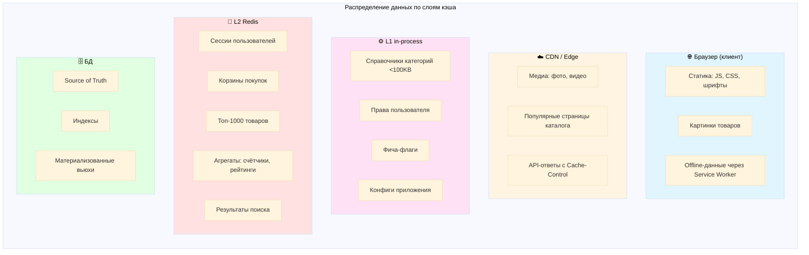
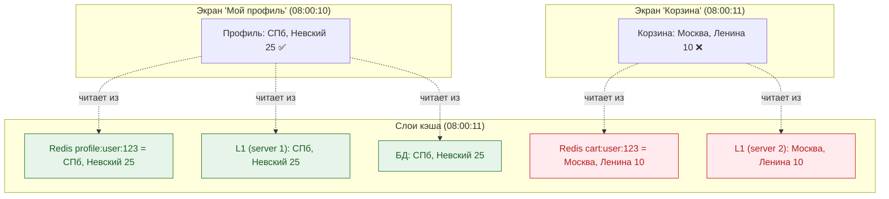
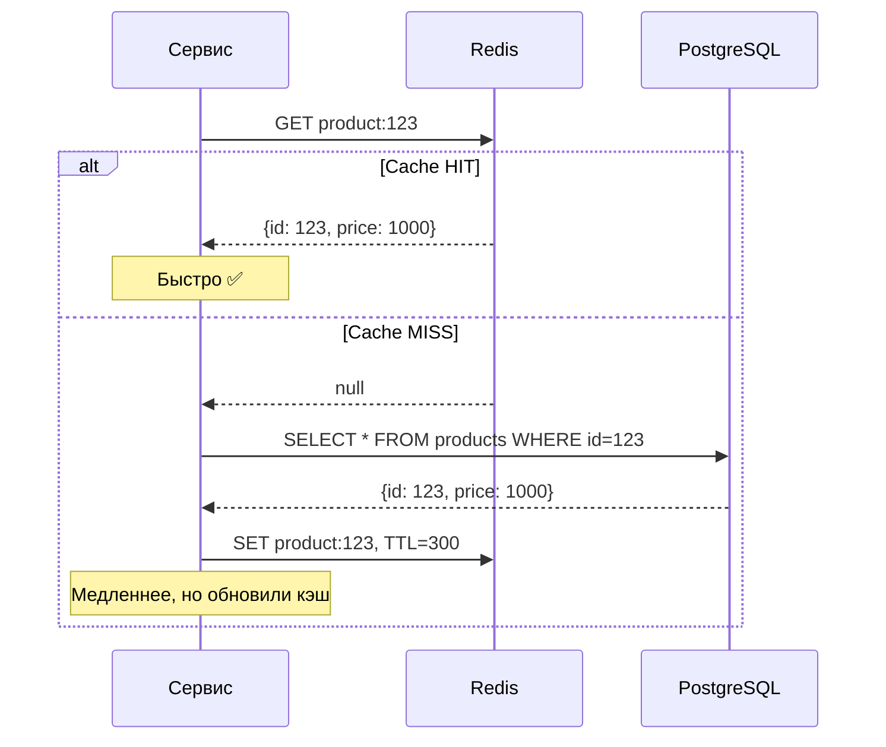
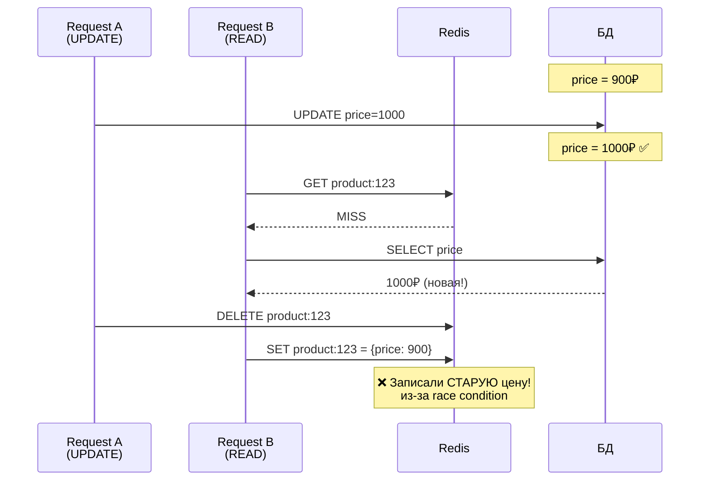

## Часть 1: Продвинутое кэширование и консистентность кэша

## Введение в кеш

Привет! Мы начинаем продвинутую часть курса по системному дизайну. В предыдущих главах мы говорили про кэш на уровне "вот Redis, он ускоряет запросы к базе". Это правда, но очень поверхностно.

На практике это ещё и опасное упрощение: неправильно спроектированный кэш легко делает обратное — замедляет сервис или под нагрузкой вообще кладёт систему. И делает это разными, неочевидными способами, к которым мы вернёмся в конце этой части.

Для примеров я буду использовать маркетплейс с миллионами товаров, корзинами, заказами — всё как в реальной жизни.

Зачем нужен кэш в продакшене?
Кэш нужен для:
- **Разгрузки БД и внешних API** — вместо 100k запросов в секунду делаем 100 и не DDoS'им систему
- **Ускорения чтений** — карточка товара за 2ms вместо 50ms из БД
- **Переиспользования дорогих вычислений** — рекомендации, агрегаты, отчёты

Представьте: у вас маркетплейс, на оформление заказа нужно показать актуальный курс валют. Вы интегрировались с внешним сервисом курсов.

**Проблема:** Каждый пользователь при оформлении заказа дёргает этот API. У вас 200 тысяч активных пользователей. Внешний API не ваш, он может упасть, тормозить или банально заблокировать вас за DDoS.

**Решение:** Отдельный воркер раз в минуту запрашивает курсы и кладёт их в Redis. Все запросы пользователей читают из кэша, а не лупят внешний API.

Также кеш может позволить пережить краткосрочное падение бэка/базы - например nginx может отдавать закешированные ответы даже если они устарели при проблемах с upstream через директиву proxy_cache_use_stale

Базовая терминология:
- `cache hit` - попадание в кеш (искомый ключ имелся в кеше)
- `cache miss` — промах в кеше - не нашли искомый элемент
- `hot key` — очень популярный ключ (например, товар дня)
- `stale data` — устаревшие данные в кэше
- `Hit rate` — процент запросов, которые нашли данные в кэше
- `TTL` (Time To Live) — как долго данные живут в кэше
- `Latency` — время ответа из кэша vs из БД

## A. Многоуровневое кэширование и оптимизации

### Архитектура слоёв

Касательно latency - мы хотим отдавать данные как можно ближе к пользователю. Зачем тянуть картинку из S3 в БД, если её может отдать CDN за 10ms?
Зачем каждый раз ходить в Redis (2-5ms), если можно держать маленький L1-кэш прямо в памяти сервера (<1ms)?
Вдобавок ем раньше мы отдадим что-то из кеша, тем меньше мы нагрузим дальнейшие слои системы

Но чем больше слоёв, тем сложнее поддерживать согласованность.

Вопрос: **какие данные на каком уровне держать?**


```mermaid
%%{init: {'theme':'base'}}%%
graph TB
    subgraph "Распределение данных по слоям кэша"
        direction TB
        
        subgraph Browser["🌐 Браузер (клиент)"]
            B1[Статика: JS, CSS, шрифты]
            B2[Картинки товаров]
            B3[Offline-данные через Service Worker]
        end
        
        subgraph CDN["☁️ CDN / Edge"]
            C1[Медиа: фото, видео]
            C2[Популярные страницы каталога]
            C3[API-ответы с Cache-Control]
        end
        
        subgraph L1["⚙️ L1 in-process"]
            L1_1[Справочники категорий <100KB]
            L1_2[Права пользователя]
            L1_3[Фича-флаги]
            L1_4[Конфиги приложения]
        end
        
        subgraph L2["🔴 L2 Redis"]
            L2_1[Сессии пользователей]
            L2_2[Корзины покупок]
            L2_3[Топ-1000 товаров]
            L2_4[Агрегаты: счётчики, рейтинги]
            L2_5[Результаты поиска]
        end
        
        subgraph DB["🗄️ БД"]
            DB1[Source of Truth]
            DB2[Индексы]
            DB3[Материализованные вьюхи]
        end
    end
    
    style Browser fill:#e1f5ff
    style CDN fill:#fff4e1
    style L1 fill:#ffe1f5
    style L2 fill:#ffe1e1
    style DB fill:#e1ffe1
```

Важны метрики hit rate, latency по слоям, подробнее о мониторинге поговорим в конце


## B. Cache Coherence в распределённых системах

### B1. Проблема расхождения слоёв

Теперь предположим такую ситуацию

08:00:00 — Пользователь Иван заходит в "Мой профиль", меняет адрес доставки:
```text
Было: "Москва, ул. Ленина, 10"
Стало: "Санкт-Петербург, Невский пр., 25"
```

08:00:02 — Адрес успешно обновился, Иван видит сообщение: ✅ "Адрес сохранён"

08:00:10 — Иван переходит в корзину, чтобы оформить заказ
08:00:11 — В корзине показывается старый адрес: "Москва, ул. Ленина, 10" ❌

Иван пишет в техподдержку
```text
Все фигня ничего не работает верните деньги!
```

Что произошло под капотом?


```mermaid
graph TB
    subgraph "Экран 'Мой профиль' (08:00:10)"
        ProfileUI["Профиль: СПб, Невский 25 ✅"]
    end

    subgraph "Экран 'Корзина' (08:00:11)"
        CartUI["Корзина: Москва, Ленина 10 ❌"]
    end

    subgraph "Слои кэша (08:00:11)"
        DB["БД: СПб, Невский 25"]
        RedisProfile["Redis profile:user:123 = СПб, Невский 25"]
        RedisCart["Redis cart:user:123 = Москва, Ленина 10"]
        L1Profile["L1 (server 1): СПб, Невский 25"]
        L1Cart["L1 (server 2): Москва, Ленина 10"]
    end

    ProfileUI -. читает из .-> RedisProfile
    ProfileUI -. читает из .-> L1Profile
    ProfileUI -. читает из .-> DB

    CartUI -. читает из .-> RedisCart
    CartUI -. читает из .-> L1Cart

    classDef fresh fill:#e6f4ea,stroke:#2e7d32,color:#1b5e20;
    classDef stale fill:#ffebee,stroke:#c62828,color:#b71c1c;

    class DB,RedisProfile,L1Profile fresh;
    class RedisCart,CDN,L1Cart stale;
```

То есть информация об адресе пользователя хранилась в нескольких слоях (и инстансах)

| Слой | Ключ | Значение | Статус |
|------|------|----------|--------|
| **БД** | `users.address` | СПб, Невский 25 | ✅ Обновлён |
| **Redis** | `profile:user:123` | СПб, Невский 25 | ✅ Инвалидирован, перезагружен |
| **Redis** | `cart:user:123` | Москва, Ленина 10 | ❌ **НЕ инвалидирован!** |
| **L1 APCu** | `profile:user:123` (server 1) | СПб, Невский 25 | ✅ Инвалидирован |
| **L1 APCu** | `cart:user:123` (server 2) | Москва, Ленина 10 | ❌ **НЕ инвалидирован!** |

Получилось так, что при обновлении мы инвалидировали только часть слоев

Вдобавок к тому что разные экраны показывают разные данные, так еще и экран пользователя может показывать то одно значение то другое в зависимости от того на какой инстанс его кинет 

Здесь мы приходим к понятию Cache Coherence
Cache Coherence — это свойство системы, при котором все копии одного и того же объекта данных в разных кэшах остаются согласованными.

Вопросы для размышления

Q1: Как быстро мы требуем согласованность?

* Мгновенно (strong coherence)? — дорого
* В течение секунды (eventual coherence)? — реалистично
* В течение минуты? — зависит от бизнеса

Q2: Какие данные критичны к coherence?

* Адрес доставки: средняя критичность (eventual до 5 секунд окей)
* Баланс счёта: высокая критичность (<1 секунды)
* Лента новостей: низкая критичность (до 5 минут окей)

Q3: Как проверить, что coherence нарушена?

* Метрика stale_read_rate (об этом расскажу в разделе D)


### B2. Стратегии наполнения кэша

Так как мы можем бороться с расхождением кеша? Сначала надо определиться кто в системе будет отвечать за это

Есть два разных подхода:

| Подход | Кто управляет | Плюсы | Минусы |
|--------|---------------|-------|--------|
| **Сервис-driven** | Код сервиса явно работает с кэшем | Полный контроль | Легко ошибиться |
| **Cache-driven** | Кэш-слой прозрачно работает с БД | Меньше кода | Меньше гибкости |

В свою очередь из этих подходов рождаются 4 разных стратегии наполнения кеша

#### Стратегия 1: Cache-Aside (Lazy Loading)

При этом подходе всем управляет сервис. То есть мы в коде явно проверяем кэш, читаем из БД, пишем в кэш.


```mermaid
sequenceDiagram
    participant Service as Сервис
    participant Cache as Redis
    participant DB as PostgreSQL
    
    Service->>Cache: GET product:123
    
    alt Cache HIT
        Cache-->>Service: {id: 123, price: 1000}
        Note over Service: Быстро ✅
    else Cache MISS
        Cache-->>Service: null
        Service->>DB: SELECT * FROM products WHERE id=123
        DB-->>Service: {id: 123, price: 1000}
        Service->>Cache: SET product:123, TTL=300
        Note over Service: Медленнее, но обновили кэш
    end
```

Но так легко забыть удалить связанные ключи

```php
// ❌ Забыли инвалидировать связанные ключи
$this->cache->delete("product:{$productId}"); // ✅
// Забыли:
// $this->cache->delete("cart:user:123"); // адрес был тут
// $this->cache->delete("search:results"); // товар был тут
```


```mermaid
sequenceDiagram
    participant A as Request A<br/>(UPDATE)
    participant B as Request B<br/>(READ)
    participant Cache as Redis
    participant DB as БД
    
    Note over DB: price = 900₽
    
    A->>DB: UPDATE price=1000
    Note over DB: price = 1000₽ ✅
    
    B->>Cache: GET product:123
    Cache-->>B: MISS
    B->>DB: SELECT price
    DB-->>B: 1000₽ (новая!)
    
    A->>Cache: DELETE product:123
    
    B->>Cache: SET product:123 = {price: 900}
    Note over Cache: ❌ Записали СТАРУЮ цену!<br/>из-за race condition
```

[//]: # (нужно объяснить стратегии наполнения кеша cache aside/ read through/write through /Write-Behind)
[//]: # (где какая используется , плюсы минусы)
B3. Инвалидация и гонки
[//]: # (Стратегии инвалидации TTL-only/Event-based &#40;pub/sub&#41;/Lease-based)
[//]: # (B3. Race condition в Cache-Aside &#40;2-3 мин&#41;)
B4. Метрики и сигналы
[//]: # (объяснить что надо покрывать метриками и следить за метриками а не на глаз выбирать че кешируем че нет)
[//]: # (тегирование для инвалидации, лучше б скрин какой)

## C. Решение сложных проблем кэширования

История 1: stale data / forever cache
[//]: # (stale data -> polaris)
[//]: # (forever cache)
[//]: # (eviction policies + example redis)

История 2: thundering herd
[//]: # (грохочущее стадо)
[//]: # (Jittered TTL &#40;рандомизация&#41;)
[//]: # (пример для стада про життер)
[//]: # (Early Refresh)
[//]: # (request coalescing)

История 3: инцидент на деплое / blue-green
[//]: # (прогрев кеша)
[//]: # (blue green deploy)
[//]: # (версионирование)

История 4: split-brain / кластеры
[//]: # (split brain)

[//]: # (doom loop)
[//]: # (Кэширование негативных результатов)
[//]: # (hot keys + Separate tier для hot keys)

___

## D. Observability и Production Readiness (новый раздел!)

D1. Архитектура мониторинга (2-3 мин)
- Кто экспортирует (PHP exporter, Redis exporter)
- Куда экспортирует (Prometheus)
- Кто показывает (Grafana)
- Схема потока метрик

D2. Ключевые метрики (3-4 мин)
- По слоям: hit rate, latency, size
- По проблемам: stale_read_rate, eviction_rate, QPS spike
- Таблица: метрика → что показывает → целевое значение

D3. Дашборды (2-3 мин) 🎨
- Скрин 1: Cache Overview Dashboard
(панели: hit rate по слоям, latency, operations/sec)
- Скрин 2: Cache Health Dashboard
(панели: stale reads, evictions, memory usage)
- Скрин 3: Incident Investigation Dashboard
(панели: QPS spike detection, hot keys, errors)

D4. Алерты (2-3 мин)
- Примеры Prometheus alert rules
- Пороговые значения с обоснованием
- Примеры runbook: "Если алерт X, делай Y"

D5. Decision Tree (1-2 мин)
- Блок-схема диагностики
- "Hit rate < 80%? → Проверь A, B, C"
- "Stale reads > 1%? → Проверь D, E, F"
