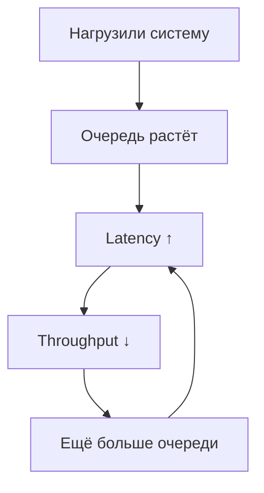

# 🔥 B. Throughput Scaling (как масштабирование ломается об законы физики)


## 📌 Что такое Throughput (и чем он отличается от Latency)

Есть два фундаментальных параметра производительности системы:

### **Latency — как быстро система отвечает на один запрос.**

Измеряется в миллисекундах.

### **Throughput — сколько запросов система может обработать за единицу времени.**

Измеряется в:

* RPS (requests per second),
* QPS (queries per second),
* ops/sec (операций в секунду),
* messages/sec (для очередей).

И вот тут начинается самое весёлое.

---

## 🧠 Почему люди путают throughput и latency?

Потому что в реальной системе они влияют друг на друга:

* если throughput превышает предел системы → latency растёт
* если latency растёт → падает throughput
* если растёт concurrency → растёт latency → падает throughput

Это не “разные метрики”, это **две стороны одной деградации**.

---

## 📐 Простая визуализация



Это и есть цикл деградации производительности.

---

## 📊 Главная формула (Little’s Law)

```
Latency = Concurrency / Throughput
```

Она простая, но она разрушает все фантазии про “давайте поставим ещё серверов”.

**Если входящий поток больше, чем система может обработать →
latency растёт автоматически**, даже если код идеальный.

---

## 🔥 Почему throughput — это про “сколько система может выдержать”,

а latency — “как быстро она отвечает”

Пример:

* Redis отвечает за 1–2 ms (маленькая latency)
* но на hot key может выдержать только 50–100k RPS (throughput ограничен)

Если приходит 200k RPS:

* latency становится 10ms
* потом 50ms
* потом 100ms
* и дальше Redis начинает дропать соединения

То есть:

> Даже идеально быстрый сервис имеет *жёсткий потолок по throughput*,
> и при его достижении latency взрывается.

---

## 🔥 Краткая аналогия (для UI)

**Latency** — скорость обработки *одной* машины на кассе.
**Throughput** — сколько людей касса может обслужить *в минуту*.

Если люди приходят быстрее, чем касса обслуживает:

* очередь растёт
* время ожидания растёт
* throughput не растёт → касса упёрлась
* люди начинают орать в чат поддержки “приложение лагает!”

## 1. Боль

“Добавим ещё серверов — будет быстрее”.
Не будет.

### Реальные проблемы:

* производительность растёт нелинейно
* после точки насыщения производительность падает
* очереди забиваются
* блокировки становятся центральным bottleneck
* даже 1 медленный запрос делает весь сервис медленным

---

## 2. Законы, которые стоит объяснить

### ✔ 2.1. Amdahl’s Law

Потолок производительности из-за непараллелящихся частей.

### ✔ 2.2. Gustafson’s Law

Хорошая новость: если масштабируется сама задача — можно растить throughput.

### ✔ 2.3. Universal Scalability Law (Gunther)

Самый практичный:

* конкуренция за shared ресурсы
* overhead на координацию
* почему после N серверов перфоманс падает

### ✔ 2.4. Little’s Law

Основной закон очередей:

```
Latency = Concurrency / Throughput
```

---

## 3. Дополнительные критически важные эффекты

### ✔ 3.1. Convoy Effect

Один медленный запрос держит lock → все остальные встают.

### ✔ 3.2. Head-of-Line Blocking

Один тормоз в очереди блокирует всех.

### ✔ 3.3. Tail Amplification

При увеличении нагрузки хвост растёт быстрее, чем средняя.

### ✔ 3.4. Coordinated Omission

Неверные измерения скрывают хвост и дают ложную стабильность.

---

## 4. Примеры боли (живые, инженерные)

* RabbitMQ очередь замирает из-за одного slow consumer
* Redis перестаёт тянуть hot key на allkeys-lru
* Postgres упирается в row lock / index lock
* PHP-FPM достигает max_children → начинает выстраивать очередь перед воркерами
* Kafka partition lag растёт из-за одного медленного consumer
* gRPC начинает ретраить → load multiplies → cluster death

---

## 5. Практические техники решения

### ✔ Избегать координации

* убирать глобальные mutex’ы
* не использовать seq ID
* убрать centralized counters

### ✔ Segregation of workloads

Потоки “письма” и “чтения” должны быть изолированы.

### ✔ Изоляция горячих ключей

* отдельный Redis cluster tier
* microsharding
* L1 cache

### ✔ Backpressure

Система должна уметь сказать “хватит”.

### ✔ Circuit Breakers

Чтобы один умирающий сервис не убил всех.

### ✔ Replication vs Sharding

Классическая дилемма “скорость чтения” vs “скорость записи”.

