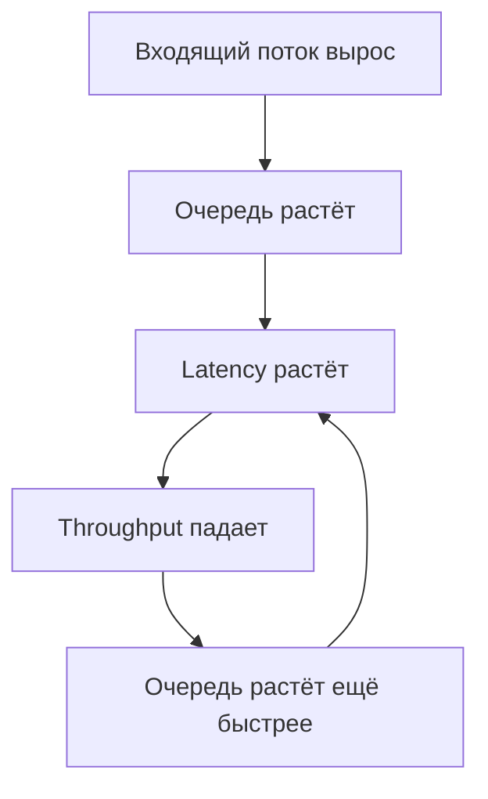

# 🔥 B. Throughput Scaling

# 🎬 ВСТУПЛЕНИЕ (2–3 минуты)

Представьте: ваш сервис работает быстро. Красиво, ровно, графики зелёные.
Вы добавляете немного нагрузки — и всё внезапно превращается в ад.

* latency прыгнуло в 20 раз,
* RPS упал,
* очереди выросли,
* клиенты начали ретраить,
* downstream умер,
* удержание пользователей опустилось в минус бесконечность.

Это не баг, это **законы физики распределённых систем**.

Сегодня мы разберём:

* что такое throughput,
* почему он НЕ растёт от количества серверов,
* почему добавление ресурсов иногда *убивает* производительность,
* и какие законы описывают такое поведение

---

# 📌 ЧТО ТАКОЕ THROUGHPUT (и чем он отличается от latency)

Большинство инженеров в голове путают эти две вещи, а потом удивляются графикам.

### Latency

Это время ответа на **ОДИН** запрос.
Миллисекунды.

### Throughput

Это **СКОЛЬКО** запросов мы можем обработать **в секунду**.
RPS, QPS, ops/sec.

Они неразрывно связаны:

```text
Если нагрузка > throughput → latency растёт.  
Если latency растёт → throughput падает.  
Если растёт concurrency → растёт latency.
```

Это не две независимые метрики.
Это два конца одной трубы, которая забивается при перегрузе.

---

# 📐 Визуализация деградации



Это и есть **doom loop**.
Любая система, которая не ограничивает нагрузку — умеет падать сама на себя.

---

# 📊 ГЛАВНАЯ ФОРМУЛА (Little’s Law)

```
Latency = Concurrency / Throughput
```

Пример:

* concurrency = 3000
* throughput = 1000 RPS

latency = 3 секунды.

Без магии.
Просто законы очередей.

---

# 🔥 ПРИМЕР ИЗ РЕАЛЬНОГО МИРА

Redis отвечает за 1–2 ms. Идеально.

Но:

* на hot key он выдерживает только 50–100k RPS,
* вы даёте 200k входящего,
* throughput кончается,
* latency растёт до 10ms,
* потом 50ms,
* потом 200ms,
* потом Redis сбрасывает коннекты.

Даже железный Redis имеет жёсткий потолок.

---

# 🧩 АНАЛОГИЯ

**Latency** — скорость одного кассира обслужить покупателя.
**Throughput** — сколько покупателей пройдёт через кассу за минуту.

Если покупателей приходит больше, чем касса успевает обслужить:

* очередь растёт,
* throughput не растёт — упёрлась,
* люди бесятся.

С backend-системами то же самое.

---

# 1. БОЛЬ: ПОЧЕМУ “ДОБАВИМ СЕРВЕРОВ” НЕ РАБОТАЕТ

* масштабирование **нелинейно**
* после точки насыщения производительность **падает**
* очереди формируются **везде**
* блокировки становятся **центральной точкой бутылочного горлышка**
* даже ОДИН медленный запрос ломает всю цепочку

---

# 2. ЗАКОНЫ МАСШТАБИРОВАНИЯ

## ✔ 2.1. Закон Амдаля (Amdahl’s Law)

Говорит простое:

> если хотя бы маленькая часть программы НЕ параллелится — она ограничивает ускорение.

Пример:

* 95% можно распараллелить,
* 5% — нет,

→ максимум ускорения = x20.
Хоть 1000 серверов ставь.

---

## ✔ 2.2. Закон Густафсона (Gustafson’s Law)

Противоположность Амдалю:

> если сама задача растёт → параллелизм работает лучше.

Хорошо подходит для аналитики, ML, batch-процессинга.
Плохо — для веба и API.

---

## ✔ 2.3. Universal Scalability Law (Gunther)

Это практическая модель, которую любят SRE.

Она объясняет почему:

* при увеличении количества worker’ов throughput растёт,
* потом достигает пика,
* а потом начинает ПАДАТЬ.

Почему?
Потому что:

* **конкуренция** (за shared ресурсы),
* **координация** (overhead на синхронизацию).


---

## ✔ 2.4. Little’s Law (ещё раз)

Основной закон очередей:

```
Latency = Concurrency / Throughput
```

Работает ВСЕГДА.

---

# 3. КРИТИЧЕСКИЕ ЭФФЕКТЫ, КОТОРЫЕ УБИВАЮТ ПРОД

## ✔ Convoy Effect

Один тормозящий запрос держит lock → все ждут.

## ✔ Head-of-Line Blocking

Первый в очереди медленный → вся очередь умерла.

## ✔ Tail Amplification

При росте нагрузки хвост увеличивается быстрее средней.

## ✔ Coordinated Omission

Метрики лгут.
Система работает медленно, но графики гладкие, потому что метрики не учитывают моменты, когда запросы просто не могли попасть в систему (классическая ошибка в нагрузочных тестах).

---

# 4. РЕАЛЬНАЯ БОЛЬ У ИНЖЕНЕРОВ

* RabbitMQ очередь замерла из-за одного slow consumer
* Redis не вытягивает hot key
* Postgres упёрся в row lock
* PHP-FPM достиг max_children и начал ставить очередь на воркеры
* Kafka consumer lag растёт из-за одного тормоза
* gRPC ретраи умножают нагрузку → кластер умирает

---

# 5. ПРАКТИЧЕСКИЕ СПОСОБЫ РЕШИТЬ ЭТУ БОЛЬ

## ✔ Избегать координации

* убрать глобальные mutex’ы
* отказаться от глобальных последовательных ID
* убрать centralized counters

## ✔ Segregation of workloads

Разделить:

* write-heavy / read-heavy
* user traffic / batch jobs
* background tasks / synchronous API

## ✔ Изоляция hot keys

* отдельный Redis tier
* microsharding
* L1 cache

## ✔ Backpressure

Система должна уметь **отказывать**, а не умирать:

* HTTP 429
* лимиты на queue length
* ограничения concurrency
* drop overload traffic

## ✔ Circuit Breakers

Чтоб один умирающий сервис не утянул за собой 10 здоровых.

## ✔ Replication vs Sharding

Для чтения → реплики.
Для записи → шарды.

“Пихать всё в одну базу” — прямой путь к row-lock аду.

