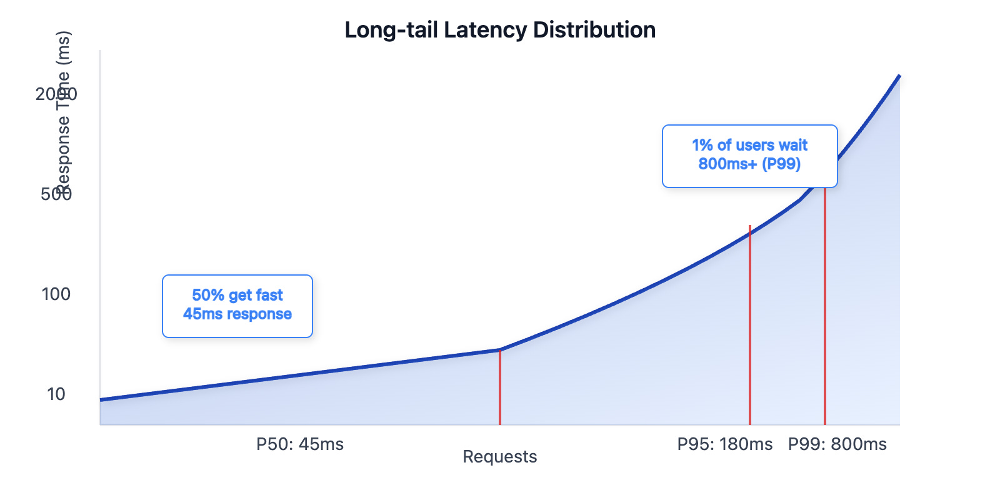
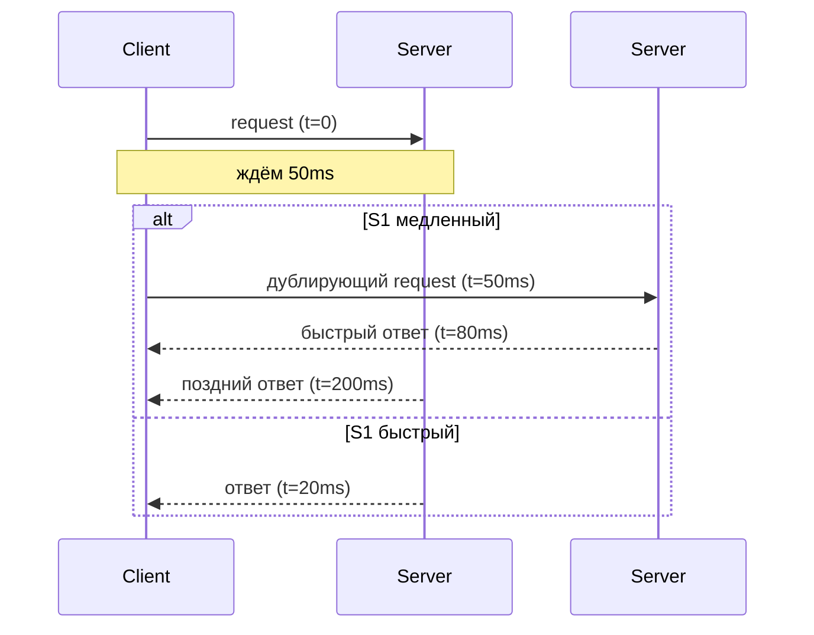

Ну давай, держись. Tail latency — это та самая гадость, которая делает вид, что у тебя “всё быстро”, а потом в рандомный момент устраивает тебе маленький апокалипсис.

Я расскажу тебе как человеку, который в продах живёт, а не учебники листает.

---

# 🧨 Что такое Tail Latency (и почему это тебя должно волновать)

`Latency` — время ответа

Средняя Latency — это декоративный показатель для презентаций CTO.
Настоящая боль лежит в хвостах: **p95 / p99 / p999**.

Это те *редкие* запросы, которые:

* внезапно едут вместо 20ms → 400ms
* или 2 секунды
* или 10 секунд (привет, GC, сеть, диск)
* или вообще таймаутят

И эти редкие запросы **ломают UX, очереди, таймауты, ретраи, балансировку**, и заодно твоё настроение.

---

# 📈 Мини-график для визуала (mermaid)

Вот примерно так выглядит распределение латентности:

* 90% запросов быстрые
* но хвост (p99, p999) живёт своей жизнью
* и именно он определяет стабильность системы

---

# 🥩 Что именно надо понимать

## 1. Среднее значение **бессмысленно**

Если медиана (p50) = 20ms, но p99 = 1 секунда —
значит 1% запросов медленнее в 50 раз.

И эти 1%:

* ломают checkout
* рвут цепочки микросервисов
* вызывают retry storm
* создают очереди, которые тянут всё вниз
* превращают логирование в снежный ком

---

## 2. Tail latency растёт при масштабировании

Google в статье **"The Tail at Scale"** (читай обязательно, оно культовое) показал:

> Если твой запрос зависит от 100 бэкенд-запросов,
> то вместо твоего p99 ты видишь p99^100.

То есть маленький хвост → в распределённой системе → превращается в чудовище.

🔗 Google’s The Tail at Scale:
[https://research.google/pubs/the-tail-at-scale/](https://research.google/pubs/the-tail-at-scale/)

---

## 3. Tail latency часто “случайная”, но причины банально земные

### Аппаратные:

* GC пауза
* CPU ненадолго вылетел обрабатывать чужой процесс
* диск дернулся
* страница памяти выгружена
* NUMA перескочило

### Сетевые:

* один плохой hop
* пинг всплеснул
* перегруженный роутер
* трафик на канале

### На уровне сервисов:

* один инстанс “завис”
* hot key блокирует что-то
* лок висит дольше
* сериализация/десериализация 5MB JSON
* один shard в кластерной БД тормозит

---

## 4. Tail latency разрушает всё цепочки вызовов

Классика:

1. Микросервис А вызывает B
2. B вызывает C
3. C вызывает D

Если у D п99 = 500ms → у всей цепочки “практическая латентность” улетает.

А потом:

* везде происходят таймауты
* идут ретраи
* нагрузка взлетает
* начинаются лавины, которые валят прод

---

# 🔧 Проблемы, которые tail latency вызывает

* 📛 **cascade timeouts**
* 📛 **retry storm**
* 📛 **расхождение состояния** (когда половина цепочки отвалилась)
* 📛 **queues backpressure**
* 📛 **непредсказуемый UX**
* 📛 **нечестные SLA**
* 📛 **hot spot на одном инстансе**

Любая распределённая система, у которой нет стратегии хвостов, обречена.

---

# 🛠 Какие есть реальные техники борьбы

## 1. **Hedged Requests** (дублирование запросов)

Если запрос висит > X ms — шлём второй на другой инстанс.
Побеждает первый ответ.

Google показал, что это резко снижает хвосты.

---

## 2. **Load Balancing по latency, а не round-robin**

Выкидываешь “медленные” инстансы из пула, пока они не очухаются.

---

## 3. **Timeouts + budget propagation**

Запрос должен знать, сколько ему осталось жить, и передавать deadline дальше по цепочке.

---

## 4. **Local L1 cache**

Чтобы обрабатывать часть запросов без сети.

---

## 5. **Request coalescing**

Для популярных ключей — строит очередь и отправляет в бэк только один запрос.

---

## 6. **Изоляция горячих сервисов**

Например, вынос в отдельный autoscaling pool.

---

## 7. **Shard-per-key**

Когда один горячий ID не тормозит весь shard.

---

# 🧪 Диаграмма для hedged requests (готовая к видео)

---

# 📚 Ссылки на хорошие материалы

### 🔥 Главная статья:

**The Tail at Scale** (Google Research)
[https://research.google/pubs/the-tail-at-scale/](https://research.google/pubs/the-tail-at-scale/)

### Дополнительно:

* Jeff Dean, “Achieving Rapid Response Times in Large Online Services”
* ACM Queue: “Latency Numbers Every Programmer Should Know”
* HighScalability: обзоры по tail latency
* AWS Builder’s Library: “Timeouts, retries, and backoff with jitter”
* Papers on hedged requests (Google)
* LinkedIn’s work on queue latency & tail control

---

# 🎯 Краткое резюме для сценария

Tail latency — это:

* не средняя задержка
* не p50
* это худшие 1% запросов
* они ломают всё, что связано с распределённостью
* и растут экспоненциально при каскаде сервисов

> Каратишь хвост — спасаешь прод.
> Улучшаешь среднее — улучшаешь только графики.

---

Если хочешь — могу:

* собрать целиком **блок сценария** (5–7 минут материала)
* добавить ещё диаграммы: p50 vs p99, queueing delay, retry storm
* расписать пример “как один медленный Redis положил все сервисы”
