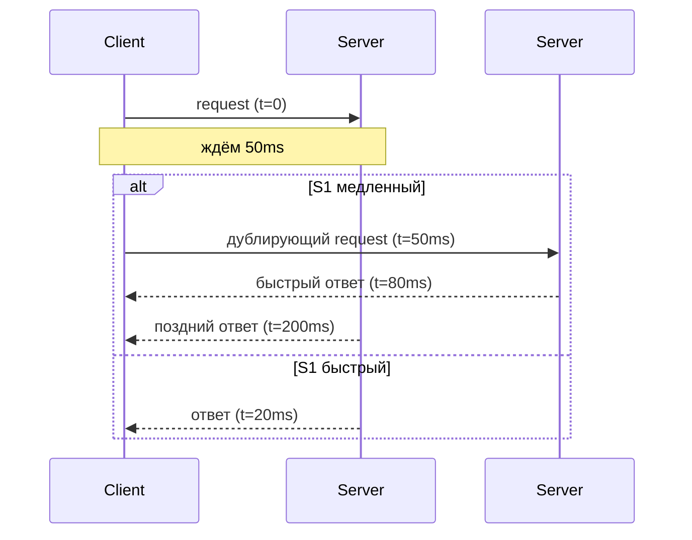

# 🧨 Что такое Tail Latency (и почему это тебя должно волновать)


`Latency` — время ответа

Средняя Latency — это декоративный показатель для презентаций CTO.
Настоящая боль лежит в хвостах: **p95 / p99 / p999**.

Это те *редкие* запросы, которые:

* внезапно едут вместо 20ms → 400ms
* или 2 секунды
* или 10 секунд (привет, GC, сеть, диск)
* или вообще таймаутят

И эти редкие запросы **ломают UX, очереди, таймауты, ретраи, балансировку**, и заодно твоё настроение.

---

Почему существует изменчивость?

# 📈 Мини-график для визуала (mermaid)


Вот примерно так выглядит распределение латентности:

* 90% запросов быстрые
* но хвост (p99, p999) живёт своей жизнью
* и именно он определяет стабильность системы

---

# 🥩 Что именно надо понимать

## 1. Среднее значение **бессмысленно**

Если медиана (p50) = 20ms, но p99 = 1 секунда —
значит 1% запросов медленнее в 50 раз.

И эти 1%:

* ломают checkout
* рвут цепочки микросервисов
* вызывают retry storm
* создают очереди, которые тянут всё вниз
* превращают логирование в снежный ком

---

## 2. Tail latency растёт при масштабировании

Google в статье **"The Tail at Scale"** (читай обязательно, оно культовое) показал:

> Если твой запрос зависит от 100 бэкенд-запросов,
> то вместо твоего p99 ты видишь p99^100.

То есть маленький хвост → в распределённой системе → превращается в чудовище.

🔗 Google’s The Tail at Scale:
[https://research.google/pubs/the-tail-at-scale/](https://research.google/pubs/the-tail-at-scale/)

---

## 3. Tail latency часто “случайная”, но причины банально земные

### Аппаратные:

* GC пауза
* CPU ненадолго вылетел обрабатывать чужой процесс
* диск дернулся
* страница памяти выгружена
* NUMA перескочило

### Сетевые:

* один плохой hop
* пинг всплеснул
* перегруженный роутер
* трафик на канале

### На уровне сервисов:

* один инстанс “завис”
* hot key блокирует что-то
* лок висит дольше
* сериализация/десериализация 5MB JSON
* один shard в кластерной БД тормозит

---

## 4. Tail latency разрушает всё цепочки вызовов

Классика:

1. Микросервис А вызывает B
2. B вызывает C
3. C вызывает D

Если у D п99 = 500ms → у всей цепочки “практическая латентность” улетает.

А потом:

* везде происходят таймауты
* идут ретраи
* нагрузка взлетает
* начинаются лавины, которые валят прод

---

# 🔧 Проблемы, которые tail latency вызывает

* 📛 **cascade timeouts**
* 📛 **retry storm**
* 📛 **расхождение состояния** (когда половина цепочки отвалилась)
* 📛 **queues backpressure**
* 📛 **непредсказуемый UX**
* 📛 **нечестные SLA**
* 📛 **hot spot на одном инстансе**

Любая распределённая система, у которой нет стратегии хвостов, обречена.

---

# 🛠 Какие есть реальные техники борьбы

## 1. **Hedged Requests** (дублирование запросов)

Если запрос висит > X ms — шлём второй на другой инстанс.
Побеждает первый ответ.

Google показал, что это резко снижает хвосты.

Один из таких подходов заключается в отсрочке отправки вторичного запроса до тех пор, пока первый запрос не будет ожидать более 95-го процентиля ожидаемой задержки для этого класса запросов. Такой подход ограничивает дополнительную нагрузку примерно до 5%, существенно сокращая при этом хвост задержки. Этот метод работает, поскольку источник задержки часто не связан с конкретным запросом, а вызван другими формами помех. Например, в бенчмарке Google, который считывает значения 1000 ключей, хранящихся в таблице BigTable, распределенной по 100 различным серверам, отправка хеджирующего запроса после задержки в 10 мс снижает 99,9- й процентиль задержки для извлечения всех 1000 значений с 1800 мс до 74 мс, отправляя всего на 2% больше запросов. Накладные расходы на хеджируемые запросы можно дополнительно снизить, пометив их как более низкие по приоритету, чем основные запросы.


---

## 2. **Load Balancing по latency, а не round-robin**

Выкидываешь “медленные” инстансы из пула, пока они не очухаются.

---

## 3. **Timeouts + budget propagation**

Запрос должен знать, сколько ему осталось жить, и передавать deadline дальше по цепочке.

---

## 4. **Local L1 cache**

Чтобы обрабатывать часть запросов без сети.

---

## 5. **Request coalescing**

Для популярных ключей — строит очередь и отправляет в бэк только один запрос.

---

## 6. **Изоляция горячих сервисов**

Например, вынос в отдельный autoscaling pool.

---

## 7. **Shard-per-key**

Когда один горячий ID не тормозит весь shard.

---

# 🧪 Диаграмма для hedged requests (готовая к видео)


___

приоритетные очереди
* circuit breaker?
* Queue-Based Load Leveling Pattern?
* Управление фоновыми действиями и синхронизированными нарушениями
  Good enough
* 
есть подходы для уменьшения хвоста а есть подходы для маскирования/избегания/обхода хвоста. последние в свою очередь гуглом делились на кроткосрочные и долгосрочные

Связанные запросы
предоставление клиенту возможности выбора между двумя серверами на основе длины очереди во время постановки в очередь экспоненциально повышает производительность балансировки нагрузки по сравнению с равномерной схемой случайного выбора. Мы рекомендуем не выбирать, а вместо этого помещать копии запроса в очередь на нескольких серверах одновременно и позволять серверам обмениваться обновлениями статуса этих копий. Запросы, в которых серверы выполняют кросс-серверные обновления статуса, мы называем «связанными запросами». В простейшей форме связанного запроса клиент отправляет запрос двум разным серверам, каждый из которых помечен идентификатором другого сервера («связанный»). Когда запрос начинает выполняться, он отправляет сообщение об отмене своему ответчику. Соответствующий запрос, если он всё ещё находится в очереди на другом сервере, может быть немедленно прерван или существенно деприоритетирован.
Существует кратковременное окно, равное одной средней задержке сетевого сообщения, в течение которого оба сервера могут начать выполнять запрос, пока сообщения об отмене уже передаются другому серверу. Такая ситуация часто возникает, когда очереди обоих серверов полностью пусты. Поэтому клиенту полезно ввести небольшую задержку, в два раза превышающую среднюю задержку сетевого сообщения (1 мс или меньше в современных сетях центров обработки данных), между отправкой первого и второго запросов.

производительность базовых машин неравномерна и не постоянна с течением времени по причинам (таким как температурное регулирование и помехи при распределении рабочей нагрузки)

микроразделы виртуальных серверов, описанной в Stoica 12 , и методу виртуального процессорного разделения, описанному в DeWitt et al. 6


---

# 📚 Ссылки на хорошие материалы

### 🔥 Главная статья:

**The Tail at Scale** (Google Research)
[https://research.google/pubs/the-tail-at-scale/](https://research.google/pubs/the-tail-at-scale/)

### Дополнительно:

* Jeff Dean, “Achieving Rapid Response Times in Large Online Services”
* ACM Queue: “Latency Numbers Every Programmer Should Know”
* HighScalability: обзоры по tail latency
* AWS Builder’s Library: “Timeouts, retries, and backoff with jitter”
* Papers on hedged requests (Google)
* LinkedIn’s work on queue latency & tail control

---

# 🎯 Краткое резюме для сценария

Tail latency — это:

* не средняя задержка
* не p50
* это худшие 1% запросов
* они ломают всё, что связано с распределённостью
* и растут экспоненциально при каскаде сервисов

> Каратишь хвост — спасаешь прод.
> Улучшаешь среднее — улучшаешь только графики.


# 🎯 Что такое tail latency на простом языке

Tail latency — это **редкие, но очень медленные запросы**.
Типа: 1 из 1000 запросов почему-то обрабатывается 2 секунды вместо 20 мс.

Ты можешь думать: “ну и пофиг на эти 0.1%…”.
А вот нифига.

Эти *редкие* медленные запросы:

* занимают воркер
* занимают место в очереди
* задерживают остальные запросы
* вызывают ретраи
* вызывают таймауты
* создают лавину, которая валит всё

То есть **один тормозящий запрос → тянет за собой лавину других**.

---

# 🧨 Почему один медленный запрос ломает всю систему?

Теперь по пунктам, конкретно.

---

# 1) ✔ Да — запросы становятся в очередь

Представь:

* у сервиса 20 воркеров
* 1 воркер завис на 1 секунду
* остальные 19 работают нормально

Что происходит?

* в очередь ложится на 1 запрос больше
* этот лишний запрос замедляет следующие
* и эта задержка **распространяется как волна**

Это называется **queueing delay**.

График (очень наглядно):

Если входящий RPS почти равен максимальному → **любая** задержка порождает очередь → хвост растёт многократно.

---

# 2) ✔ Один медленный инстанс портит балансировку

У тебя 10 серверов, балансировщик кидает запросы round-robin:

* 9 серверов отвечают за 20 ms
* один отвечает за 800 ms

Каждый 10-й запрос идёт на тормозной сервер →
**каждый 10-й пользователь видит лаг в 40 раз дольше**.

А если сервис A вызывает B 5 раз подряд?
Вероятность попасть на тормозной узел увеличивается.

---

# 3) ✔ Tail latency в цепочке микросервисов множится

Один сервис — фигня.
Но если у тебя цепочка:

```
Frontend → API Gateway → Auth → Profile → Cart → Payment
```

Каждый сервис добавляет свою долю “хвоста”.

Если у каждого p99 = 200 ms,
то цепочка может давать **секунды** на p99.

Это и есть эффект “tail at scale”.

---

# 4) ✔ Из-за хвостов начинают работать таймауты

Запрос повис → клиент ждёт → время вышло → таймаут →
клиент делает retry → ретраи создают доп. нагрузку → начинают падать другие запросы.

Это называется **retry storm**.

Хуже всего: если у тебя автоматические ретраи в SDK или в gateway.

Реальный сценарий:

1. Один инстанс медленный
2. p99 ↑
3. timeout ↑
4. retry * N
5. нагрузка ↑
6. база ↑
7. всё ложится

---

# 5) ✔ Тормоза вызывают backpressure

Если очередь сообщений (RabbitMQ, Kafka) начинает расти:

* потребители не успевают
* задержка увеличивается
* события обрабатываются позже
* дедлайны нарушаются
* больше ретраев
* больше задержки
* ещё медленнее

Это называется **снежный ком latency**.

---

# 6) ✔ Tail latency ломает кэш

Один медленный запрос → один медленный refresh ключа →
десятки клиентов получают cache miss →
все идут в базу →
база падает.

Если у тебя hot-key — это реальная угроза.

---

# 🧩 Итого: что нужно понять

Tail latency опасна не потому что “один запрос медленный”.

Tail latency опасна, потому что:

* распределённая система **усиливает медленные запросы**
* очереди **размножают задержки**
* ретраи **умножают нагрузку**
* балансировщики **равномерно раздают эту боль**
* цепочки микросервисов **накручивают хвосты**
* кэши и базы **не выдерживают лавину miss + retry**
* конечный пользователь получает “у нас всё сломалось”

> Tail latency — это эффект домино:
> один медленный запрос проталкивает всю систему в зону хаоса.
