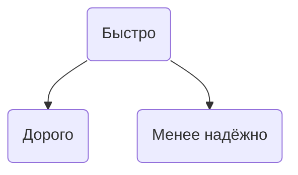

# 🔥 C. Resource Optimization Trade-offs

## (когда оптимизация одной метрики ломает три других)

## 1. Боль (контекст)

Вы оптимизируете одну метрику — и ломаете три другие:

* уменьшили latency → расходы выросли ×2
* увеличили throughput → consistency улетела в eventual
* ужали стоимость → SLA упал до ± “как повезёт”
* включили кэширование → согласованность умерла
* включили retries → убили backend retry-stормом
* параллелили запросы → получили lock contention и стали медленнее

В распределённых системах **каждое улучшение — это плата чем-то другим**.

## 2. Структура раздела (с разбивкой на типы trade-off’ов)

---

# 🔷 Категория 1. Latency vs Consistency

### Почему это важно:

Чтобы ускорить систему, мы всегда идём на компромисс по консистентности.

#### Обсудить:

* Кэш ускоряет чтения, но всегда создаёт stale window.
* Eventual consistency как следствие распределённости.
* Read replicas (реплики) ускоряют чтение → дают сломанное чтение при репликационной задержке.

#### Пример боли:

Отдал пользователю корзину из Redis, в которой забыли обновить item → заказ пришёл с неверной ценой.

---

# 🔷 Категория 2. Throughput vs Accuracy

Чтобы увеличить throughput, приходится **жертвовать точностью**.

#### Варианты:

* HyperLogLog: скорость счётчика в обмен на “плюс-минус 1.5% точность”
* Bloom Filter: быстрые проверки `exists` без точности 100%
* Sampling: логирование 1% запросов вместо 100% снижает нагрузку, но уменьшает полноту данных

#### Пример боли:

Пытаешься сделать “точный real-time счётчик просмотров” → ломаешь базу.

---

# 🔷 Категория 3. Latency vs Cost

Хочешь дешево → будет медленно.
Хочешь быстро → будет дорого.

#### Типичные trade-off’ы:

* больше инстансов → меньше latency → больше счета в AWS
* CDN даёт суперскорость, но stale window (5–60 мин)
* provisioned capacity vs on-demand

#### Пример боли:

“Давайте держать warm-пулы Lambdas” → счёт вырастает в 10 раз.

---

# 🔷 Категория 4. Availability vs Consistency (CAP)

Ты либо:

* держишь консистентность (CP),
* либо доступность (AP),
* либо умираешь.

#### Пример:

Cassandra выбирает AP → старые данные возможны, но система не падает.
Postgres выбирает CP → падает под сетевыми проблемами, но никогда не отдаёт мусор.

---

# 🔷 Категория 5. Caching vs Correctness

Кэш улучшает latency и throughput, но:

* stale data
* incoherent replicas
* invalidation hell
* race conditions при записи

#### Пример:

Три инстанса API читают кэш, а один пишет → inconsistent view.

---

# 🔷 Категория 6. Parallelism vs Contention

Больше воркеров = больше throughput… до поры.

Потом:

* lock contention
* mutex замедляет все потоки
* shared ресурсы превращаются в bottleneck

Это разрушает throughput сильнее любой другой метрики.

#### Пример боли:

Подняли workers в PHP-FPM с 20 до 80 → latency стала хуже.

---

# 🔷 Категория 7. Memory vs Throughput

Поднимаешь throughput → растёт потребление RAM.
Ставишь кэш → растёт RSS.
Используешь async batching → пик памяти умножается.

#### Пример:

Redis потребляет ×4 больше памяти из-за фрагментации.

---

# 🔷 Категория 8. Durability vs Speed

Если хочешь быструю запись:

* отключай fsync
* используй buffered writes
* уменьши durability window

Но это увеличивает риск потери данных.

#### Примеры:

* Postgres `synchronous_commit=off` → быстрее, но риск потерь
* Redis AOF “everysec” vs “always” vs “no”

---

# 🔷 Категория 9. Reliability vs Performance

Хотим, чтобы реплики были везде → дорого.
Хотим минимальные задержки → меньше реплик → ниже fault tolerance.

#### Пример:

Три Availability Zone против одной.

---

# 3. Примеры боли (живые, инженерные)

Ты уже частично перечислил, я расширю:

* aggressive retries превращаются в retry-storm → падает кластер
* L1 кэш ускоряет API → но stale window ломает бизнес-логику
* уменьшили количество воркеров → выросла очередь → latency ×20
* увеличили количество воркеров → lock contention → throughput падает
* уменьшили реплика-фактор в Kafka → производительность выросла → но упала fault tolerance
* перенесли всё в Redis из Postgres → быстрый сервис стал неконсистентным

---

# 4. Чего ещё не хватает?

## 🔥 Добавить “ресурсный треугольник трёх метрик”

SRE любят график:

```
     Производительность
         /      \
   Стоимость — Надёжность
```

Это можно показать как Mermaid:



## 🔥 Добавить “The Iron Law of Latency Costs”

> Любая миллисекунда сокращения latency стоит денег.

## 🔥 Добавить ссылку на материалы

### **Лучшее, что можно прочитать:**

1. **The Tail at Scale — Google Research**
2. **Jeff Dean — Achieving Rapid Response Times in Large-Scale Systems**
3. **Designing Data-Intensive Applications — Kleppmann (глава про trade-offs)**
4. **AWS Builder’s Library: Timeouts, backpressure, retries**
5. **“Fallacies of Distributed Computing” — классика**
6. **Mechanical Sympathy — Martin Thompson**
