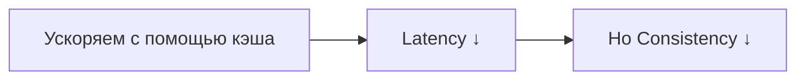
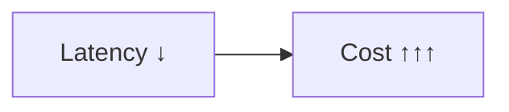
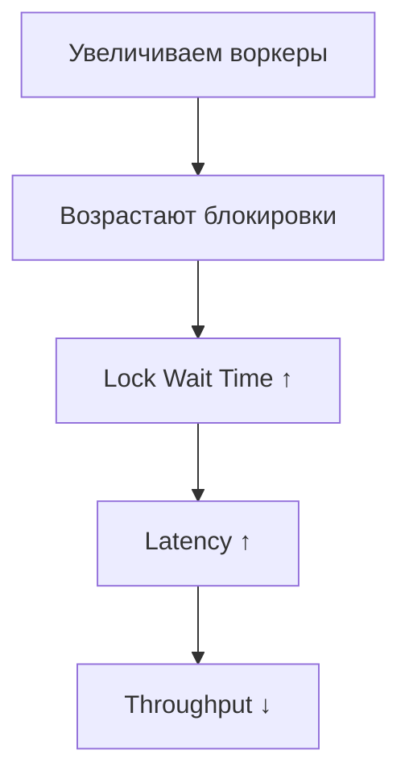

# ВСТУПЛЕНИЕ (1–2 мин)

Ты оптимизируешь latency → увеличивается стоимость.
Увеличиваешь throughput → падает консистентность.
Добавляешь кэш → появляются stale data.
Увеличиваешь число воркеров → всё вдруг становится медленнее.

Кажется, что система тебе мстит за попытки улучшить её жизнь.

Но это не злой умысел.
Это **ресурсные trade-offs** — фундаментальная причина, почему любое ускорение что-то ломает.

Сегодня разберём:

* почему нет ни одной “бесплатной” оптимизации,
* как эти trade-offs проявляются в реальном проде,
* и какие решения реально работают.

Поехали.

---

# 🧨 БЛОК 1. БОЛЬ (3–4 мин)

Инженеры любят мыслить линейно:

> “Уменьшим latency → всё станет быстрее.”
> “Добавим сервер → throughput вырастет.”
> “Поставим больше воркеров → очередь исчезнет.”

На практике:

* система работает **нелинейно**,
* каждая оптимизация почти всегда ломает две другие вещи,
* и **нет способа улучшить всё одновременно**.

Примеры боли:

* подняли PHP-FPM max_children → выросли lock-и на Redis.
* увеличили Redis-кластер → выросло количество stale data.
* уменьшили время таймаута → вырос retry-storm.
* включили sync replication → SLA упал.
* добавили aggressive caching → пользователи начали получать “вчерашние” данные.

Это не ошибки инженеров.
Это законы физики в распределённых системах.

---

# 🧩 БЛОК 2. ОСНОВНЫЕ TRADE-OFF’Ы (20–25 мин)

Теперь пойдём по каждому trade-off, от боли к решению.

---

# 🔷 **2.1 Latency vs Consistency**

*(скорость против правды)*

Боль:

> “Хочу быстрый сервис, но чтобы данные были всегда свежие.”

Не получится.

Чтобы быть быстрым — нужен кэш.
Чтобы быть консистентным — нужен только источник истины (БД).

### То, что ускоряет:

* Redis
* L1-cache
* CDN
* Query caching

### То, что ломается:

* stale reads
* несколько слоёв кэшей расходятся
* TTL делает данные непредсказуемо устаревшими
* инвалидация ломает когерентность

Диаграмма:

Решение:

* Event-based invalidation
* TTL + lease refresh
* Cache tagging
* “Don’t cache what you can’t invalidate”

---

# 🔷 **2.2 Throughput vs Accuracy**

*(производительность против точности данных)*

Когда у тебя миллионы пользователей, нельзя считать всё идеально точно — дорого, медленно и бесполезно.

Боль:

* точные счётчики дают row-lockи
* аналитика тормозит
* уникальные пользователи == медленные запросы

Реальные решения:

* **HyperLogLog** для уникальных значений (1–2% ошибка)
* **Bloom Filter** для фильтрации (false positives допустимы)
* **Sampling 1:100 для логов и метрик**
* **Probabilistic caching** — кэшируем не все запросы, а часть

Пример:

Если ты хранишь точный “количество лайков”:

– будешь биться за row-lock в Postgres.

Если ты хранишь approximate counter:

– он масштабируется бесконечно.

---

# 🔷 **2.3 Latency vs Cost**

*(хочешь быстро — плати)*

Хочешь сервис за 20ms ответ — значит:

* нужен больше CPU,
* больше RAM,
* больше инстансов,
* больше реплик,
* больше уровней кэша.

AWS не подарит тебе железо за красивые глаза.

Диаграмма:

Типичные примеры:

* Warm cache на CDN = дешёвый способ сократить latency.
* Multi-region = быстрый, но дорогой сетевой трафик.
* Больше воркеров → больше CPU → больше денег.

Иначе говоря:

> Оптимизация скорости почти всегда превращается в оптимизацию счета в AWS.

---

# 🔷 **2.4 Consistency vs Availability (CAP trade-off)**

*(реальное применение CAP, а не школьная диаграммка)*

CAP важна здесь ровно для одного:

**объяснить, почему увеличение производительности всегда бьёт по консистентности.**

Боль:

* хочешь, чтобы система всегда отвечала быстро → снижаешь строгость данных
* хочешь сильную консистентность → жди реплик → throughput падает

Коротко:

При сетевом разрыве ты должен выбрать:

### ✔ CP (Consistency Priority)

*строгое обновление на всех узлах*
→ latency ↑
→ throughput ↓
→ часть запросов блокируется

### ✔ AP (Availability Priority)

*отвечаем быстро на основе локальных данных*
→ consistency ↓
→ возможны stale reads

Примеры:

| Технология                | Реальный режим |
| ------------------------- | -------------- |
| Redis                     | AP             |
| Mongo при failover        | AP             |
| Postgres sync replication | CP             |
| DynamoDB                  | AP (частично)  |
| Multi-region writes       | AP             |

Вот и всё, тебе не нужен CAP-треугольник — только практические последствия.

---

# 🔷 **2.5 Caching vs Correctness**

*(ускорение чтений ломает свежесть данных)*

Боль:

* есть 10 слоёв кэша — данные разъезжаются
* TTL делает поведение случайным
* первые пользователи после истечения TTL получают медленный запрос
* invalidation — сложнее, чем ядро Linux

Кэш = ускорение за счёт отказа от строгой истины.

Решения:

* Jittered TTL
* Global cache busting
* Stale-while-revalidate
* Versioned keys
* Multi-layer invalidation

---

# 🔷 **2.6 Parallelism vs Contention**

*(больше воркеров → больше конфликтов → меньше throughput)*

Это классическая ловушка:

> “Давайте увеличим количество PHP-FPM воркеров с 50 до 200, будет быстрее”.

Будет хреново.

На самом деле:

* contention на Redis растёт
* database locks растут
* всё больше процессов ждут друг друга
* CPU тратит больше времени на переключение контекстов
* latency растёт
* throughput падает

Диаграмма:

Решение:

* ограничивать параллелизм
* использовать очереди
* шардировать горячие сущности
* избегать глобальных счётчиков
* снижать объём shared-состояния

---

# 🔥 БЛОК 3. РЕАЛЬНЫЕ ИНЖЕНЕРНЫЕ ПРИМЕРЫ (3–5 мин)

* aggressive retries в gateway → retry storm → backend death
* sync replication в Postgres → SLA падает до 95%
* добавили CDN → появились stale responses
* L1-cache в PHP-FPM → когерентность улетела в космос
* уменьшили воркеры → очередь выросла
* увеличили воркеры → contention убил throughput
* шардирование спасло latency → но убило strong consistency

Каждый пример — это trade-off, а не ошибка.

---

# 🎯 БЛОК 4. ПРАКТИЧЕСКИЕ РЕКОМЕНДАЦИИ (5 мин)

**1. Не оптимизируй вслепую**
Сначала метрики, потом решения.

**2. Понижай требования**
Strong consistency стоит дороже всего.

**3. Сегрегируй нагрузки**
Чтение отдельно, запись отдельно.

**4. Лимить параллелизм**
Concurrency != throughput.

**5. Обязательно внедряй backpressure**
Система должна иметь право сказать “стоп”.

**6. Документируй trade-offs**
Иначе через 3 месяца никто не поймёт, почему так сделали.

---

# 🏁 ФИНАЛ

В распределённых системах **нет бесплатных ускорений**.
Каждый прирост одной метрики:

* увеличивает стоимость,
* снижает точность,
* ломает консистентность,
* или увеличивает риск катастрофы.

Главная задача инженера — не ускорить систему любой ценой,
а **распределить боль так, чтобы бизнес мог жить**.
ч