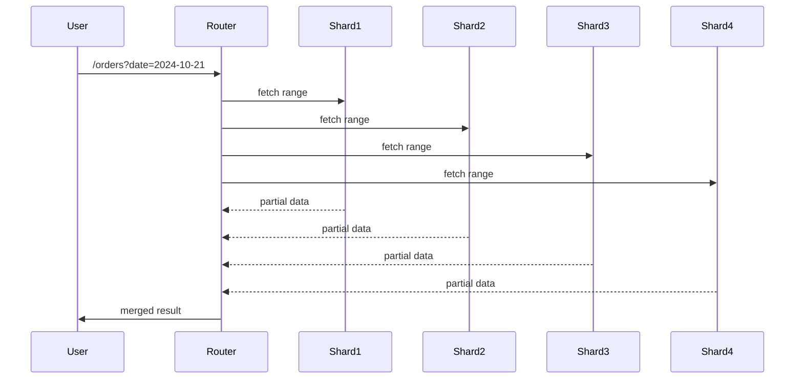
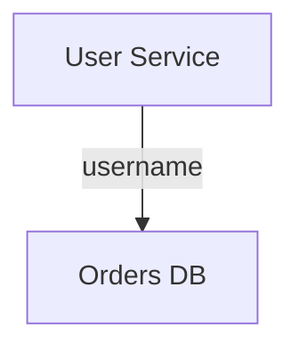

# 🎬 **Сценарий: Cross-Shard операции и оптимизации**

*(часть серии про распределённые БД и шардирование)*

---

# 🎣 **0. ВВЕДЕНИЕ — боль, из которой всё начинается (1 минута)**

Представь ситуацию.

Ты сидишь, никого не трогаешь, и внезапно мониторинг начинает орать:

* БД стала тормозить
* latency вылетает за p99
* CPU 100%
* replication lag растёт
* очередь запросов растёт
* пользователи жалуются “приложение лагает!!!”

И менеджер тебе говорит:

> “Добавь ещё реплик, пусть работает быстрее”.

Ну да, конечно.
Реплика же ускоряет запись?
Она же снимает нагрузку с hot keys?
Она же магически убирает row lock?

И вот в этот момент ты впервые произносишь сакраментальную фразу:

> “Нам надо шарды…”

И всё. Жизнь никогда не будет прежней.

---

# 🧱 **1. Почему мы вообще приходим к шардированию (2–3 мин)**

Причины всегда одинаковые:

### ✔ База упёрлась в вертикальный предел

CPU, RAM, IOPS — всё в потолке.

### ✔ Логические hot keys рвут один узел

Один популярный userId ломает весь кластер.

### ✔ Записи слишком тяжёлые

Даешь 5к RPS update — и Postgres умирает.

### ✔ Данные растут линейно, нагрузка растёт квадратично

Монолитная БД перестаёт тянуть “в пике”.

Тут и начинается путь боли.

---

# 🧠 **2. Поясняем шардирование простым языком (1 минута)**

Шардирование — это попытка решить проблему одной фразой:

> “Давайте поделим данные между несколькими БД”.

Обычно делают вот так:

```text
shard = userId % 8
```

Шардов 8.
Данные разлетаются “равномерно”.
Жизнь прекрасна.
Ты ходишь по офису, как победитель.

А потом наступает реальность.

---

# 🧨 **3. Боль статического шардирования (3–4 минуты)**

Это место, где у слушателя должны начать чесаться ладони.

### ❌ 3.1. Hot key никуда не делся

Если userId=42 даёт 30% нагрузки — модуль тебе не поможет.
Он просто сломает shard #2 вместо всей базы.

### ❌ 3.2. Ты *никогда* больше не сможешь изменить число шардов

Потому что:

```
userId % 8 -> userId % 9
```

→ 100% ключей мигрируют
→ все данные переезжают
→ кеш-инвалидация
→ downtime
→ все в панике бегают как куры без головы.

### ❌ 3.3. JOIN превращается в сетевой обход

User на shard1
Orders на shard3
Payments на shard7

Добро пожаловать в мир cross-shard операций.

### ❌ 3.4. Транзакции невозможны

Даже банальное:

```
списать баланс + создать заказ
```

становится distributed transaction.

### ❌ 3.5. Любой RANGE / FILTER → обход всех шардов

“Покажи всех кто создал заказ вчера”
→ запрос шлётся на все шарды.

Диаграмма:



И так — для любой операции без shard key.

---

# ⚔️ **4. Переход: почему cross-shard операции неизбежны (1 минута)**

Очень важно сформулировать:

> Шардирование масштабирует систему,
> но ломает привычный способ работы с данными.

Cross-shard операции — это НЕ баг.
Это нормальное следствие масштабирования.

И теперь вопрос:

**Как с этим жить?**

---

# 🧩 **5. Каталог cross-shard операций (2 минуты)**

Чётко перечисляем, чтобы слушатель понимал масштабы ада:

### ✔ Cross-shard JOIN

Данные на разных шардах → join по сети.

### ✔ Cross-shard Transactions

Нужна atomicity across nodes?
2PC? Удачи.

### ✔ Cross-shard Aggregations

Суммы / статистики / counter — по всей системе.

### ✔ Cross-shard Range Queries

Поиск по дате, фильтры — требуют обхода всех узлов.

### ✔ Cross-shard Filtering

Фильтры по атрибутам → все шарды.

Тут человек уже морально готов узнать реальные техники.

---

# 🛠 **6. Практические стратегии решения cross-shard боли (основной блок — 5–7 минут)**

Идём по реальным боевым техникам.
Показываем, что инженерия — это ремесло, не магия.

---

## 🟦 6.1. Data Locality (правильный shard key)

Главный принцип:

> Лучший cross-shard JOIN — это тот, который не нужен.

### Как это делают:

* шардируют по userId, если всё вокруг пользователя
* шардируют по tenantId в SaaS
* шардируют по магазину в маркетплейсе
* шардируют по chatId в мессенджерах

### Пример (правильно и неправильно)

**Неправильно:**
orders по orderId
→ userId в другом шарде
→ всё ломается

**Правильно:**
orders по userId
→ все данные пользователя всегда рядом
→ JOIN почти не нужен

Эту мысль надо вбить слушателю в мозг.

---

## 🟧 6.2. Денормализация вместо JOIN

Главный компромисс распределённых систем:

> Скорость покупки независима от нормализации данных.

Примеры:

* username храним прямо в order
* количество лайков храним прямо в таблице поста
* кешируем количество подписчиков в отдельной таблице

Диаграмма:



Да, данные дублируются.
Да, нужна eventual consistency.
Но JOIN исчезает → latency падает.

---

## 🟩 6.3. Scatter-Gather (Fan-Out)

То, что делает MongoDB, Elastic, Bigtable, Solr.

### Процесс:

1. Разослать запрос на все шарды
2. Получить частичные результаты
3. Смержить
4. Отдать клиенту

Проблема:

> Один медленный шард = медленный ответ всей системы.

Tail latency x N.

Оптимизации:

* заранее знать, какие шарды нужны
* early cutoff
* shard filtering
* pre-indexing

---

## 🟨 6.4. Routing Index (централизованный индекс)

То, что делает:

* Cassandra
* Spanner
* Elasticsearch
* Solr
* Pinterest graph DB

Идея:

> Отдельная таблица/индекс хранит мета-информацию: где что лежит.

Пример:

```
age: 18-25 → shards [1, 7, 9]
premium = true → shard 3
```

Теперь запрос:

```
SELECT * FROM USERS WHERE age BETWEEN 18 AND 25
```

идёт только на 3 шарда вместо 30.

---

## 🟪 6.5. Cross-shard Transactions → Saga

Ты говоришь:

> “Сделаем 2PC”.

И DBA просто выходит покурить навсегда.

### Почему 2PC = ад:

* coordinator может умереть
* global locks
* high latency
* cluster-wide stalls

Поэтому:

✔ Saga
✔ Outbox + CDC
✔ Event-driven async workflow
✔ Temporal / Conductor / Camunda

Утверждение:

> В распределённых системах не бывает ACID.
> Бывает только eventual consistency + компенсирующие операции.

---

## 🟥 6.6. Pre-aggregation (MapReduce стиль)

Facebook, YouTube, TikTok делают так:

* каждый шард считает свою часть агрегации
* агрегатор объединяет результаты

Пример:

```
views_total = sum(views_shard_1...views_shard_N)
```

Преимущества:

* операции O(shards), а не O(rows)
* линейная масштабируемость

---

# 🧨 **7. Практические оптимизации cross-shard (1–2 минуты)**

Короткий список:

* кешировать результаты scatter-gather
* не делать ORDER BY global
* сортировать локально и мержить
* избегать глобальных JOIN
* использовать batch-запросы
* использовать bloom filters для shard filtering
* изолировать hot keys в отдельный tier
* ограничивать fan-out лимитами

---

# ☠️ **8. Анти-паттерны (блок боли, 1 минута)**

### ❌ “JOIN через REST другого сервиса”

Молись, чтобы никто так не делал.

### ❌ “Мы договоримся про ACID между микросервисами”

Там только боль, кровь и distributed deadlock.

### ❌ “Фан-аут на все шарды всегда”

Убьёт tail latency в 10×.

### ❌ “Пусть фронтенд сам соберёт несколько запросов”

Фронтенд не должен знать, как шардированы данные.

---

# 🎯 **9. Итоговая мысль (30 секунд)**

Шардирование не даёт скорости бесплатно.
Шардирование создаёт новые типы боли.

> Cross-shard операции — не ошибка архитектуры.
> Это цена масштабирования.

А дальше начинается ещё более интересная проблема:

👉 **Как перекладывать данные между шарами БЕЗ downtime?**
👉 **Как автоматически сбалансировать нагрузку?**
👉 **Как перестроить шардинг, когда бизнес поменял требования?**

И это — следующая тема:
**Rebalancing & Online Migrations без остановок.**
