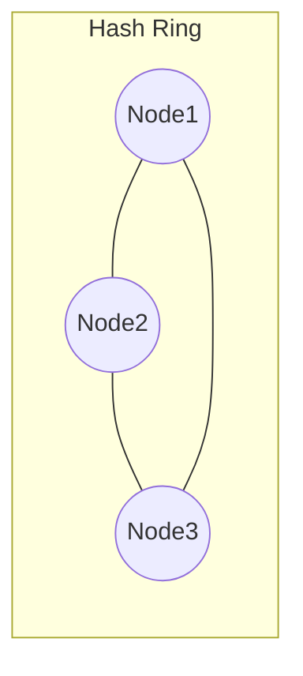

Я сейчас напишу **полный сценарий**, который можно сразу читать в камеру.
Стиль — как у твоих прошлых сценариев: разговорный, практичный, местами едко-ироничный, без академической воды, с опорой на реальные боли.

---

# 🎬 **Полный сценарий: Dynamic Sharding стратегии (15 минут контента)**

*(готов под запись: можно читать вслух)*

---

# ⭐ Интро (30–40 секунд)

Представьте, что у вас маркетплейс.
Всё красиво: микросервисы, таблицы, шарды…
Сервис растёт, бизнес радуется, жизнь прекрасна.

Пока однажды не появляется пользователь с `userId = 123`, который почему-то генерирует **30% всего трафика**.

И в этот момент вы узнаёте две неприятные истины:

1. статическое шардирование — это не шардирование
2. всё, что делилось “по остатку от деления”, живёт ровно до первого роста бизнеса

И вот тогда приходит понимание: нужно **динамическое шардирование**.
Но что это такое? И почему без него большие системы не работают?

Давайте разбираться.

---

# 🧭 Часть 1: Что такое Dynamic Sharding (1 минута)

Если коротко:

> Шардирование — это не про деление данных.
> Шардирование — это про постоянное *перераспределение* данных.

Рост нагрузки → перекос (skew).
Появление горячих ключей → перегрузка.
Расширение бизнеса → нужно добавлять шарды.
Удаление старых узлов → Redis/Rabbit/Postgres умирают от перераспределений.

Dynamic sharding — это система, которая умеет:

* добавлять новые шарды в рантайме
* менять маршрутизацию ключей
* делить перегретые диапазоны
* изолировать горячие ключи
* делать это *без остановки сервиса*

Но важный момент:

⚠ **Сейчас мы обсуждаем только стратегии.**
Как переносить данные и как работать между шардами — в следующих главах.

---

# 🧱 Часть 2: Базовые понятия (1–2 минуты)

Чтобы понимать, какие стратегии существуют, нужно знать три термина.

## 1. Shard Key

Это правило: *как мы выбираем, куда попадает запись*.

Плохой shard key = умирающий прод.

## 2. Hot Key

Когда один ключ генерирует несоразмерно большой трафик.

Например:
видео, которое в трендах → 100k RPS на один key.

## 3. Skew

Перекос нагрузки, когда одни шарды горят, а другие спят.

---

# 🧩 Часть 3: Стратегии динамического шардирования (8–10 минут)

Теперь — самая мякотка.

Это те стратегии, которые реально используют:

* Twitter
* Instagram
* Facebook
* DynamoDB
* Redis Cluster
* MongoDB
* CockroachDB
* Kafka

Поехали.

---

# 🚀 Стратегия 1: Consistent Hashing + виртуальные ноды (2 минуты)

Используют: Redis Cluster, Cassandra, Kafka.

Все мы знаем классическую формулу:

```
shard = user_id % N
```

Проблема: когда N меняется — всё разваливается.

Добавили ещё один шард?
→ 100% ключей меняют место, весь кеш протухает, нагрузка улетает в космос.

### Consistent Hashing решает это:

* есть кольцо хэширования
* узлы равномерно распределены
* при добавлении новой ноды меняется *только часть* сегментов кольца



Звучит идеально.
И действительно — это потрясающе для масштабирования.

### Но есть проблема

Consistent hashing **не спасает от горячих ключей**.
Один hot key может спокойно убить сегмент.

И это подводка к следующей стратегии.

---

# 📚 Стратегия 2: Directory-Based Sharding (2 минуты)

Используют: Instagram, Facebook TAO.

Суть простая:

Есть мета-слой — lookup-таблица:

```
0–1M userId → shard1
1M–2M → shard2
```

То есть:

* есть центральный сервис
* он знает “кто куда идёт”
* приложение просто спрашивает: “этот ключ куда?”

### Чем это хорошо?

* можно менять логику шардирования в рантайме
* можно делать split диапазонов
* можно перемещать конкретных пользователей/диапазоны
* можно менять shard key вообще полностью

Это самая гибкая стратегия.

### Чем плохо?

* нужен быстрый мета-сервис
* нужен кэш маршрутов
* без репликации станет SPOF

Но зато управление становится гибким как чёрт.

---

# 🌗 Стратегия 3: Dynamic Range Splitting (1.5 минуты)

Используют: MongoDB, HBase, CockroachDB, TiDB.

Core идея:

Если диапазон стал слишком большим или перегретым — **разделить**:

```
[0..10M] → [0..5M] + [5M..10M]
```

Система сама мониторит нагрузку:
если растёт слишком быстро → split.

### Плюсы:

* идеально для монотонных ключей (типа автоинкремента)
* автоматическая адаптация
* количество данных в одном шарде остаётся адекватным

### Минусы:

* нужно уметь переносить данные (сложная тема)
* может появиться слишком много маленьких диапазонов
* нужен контроллер распределения

Супер-фундамент, но без миграций бесполезно (следующая глава).

---

# 🪶 Стратегия 4: Microsharding (2 минуты)

Используют: Twitter Manhattan, Uber.

Вместо 8 шардов — делаешь 1000 маленьких виртуальных шардов:

```
virtual shards: 0…999
```

Потом физически они распределяются:

```
Node1 → 13 virtual shards
Node2 → 17
Node3 → 16
```

Если один перегрелся:

* перенесли 5 виртуальных шардов на другой узел
* никто этого не заметил
* нагрузка выровнялась

### Плюсы:

* супер-гибкое распределение
* минимальная стоимость миграции
* идеальная защита от skew

### Минусы:

* маршрутизатор становится сложнее
* нужен отдельный “placement driver”

---

# 🔥 Стратегия 5: Hot-Key Isolation (1.5 минуты)

Используют: DynamoDB Adaptive Capacity, Cloudflare.

Если у вас есть ключи, которые:

* слишком часто читают
* слишком часто пишут
* слишком часто обновляют рейтинг

Можно тупо сказать:

```
KEY123 → отдельный hot-shard
```

Горячий ключ отделён → остальные живут спокойно.

### Плюсы:

* мгновенно снимает перегрузку
* защищает весь кластер

### Минусы:

* архитектура усложняется
* нужны хорошие метрики hotspot’ов

---

# 🧨 Часть 4: Главный вывод (1 минута)

Смотрите.

Шардирование — это не выбор “какого-то одного способа”.

Шардирование — это:

* **стратегия деления**
* **стратегия маршрутизации**
* **стратегия борьбы со skew**
* **способность быстро адаптироваться**

Но это только половина картины.

Дальше остаются два самых сложных вопроса:

---

# 👉 Следующая глава: Cross-Shard Operations (join’ы, транзакции, агрегаты)

Как делать операции, которые затрагивают несколько шардов:

* join
* агрегаты
* поиск по диапазонам
* транзакции
* кросс-шардовые апдейты

и не убивать latency.

---

# 👉 Глава после неё: Rebalancing & Migration (без downtime)

Как переносить данные:

* без остановки сервиса
* без “двойных записей”
* без рассинхронизации
* без потери части данных
* без адских ночных deploy’ев

---

# 📚 Часть 5: Что почитать

### Papers

* Dynamo (оригинал AWS)
* TAO (Facebook)
* Twitter Manhattan
* Bigtable
* HBase region splitting

### Talks

* “How Instagram scales Direct”
* “Twitter Manhattan”
* “TiDB Placement Driver”
* “CockroachDB range splits”

### Docs

* Redis Cluster hash slots
* Cassandra partitioning
* MongoDB autosplit

---

# 💬 Если хочешь — могу написать **полные сценарии**

и для **cross-shard operations**, и для **rebalancing**, чтобы они логически продолжали этот блок
и были в едином стиле.

Скажи только: **“давай следующие два сценария”**.
