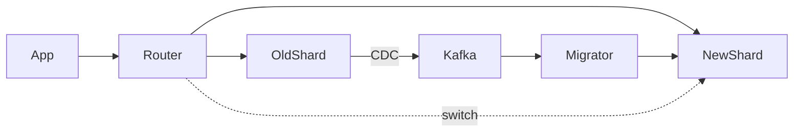

# 🎬 **ПЛАН СЦЕНАРИЯ: Rebalancing и Online Migration без Downtime**

## 🧨 0. Вступление: “Почему вообще нужен Rebalancing?” (1 минута)

Боль:

* Один шард разросся быстрее остальных
* Один шард стал hot spot
* Один шард перегружен запросами
* У shard key плохая кардинальность
* Проект вырос → нужно больше шардов
* На старте была статика (“customer_id % 8”) — теперь нужно 16 шардов

И главный момент:

> Когда шарды несбалансированы — cross-shard операции начинают умирать первыми.

---

# 🧩 1. Виды миграций (2 минуты)

Коротко показываем, что “миграция” — это не одно действие, а пять разных типов:

### ✔ 1.1. Resharding (перераспределение ключей)

Перераспределение данных между теми же шард-серверами.

### ✔ 1.2. Upscaling (добавление новых шардов)

Было N шардов → стало N+K.

### ✔ 1.3. Downscaling (слияние шардов)

Когда перестали нужны 100 шардов.

### ✔ 1.4. Online relocation (перемещение части ключей)

Наиболее частая операция: “перенести shard region X → Y”.

### ✔ 1.5. Shard key migration (смена способа шардирования)

Самый трудный вариант. Иногда неизбежен.

Это задаёт контекст.

---

# 🛑 2. Боль статических схем (2 минуты)

* customer_id % 8 → как только нужно 16 шардов — всё умерло
* невозможно добавить новые узлы без полной миграции
* нельзя менять шард-границы без даунтайма
* нельзя выделять горячие сегменты в отдельный tier
* невозможно online-resolve “hot shard” проблему

Фраза, которую ты можешь использовать:

> “Статическое шардирование — это технический долг, который всегда с процентами.”

---

# 🧠 3. Проблемы, которые надо решать при rebalancing (3 минуты)

Здесь описываем реальную инженерную боль:

### ✔ 3.1. Данные неконсистентны во время миграции

Утечки, дубли, “split brain” между шардами.

### ✔ 3.2. Нельзя ломать SLA

Пользователь не должен понимать, что у него переезжает 50 ГБ данных.

### ✔ 3.3. Race conditions

Запись произошла во время переноса.

### ✔ 3.4. Atomic switch-over

Нужен транзакционный момент “до этого читал старый шард, после — новый”.

### ✔ 3.5. Нагрузка на сеть

Rebalancing — это DDoS на твой же кластер, если плохо сделать.

### ✔ 3.6. Влияние на кеши

Риск:

* stale data
* cache poisoning
* устаревшие маршруты

---

# ⚙️ 4. Подходы к Rebalancing (8–10 минут)

Теперь — мясо.

---

## 🟦 4.1. “Двойная запись” (Dual Write)

(наиболее известный, но опасный)

Алгоритм:

1. Пишем в старый + новый шард
2. Чтение идёт из старого
3. Когда данные синхронизированы → переключаем чтение
4. Старый источник выключаем

Опасности:

* рассинхрон
* разные транзакции в разное время
* сложные race conditions
* проблема “двойной инкрементации”

Использовать только для “простых” коллекций.

---

## 🟩 4.2. “Read-from-old, write-to-new” + Repair Worker

(безопаснее, рекомендуемый вариант)

Алгоритм:

1. Пишем в новый шард
2. Читаем пока из старого
3. Фоновый воркер переносит новые записи
4. Когда догнали → переключаем чтения

Плюсы:

* атомарный переключатель
* проще reasoning
* можно откатывать

Минусы:

* сложность чистки остаточных данных

---

## 🟧 4.3. "Change Routing First" (поменять маршрутизацию, потом мигрировать)

Используют LinkedIn, Twitter, Uber.

Алгоритм:

1. Меняем shard map: “эти ключи обслуживает новый шард”
2. Читатели и писатели идут в новый
3. Фоновый процесс переносит холодные данные
4. Старый шард чистится

Плюсы:

* минимальный downtime
* безопасно для горячих ключей

Минусы:

* нужно уметь жить с данными, которые в двух местах

---

## 🟥 4.4. Change Data Capture (CDC) + Backfill

(современно, надёжно, особенно если Kafka)

Алгоритм:

1. Стрим изменений старого шарда → Kafka
2. Параллельно backfill из snapshot'а
3. Kafka догоняет хвост
4. Переключаем чтение

Это как Uber и Pinterest делают большие миграции.

---

## 🟪 4.5. Live Traffic Replay (для high-traffic систем)

Используют:

* AWS DynamoDB
* Spanner migrations
* Alibaba migrations

Алгоритм:

1. Ловим весь трафик на старый шард
2. Replay'им его в новый
3. Дожидаемся синхронизации
4. Ровный switch

Очень надёжно, но сложно.

---

# 🧬 5. Atomic Cutover (переключение без даунтайма) (2–3 минуты)

Ключевой момент:

> В миграции важно не как переносить данные.
> Важно как переключить чтение и запись атомарно.

Техники:

### ✔ Feature flag

Переключатель на уровень приложения.

### ✔ Routing map generation

Старая карта → новая карта → переключение.

### ✔ Epoch / Generation ID

Каждый шард имеет “номер поколения”.
Если клиент присылает запрос со старой generation → redirect.

### ✔ Read-repair

Если запрос ушёл старому узлу → он возвращает redirect на новый.

---

# 🧨 6. Проблема бегущих записей (in-flight writes) (2 минуты)

Описываем классическую боль:

* запись прилетает в старый шард в момент переключения
* запись теряется
* запись появляется в двух местах
* кэш устаревший
* saga ломается

Решения:

* пауза писателей (short freeze < 50ms)
* idempotency
* version vectors
* sequence tokens
* write fencing (пишем только если generation совпадает)

---

# 🧹 7. Очистка “мусора” (пост-миграционный этап) (1 минута)

Здесь коротко:

* старые данные
* старые кеши
* stale индексные записи
* orphaned keys

Нужна:

* GC воркер
* TTL
* version purge

---

# 🚫 8. Анти-паттерны (1 минута)

Быстро и жёстко:

### ❌ “Переехали просто SELECT * INTO …”

Это offline migration, убивает SLA.

### ❌ “Сначала выключим старый шард…”

Умирает весь трафик.

### ❌ “Клиент сам знает, куда писать”

Развалит любую миграцию.

### ❌ “Сделаем всё за один большой скрипт”

Никогда не получится в production.

---

# 🔥 9. Пример архитектуры онлайн-миграции (mermaid диаграмма)

---

# 🚀 10. Завершение

Итог:

* rebalancing — самая сложная часть шардирования
* это всегда многоэтапный процесс
* решение — смесь routing, CDC, backfill, миграторов
* если правильно реализовано → можно без даунтайма мигрировать терабайты

Мостик:

> “Следующая тема — реальные инциденты больших компаний и их миграции. Как Amazon, LinkedIn, Uber, TikTok делали онлайн-переносы данных и не уронили всё”.

